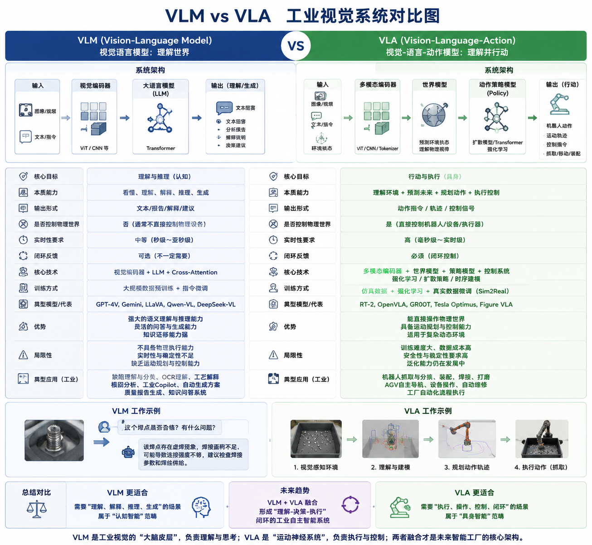

# **VLM** 与 **VLA** 对比

author: 周均扬

date: 2026.05.19

---

 **VLM（Vision Language Model）** 与 **VLA（Vision-Language-Action）** 代表两者不同的AI范式。


## 1. 核心概念

| 缩写  | 全称                     | 核心目标         | 输出        | 典型场景                      |
| --- | ---------------------- | ------------ | --------- | ------------------------- |
| VLM | Vision Language Model  | 理解视觉世界 + 推理  | 文本、语义、解释  | 缺陷分析、OCR理解、工艺解释、工业Copilot |
| VLA | Vision-Language-Action | 将视觉理解转化为动作执行 | 物理动作、控制指令 | 机器人抓取、AGV路径规划、装配操作、自动维护   |


**VLM**即视觉语言模型，核心是看懂世界！本质是把图像、视频、文本映射到统一语义空间。

典型的结构是：

```text
Image → Vision Encoder → LLM → Text / Reasoning
```

VLM的代表模型是 OpenAI的GPT-4V， Google的Gemini， Meta的LLaVa， 阿里的QWen-VL， DeepSeek的DeekSeek-VL。 

但VLM通常不直接控制物理世界。


**VLA**即视觉语言动作模型。核心是从感知直接到行动。本质是看懂并行动，并不仅仅是看懂世界！ 

VLA的典型结构是： 

```text
Image + Text → World Model → Action Policy → Robot Action
```

VLA接近机器人大脑。 VLA的代表方向是 Google的DeepMind RT-2， Tesla的Optimu， Figure AI的Figure VLA， NVIDIA的GR00T。


总结就是，**VLM**的目标是理解世界，而**VLA**的目标是操作世界。**VLM**偏向于认知智能，即 Cognitive AI； 而**VLA**偏向于具身智能，即 Embodied AI。


---

## 2. 架构对比

| 维度       | VLM                                           | VLA                                                                    |
| -------- | --------------------------------------------- | ---------------------------------------------------------------------- |
| 数据流      | Image → Vision Encoder → LLM → Reasoning/Text | Image + Text → Perception → World Model → Policy → Trajectory → Action |
| 目标       | Cognitive Intelligence（认知智能）                  | Embodied Intelligence（具身智能）                                            |
| 是否闭环控制   | 否（通常只输出理解）                                    | 是（必须闭环控制物理世界）                                                          |
| 实时性要求    | 中等                                            | 高，工业级控制必须低延迟                                                           |
| 世界模型依赖   | 可选                                            | 必须                                                                     |
| 状态机/时序建模 | 弱                                             | 强，依赖动作规划和反馈                                                            |
| 强化学习     | 可选                                            | 常用，执行策略优化                                                              |
| 工业输出     | 建议方案、异常分析、文本解释                                | 机器人动作、PLC指令、AGV路径、操作序列                                                 |
| 风险       | 错误仅影响判断                                       | 错误可能导致机械损伤或安全事故                                                        |

---

## 3. 技术栈对比

| 技术层            | VLM             | VLA                               |
| -------------- | --------------- | --------------------------------- |
| Vision Encoder | ViT、EVA、ResNet  | ViT、EVA、ResNet（同VLM）              |
| LLM/Reasoning  | Transformer、MoE | Transformer + RLHF + Planning     |
| Action Policy  | 无               | RL、World Model、Trajectory Planner |
| Simulation     | 可选              | 必须（Sim2Real）                      |
| 控制接口           | 无               | Robot SDK、PLC、AGV系统               |
| 多模态融合          | 图像+文本           | 图像+文本+状态+传感器                      |


### **VLM**的核心技术是：

#### 1. Vision Encoder， 例如：ViT、EVA、SigLIP

#### 2. LLM， 例如：Transformer、MoE

#### 3. Cross Attention， 图像与文本对齐


### **VLA**的核心技术是：

#### 1. World Model， 预测：下一步世界状态

#### 2. Policy Model， 输出：动作序列


#### 3. Trajectory Planning, 路径规划

#### 4. Reinforcement Learning, 强化学习

#### 5. Sim2Real, 仿真到现实


---

## 4. 工业视觉中的角色

| 角色         | VLM         | VLA               |
| ---------- | ----------- | ----------------- |
| 工厂认知       | “看懂工件缺陷”    | “机器人执行抓取动作”       |
| 工艺分析       | 缺陷根因分析      | 动作规划、实时控制         |
| Workflow生成 | 生成检测方案、参数推荐 | 将方案转化为执行计划        |
| 自动化执行      | 无           | 机器人、AGV、装配线、PLC控制 |

**VLM**是Information Intelligence； 而**VLA**是Physical Intelligence。

---

## 5. 核心区别总结

| 特性   | VLM          | VLA               |
| ---- | ------------ | ----------------- |
| 核心能力 | 感知 + 理解 + 推理 | 感知 + 理解 + 推理 + 行动 |
| 输出类型 | 文本/语义        | 动作/控制指令           |
| 面向世界 | 信息世界         | 物理世界              |
| 是否闭环 | 否            | 是                 |
| 风险   | 逻辑或分析错误      | 工业事故或设备损坏         |
| 实时性  | 中等           | 高，严格低延迟           |
| 工业价值 | 决策辅助、优化方案    | 自动执行、工业自动化        |


**VLM** 更像“大脑皮层”， 负责理解、推理、语义。

**VLA** 更像“大脑 + 小脑 + 神经系统”，因为除了理解外，还要 “运动控制”、“平衡”，“时序”、“力反馈”。

---

## 6. 未来融合趋势

在下一代 **Industrial Vision OS** 中：

```text
Camera → Perception → VLM理解 → World Model → VLA规划 → 机器人/PLC执行 → 数据反馈 → 自学习
```

* **VLM**：负责理解、推理、生成方案
* **VLA**：负责执行、动作控制、闭环反馈
* 两者结合形成 **认知+具身闭环工业AI系统**

---

 **VLM vs VLA 工业视觉系统对比图**，将理解层与执行层的关系、数据流和闭环反馈直观可视化。


