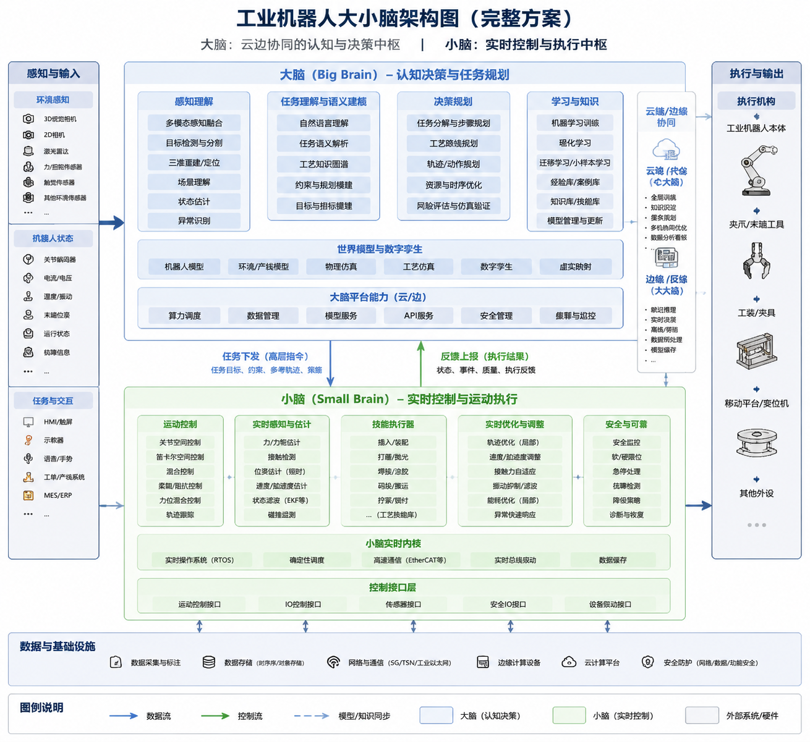

# **工业机器人“大小脑”架构方案**

author： 周均扬

date： 2026.05.22

---

分析各主流厂商的实现思路、优劣势及可行落地方案。结构分为三部分：概念、架构方案、业界调研。


## 1. 工业机器人“大小脑”概念

“大小脑”架构源自生物神经系统的启发：

| 名称                  | 功能             | 对应工业机器人角色           |
| ------------------- | -------------- | ------------------- |
| 大脑（Cortex-like）     | 高级认知、规划、决策     | 场景理解、任务规划、路径优化、任务调度 |
| 小脑（Cerebellum-like） | 精细控制、快速反馈、运动协调 | 精密执行、实时力控、补偿误差、运动平滑 |

特点：

* **大脑层**：计算量大，处理复杂感知、路径规划和环境推理，可用 AI/深度学习模型。
* **小脑层**：要求低延迟、高精度控制，适合传统控制理论（PID、LQR）或轻量化神经控制器。
* **双层协作**：大脑输出策略，小脑快速执行和校正，实现“高智能 + 高精度”。

---

## 2️. 工业机器人大小脑架构方案

### 2.1 系统分层

```
+-----------------------------------------+
|               大脑层 (Planning/AI)      |
|-----------------------------------------|
| - 高级感知 (视觉、力觉、语义)           |
| - 场景理解 & 状态估计                   |
| - 路径规划 / 任务规划 / 动作序列生成    |
| - AI策略优化 / 机器学习模块             |
+-----------------------------------------+
|               中间协调层                |
|-----------------------------------------|
| - 数据总线 (ROS2/OPC-UA)                |
| - 同步多传感器 & 状态管理               |
| - 大脑输出到小脑的动作指令转换          |
| - 安全监控 / 异常处理                   |
+-----------------------------------------+
|               小脑层 (Control/Execution)|
|-----------------------------------------|
| - 关节控制 & 运动轨迹跟踪               |
| - 力控/力矩补偿                          |
| - 高速反馈循环 (<1ms)                    |
| - 本地学习控制（LQR, RL微调）          |
+-----------------------------------------+
|               硬件层                     |
|-----------------------------------------|
| - 机器人关节、电机驱动器                |
| - 工业相机、力传感器                     |
| - 末端执行器 (抓手/工具)                 |
+-----------------------------------------+
```

### 2.2 数据流与控制逻辑

1. **感知采集**

   * 工业相机、力/扭矩传感器、激光雷达、IMU。
   * 数据统一通过 ROS2 topic 或中间层同步。
2. **大脑处理**

   * 视觉理解：点云 + 2D/3D识别。
   * 任务规划：路径优化、动作序列生成。
   * AI策略：强化学习/深度策略网络。
3. **小脑执行**

   * 高速关节控制：闭环轨迹跟踪。
   * 力控：即时反馈力矩调整，补偿振动和摩擦。
   * 可选本地 RL 微调，提高精度。
4. **反馈与迭代**

   * 小脑反馈状态回大脑进行在线修正。
   * 实现“感知-规划-执行-校正”的闭环。

### 2.3 可选技术栈

| 层级  | 技术/工具                              | 说明           |
| --- | ---------------------------------- | ------------ |
| 大脑  | PyTorch/TensorFlow, ROS2, OpenVINO | AI推理、规划、视觉理解 |
| 中间层 | ROS2, OPC-UA, DDS                  | 数据同步、任务协调    |
| 小脑  | C++实时控制, ROS2 Control, RT-Linux    | 高速关节控制、低延迟反馈 |
| 硬件  | FANUC/KUKA/UR 控制器, 工业相机, 力传感器      | 精密执行与感知      |

---

## 3️. 业界调研：大小脑或双层控制架构

| 公司 / 方案                               | 大脑层实现                       | 小脑层实现            | 优势          | 限制          |
| ------------------------------------- | --------------------------- | ---------------- | ----------- | ----------- |
| **Tesla Optimus**                     | Transformer + RL策略，用于高层任务规划 | 高速关节控制 + 本地运动学习  | AI大脑可处理复杂任务 | 硬件延迟与安全问题   |
| **Figure AI Helix**                   | 高级规划算法 + 多传感器融合             | 高速伺服控制 + 微调RL    | 灵活动作、低成本    | AI层训练依赖大量数据 |
| **NVIDIA Isaac**                      | Isaac SDK + Omniverse仿真     | ROS2控制 + GPU加速推理 | 虚拟训练可快速迭代   | 实时控制需额外硬件   |
| **Google Robotics / Everyday Robots** | AI感知 + RL策略                 | 传统PID + RL微调     | 强通用性、多任务    | 小脑控制需针对硬件优化 |
| **ABB / KUKA**                        | 传统PLC/机器人控制 + AI优化任务调度      | 实时控制器 + 力矩补偿     | 工业成熟，安全可靠   | AI大脑集成有限    |

**总结趋势：**

1. 越来越多工业机器人在大脑层引入 AI 规划与视觉理解，但小脑层仍依赖传统高精度控制。
2. 双层架构在多机器人协作、柔性制造场景更有效。
3. 虚拟仿真和强化学习是大脑层训练的主流手段，控制层需要实时硬件闭环保证精度。

---

**“工业机器人大小脑架构图”**，包含大脑/中间层/小脑/硬件的数据流、线程与控制回路。


