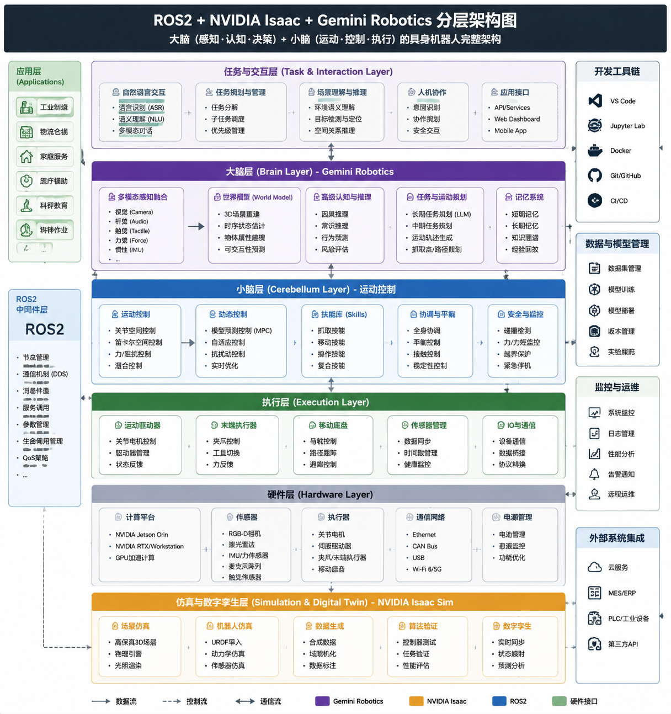

# **基于Google / DeepMind 与 NVIDIA 的机器人开发方案**

author： 周均扬

date: 2026.05.24

---

## 1. Google / DeepMind 机器人方案

### **1) Gemini Robotics 系列（多模态 VLA/VLM 模型）**

这是 Google DeepMind 基于 Gemini 大模型打造的机器人控制与感知 AI 核心：

* **能力**：结合视觉、语言和动作推理，将自然语言、高维视觉感知映射为机器人行为计划。可以将复杂任务分解成步骤并执行。([Google DeepMind][^1])
* **通用性**：模型设计目标是跨不同机器人平台泛化任务能力，不依赖特定硬件。([Google DeepMind][^1])
* **实例**：Gemini Robotics 可响应文本/图像指令，对空间和物体进行 reasoning，将高阶语义映射到具体动作。([Google DeepMind][^1])

**优点**

* 强调大模型理解与 reasoning，便于高层自然语言控制机器人。([Google DeepMind][^1])
* 能自然解释其动作计划，更方便调试与人机协作。([Google DeepMind][^1])
* 与 Google 众多 AI 基础设施（如 ALOHA、云端推理）深度集成。

**限制**

* 当前主要在研究与 SDK 阶段，硬件整合和部署生态尚不成熟。
* 对于精细动态控制更多依赖于外部底层控制器系统。

### **2) AutoRT / 大规模机器人协调系统**

来自 DeepMind 的 AutoRT 工程：

* **核心**：利用大型多模态模型和机器人交互数据来统一协调多机器人行为，能够在“真实世界场景”中收集海量多样性数据用于强化学习/自监督。([Google DeepMind][^2])
* **目的**：突破传统模拟局限，将在野外实际部署的数据反哺策略训练。

**优点**

* 支持大规模无人监控数据收集，有利于泛化机器人策略。([Google DeepMind][^2])
* 与 VLM/LLM 融合，提升任务规划和安全意识。

**限制**

* 仍然依赖规模化机器人 fleet 才能真正积累足够 data diversity。

### **3) Alphabet Robotics 生态（Intrinsic + Everyday Robotics 资产整合）**

Google 正将开源工程（Intrinsic）与 DeepMind、Gemini 合并：

* **目标**：类似 Android 之于手机系统，希望成为机器人通用软件层（提供任务层、计划层、调度层等通用模块）。([The Verge][^3])

**优点**

* 可能为不同平台提供共同的机器人实用层（API/调度/执行）。([The Verge][^3])

**当前限制**

* 仍在整合阶段，对比成熟工业机器人 OS（如 ROS2 + 商用堆栈）规模较小。

---

## 2. NVIDIA 的机器人方案

NVIDIA 机器人生态以 **Isaac 平台 + Simulation + Foundation Models** 为核心：

### **1) NVIDIA Isaac 平台（Sim + Lab + ROS + Models）**

完整机器人软件开发与模拟平台，包括：

* **Isaac Sim**：用于构建物理准确仿真场景与机器人动作学习环境（基于 Omniverse 物理引擎）。([NVIDIA Developer][^4])
* **Isaac Lab**：轻量级机器人学习工具，集成于 Sim 内支持 RL/imitation training。([NVIDIA Developer][^5])
* **Isaac ROS**：加速 ROS2 机器人感知与控制流程。([NVIDIA Developer][^5])
* **cuMotion / Motion Planning Libraries**：CUDA 加速运动规划与控制解决方案。([NVIDIA Developer][^5])

**优点**

* 提供端到端训练与仿真加速基础设施，可从模拟到现实部署。([NVIDIA Developer][^4])
* 多机器人类型支持：AMR、四足 humanoid、机械臂等。([NVIDIA Developer][^4])
* 基于强加速 GPU 构建，整合物理仿真与神经网络训练，提高样本效率。([NVIDIA Developer][^5])

**限制**

* 学习曲线陡峭，初学者部署门槛高。

### **2) Isaac GR00T Foundation Models**

NVIDIA 发布的**通用机器人基础模型**：

* **GR00T N1 系列**：用于通用 humanoid 机器人推理与技能基础模型，提高控制泛化能力。([英伟达投资者官网][^6])
* **双系统架构灵感**：类 System 1（直觉） + System 2（策略规划）架构，类似人类 cognition。([英伟达投资者官网][^6])
* 与 Cosmos Reason 等世界模型结合，可将模糊指令转化为低级动作。([英伟达投资者官网][^7])

**优点**

* 面向制造、仓储等行业可直接部署技能化机器人。([NVIDIA][^8])
* 结合模拟训练可提升 real-to-sim transfer 能力。([NVIDIA][^8])

**限制**

* 针对 humanoid usage 和融合模型的成熟度仍在发展。

### **3) Newton 物理引擎（开源 GPU 加速）**

与 **Google DeepMind + Disney Research** 共同开发的开源加速物理引擎：

* 提供更真实动力学模拟，支持 MuJoCo-Warp 和 GPU 原生加速。([NVIDIA Newsroom][^9])

**优点**

* 可显著提升复杂接触、多体动力学场景训练质量。([NVIDIA Newsroom][^9])
* 与现有仿真框架互操作，增强环境 fidelity。([NVIDIA Newsroom][^9])

---

## 3. 核心对比表（Google vs NVIDIA）

| 维度   | **Google / DeepMind Robotics** | **NVIDIA Robotics Stack**              |
| ---- | ------------------------------ | -------------------------------------- |
| 核心焦点 | 大模型 reasoning，任务理解与跨平台泛化       | 端到端仿真 + 控制 + 训练 + 部署                   |
| 典型输出 | Gemini Robotics VLA/VLM（高阶决策）  | Isaac Simulation + GR00T 模型 + ROS2 中间件 |
| 强项   | 灵活的自然语言+视觉推理，跨任务泛化能力           | 物理逼真模拟与 GPU 加速学习，高效率训练                 |
| 弱点   | 硬件整合生态尚在成长                     | 初学门槛较高，文档/部署复杂度大                       |

---

## 4. 适用策略总结

* **若目标是高层智能理解与自然语言驱动行为**：可以利用 **Google Gemini Robotics 系列模型** 作为高级策略层（世界模拟 + 语言推理）。
* **若目标是从仿真到真实部署、迭代控制策略与物理交互**：优先构建 **NVIDIA Isaac 完整训练与仿真 pipeline**。
* **混合方案**：使用 Gemini 作为大脑策略输出器 → NVIDIA Isaac 作为执行与模拟平台，形成“大脑（Gemini） + 小脑（Isaac 控制）”架构。

**ROS2 + Isaac + Gemini 分层架构图** 

---

## 5. 参考资料：

[^1]: "Gemini Robotics — Google DeepMind", https://deepmind.google/models/gemini-robotics/gemini-robotics/?utm_source=chatgpt.com 

[^2]: "AutoRT: Embodied Foundation Models for Large Scale Orchestration of Robotic Agents — Google DeepMind", https://deepmind.google/research/publications/48151/?utm_source=chatgpt.com 

[^3]: "Google takes control of 'Android of robotics' project in quest for physical AI", https://www.theverge.com/tech/885113/google-swallows-ai-robotics-moonshot-intrinsic?utm_source=chatgpt.com 

[^4]: "Isaac Sim - Robotics Simulation and Synthetic Data Generation | NVIDIA Developer", https://developer.nvidia.com/isaac-sim?utm_source=chatgpt.com 

[^5]: "Isaac - AI Robot Development Platform | NVIDIA Developer", https://developer.nvidia.com/isaac/?utm_source=chatgpt.com 

[^6]: "NVIDIA Corporation - NVIDIA Announces Isaac GR00T N1 — the World’s First Open Humanoid Robot Foundation Model — and Simulation Frameworks to Speed Robot Development", https://investor.nvidia.com/news/press-release-details/2025/NVIDIA-Announces-Isaac-GR00T-N1--the-Worlds-First-Open-Humanoid-Robot-Foundation-Model--and-Simulation-Frameworks-to-Speed-Robot-Development/default.aspx?utm_source=chatgpt.com 

[^7]: "NVIDIA Corporation - NVIDIA Accelerates Robotics Research and Development With New Open Models and Simulation Libraries", https://investor.nvidia.com/news/press-release-details/2025/NVIDIA-Accelerates-Robotics-Research-and-Development-With-New-Open-Models-and-Simulation-Libraries/default.aspx?utm_source=chatgpt.com 

[^8]: "Humanoid Robots | Use Case | NVIDIA", https://www.nvidia.com/en-us/use-cases/humanoid-robots/?utm_source=chatgpt.com 

[^9]: "NVIDIA Announces Isaac GR00T N1 — the World’s First Open Humanoid Robot Foundation Model — and Simulation Frameworks to Speed Robot Development | NVIDIA Newsroom", https://nvidianews.nvidia.com/news/nvidia-isaac-gr00t-n1-open-humanoid-robot-foundation-model-simulation-frameworks?utm_source=chatgpt.com 

