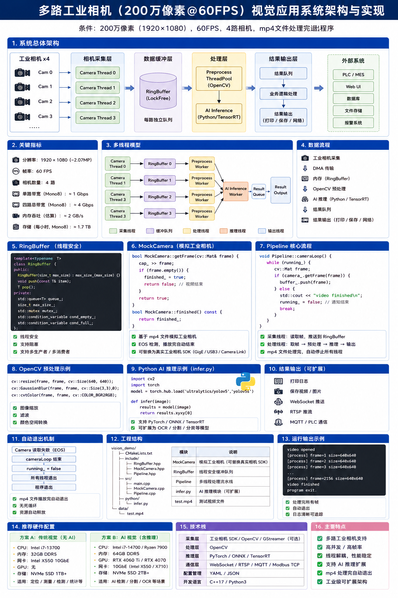

# 工业视觉系统资源评估

author： 周均扬

date： 2026.05.26

---

以典型工业视觉系统为例，对 **4 路海康工业相机（200 万像素，60FPS）** 的带宽、内存、CPU/GPU、PCIe 与存储资源进行系统估算。

假设条件：

* 分辨率：200 万像素（1920×1080）
* 帧率：60 FPS
* 相机数量：4 路
* 接口：GigE / USB3 常见工业相机
* 图像格式：

  * Mono8（灰度 8bit）
  * RGB8（彩色 24bit）
* 应用场景：

  * 实时采集
  * OpenCV 处理
  * AI 推理（YOLO / OCR / Defect Detection）

---

## 1. 基础图像数据量计算

### 1. 单帧数据量

图像数据量公式：

$Data_{frame}=Width \times Height \times BitDepth / 8$


### 2. 200万像素图像

#### 分辨率

通常： $1920 \times 1080 = 2,073,600$

约等于：* 2.07 MP

---

## 2. 带宽计算


### 情况1：Mono8 灰度图

每像素：* 8 bit = 1 Byte

因此：$Data_{frame}=1920 \times 1080 \times 1$

得到：* 2,073,600 Bytes ≈ 2 MB / frame


#### 单路实时带宽

公式：$Bandwidth=FrameSize \times FPS $

代入：$2MB \times 60 = 120MB/s$

即：* 单路 ≈ 120 MB/s

换算网络：$120 \times 8 = 960Mbps$

即：* ≈ 1Gbps

这意味着：结论（Mono8）单个 200万@60FPS 相机：* 已接近 GigE 极限

因此：

* 普通千兆网卡非常危险
* 必须：

  * Jumbo Frame
  * 独立网卡
  * 网卡中断优化
  * 大缓存

工业现场通常：

* 2.5GbE
* 5GbE
* 10GbE

更稳。

---

####  4路相机总带宽


单路：* 120 MB/s

4路：$120 \times 4 = 480MB/s$

即：* 480 MB/s ≈ 3.84 Gbps


### 情况2：RGB8 彩色

RGB8：* 3 Byte/pixel

单帧：$1920 \times 1080 \times 3 \approx 6MB$

单路：$6MB \times 60 = 360MB/s$

4路：$360 \times 4 = 1440MB/s$

即：* 1.44 GB/s ≈ 11.5 Gbps

---

## 3. PCIe 与内存带宽压力

视觉系统真正的瓶颈不是 CPU，而是：

* DMA
* 内存带宽
* PCIe
* Cache miss
* GPU Copy

---

## 4. 内存吞吐估算

视觉系统一般的数据路径： 相机 → DMA → RAM → OpenCV → GPU → AI推理

通常至少发生：

| 阶段       | 次数 |
| -------- | -- |
| DMA写入    | 1  |
| OpenCV处理 | 1  |
| GPU上传    | 1  |
| 推理输出     | 1  |

通常：

* 实际内存吞吐 ≈ 原始图像 3~5 倍


### Mono8 情况

原始：* 480 MB/s， 实际内存压力：$480 \times 4 = 1920MB/s$， 约* 2 GB/s 内存吞吐


### RGB8 情况

原始：* 1.44 GB/s，实际：$1.44 \times 4 \approx 5.8GB/s$， 即：* 5~6 GB/s 内存吞吐

---

## 5. CPU资源评估


### 1. 纯采集

如果：

* SDK DMA
* 零拷贝
* 不做算法

CPU很低：

| 任务   | CPU   |
| ---- | ----- |
| 4路采集 | 5~15% |

前提：

* i7 / Ryzen 级别


### 2. OpenCV处理

例如：

* resize
* threshold
* morphology
* contour
* edge

经验值：

| 算法       | CPU        |
| -------- | ---------- |
| 轻量OpenCV | 2~5 cores  |
| 复杂传统视觉   | 6~12 cores |


### 3. AI推理

例如：

* YOLO
* OCR
* Segmentation

此时，CPU 不再是主力，GPU 成为核心。

---

## 6. GPU资源估算


### YOLO 类推理

例如：

* YOLOv8
* 640 输入
* TensorRT FP16

经验：

| GPU     | 单路FPS       |
| ------- | ----------- |
| RTX3060 | 150~250 FPS |
| RTX4060 | 250~400 FPS |
| RTX4070 | 400~600 FPS |


### 当前需求

4路 × 60FPS：$4 \times 60 = 240FPS$，即系统总吞吐：240 FPS

推荐GPU

| 应用     | GPU建议        |
| ------ | ------------ |
| 传统视觉   | 无需GPU        |
| 轻量AI   | RTX3060      |
| 稳定工业AI | RTX4060/4070 |
| 多模型并发  | RTX4080      |

---

## 7. 存储带宽估算

如果录像：

### Mono8

480 MB/s，每小时：$480 \times 3600 \approx 1.7TB$

### RGB8

1.44 GB/s，每小时：$1.44 \times 3600 \approx 5.2TB$

---

## 8. 工程上的真实瓶颈

工业现场真正容易炸的地方：

### 1. 网卡中断风暴

GigE：

* PPS 极高
* CPU软中断暴涨

必须：

* RSS
* 中断绑核
* Jumbo Frame


### 2. Python GIL

4路60FPS：

* Python线程容易卡死

必须：

* C++采集
* Pybind11
* RingBuffer


### 3. GPU Copy

真正耗时，不是推理，而是：RAM → GPU

因此：

* pinned memory
* zero copy
* batch inference

非常关键。

---

## 9. 推荐硬件配置


### 方案A：传统视觉

| 硬件  | 建议               |
| --- | ---------------- |
| CPU | i7-13700         |
| 内存  | 32GB DDR5        |
| 网卡  | Intel X550 10GbE |
| GPU | 无                |
| SSD | NVMe Gen4        |


### 方案B：AI视觉

| 硬件  | 建议                    |
| --- | --------------------- |
| CPU | i7-14700 / Ryzen 7900 |
| 内存  | 64GB                  |
| GPU | RTX4060Ti / 4070      |
| 网卡  | 10GbE                 |
| SSD | 2TB NVMe Gen4         |


## 10. 系统架构建议

推荐架构：

```text
Camera SDK (C++)
        ↓
DMA Zero Copy
        ↓
LockFree RingBuffer
        ↓
OpenCV Preprocess
        ↓
TensorRT Batch Infer
        ↓
Result Queue
        ↓
PLC/MES/Robot
```

---

## 11. 结论

### 4路 200万 @60FPS 的真实资源量级

| 项目    | Mono8   | RGB8     |
| ----- | ------- | -------- |
| 原始带宽  | 480MB/s | 1.44GB/s |
| 网络    | ≈4Gbps  | ≈12Gbps  |
| 内存吞吐  | ≈2GB/s  | ≈6GB/s   |
| 磁盘/小时 | 1.7TB   | 5.2TB    |
| CPU   | 8~16线程  | 16线程+    |
| GPU   | 可选      | 强烈建议     |
| 推荐网卡  | 10GbE   | 10GbE以上  |

---

## 12. 工业现场经验结论

这个规模已经：

* 不再是“普通视觉”
* 而是“小型实时视觉服务器”

系统设计重点：

1. 零拷贝
2. DMA
3. RingBuffer
4. NUMA
5. GPU Pipeline
6. TensorRT
7. 多线程调度
8. PCIe拓扑

这些比“算法本身”更重要。


**工业视觉应用资源评估**

