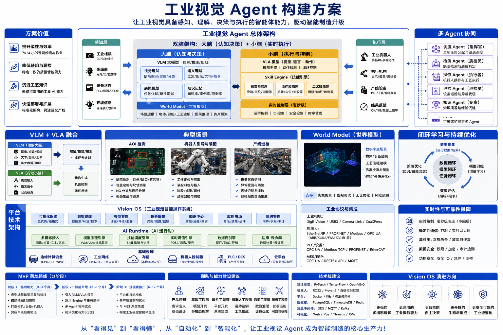

# 工业视觉AI Agent构建方案

author： 周均扬

date: 2026.05.27

---

构建工业视觉 Agent 的核心在于将高精度的机器视觉检测能力与大语言模型（LLM）的逻辑推理、决策能力相结合，实现“感知-理解-决策-执行”的端到端闭环。

## 1. 总体架构设计

### 1. 工业视觉Agent核心构建理念

- 核心能力融合：构建工业视觉Agent的核心在于将高精度机器视觉检测能力与大语言模型（LLM）的逻辑推理、决策能力相结合。

- 端到端闭环实现：通过“感知-理解-决策-执行”的端到端闭环，实现工业场景下的智能化检测、分析与控制。

- 总体架构设计必要性：为保障闭环流程高效运行，需进行科学的总体架构设计，明确各层级功能与协作机制。

### 2. 四层分层设计: 感知-理解-决策-执行

#### 感知层
 
- 数据源连接： 实时连接工业相机、设备传感器、MES系统等各类数据源，确保数据采集的全面性与及时性。
 
- 数据获取内容： 获取高分辨率图像、视频流和生产状态等关键数据，为后续的分析处理提供坚实的数据基础。

#### 理解层
 
- 图像深度解析：利用多模态大模型对图像进行深度解析，可完成缺陷分类、位置定位、文字识别OCR等任务。
 
- 信息转化： 将图像的像素级信息转化为结构化语义，使机器能够理解图像所包含的具体内容和含义。

#### 决策层

- 推理依据：Agent依据生产规则、知识库（如缺陷库、8D报告库）等进行逻辑推理，确保决策的科学性和准确性。

- 决策内容： 根据推理结果决定是否报警、停机或触发工单，实现对生产过程中异常情况的及时响应和处理。

#### 执行层
 
- 指令下发对象： 将决策层生成的指令下发给MES、PLC或其他生产系统，实现对生产设备和流程的直接控制。
 
- 闭环控制实现： 通过指令的执行，完成从检测到控制的闭环流程，保障工业生产的稳定、高效运行。

---

## 2. 核心组件构建流程

### 1. 多模态视觉模型适配

#### 模型选型
 
- 轻量级多模态大模型选择： 选用适合工业场景的轻量级多模态大模型，以满足工业环境对实时性和计算资源的要求，确保在生产线上高效运行。
 
- 基于视觉大模型的微调： 基于视觉大模型，结合特定工艺数据进行微调（Fine-tuning），使其更好地适应工业场景中的缺陷检测、零部件组装定位等具体任务。

#### 图像预处理

- 分块检测方案的应用：采用分块检测（Block-based detection）方案，先对整体图像进行组件结构识别，再针对局部区域开展高清细节分析。

- 解决零件检测难题： 通过分块检测，有效处理零件尺寸小、瑕疵不明显的问题，提高对微小缺陷的检测准确性。

### 2. 知识库与领域模型构建

#### 文档结构化

- 多类型文档解析：对生产手册、质检标准、故障字典等各类文档进行解析，提取关键信息，为知识库构建奠定基础。

- 向量数据库建立知识库：将解析后的文档信息通过向量数据库建立知识库，为工业视觉Agent提供全面的知识支持，助力其进行准确的分析和决策。

#### 8D报告生成Agent

- 质量问题库集成：集成质量问题库，使Agent能够便捷地获取历史质量问题数据，为缺陷分析提供参考依据。

- 自动生成8D诊断报告： Agent自动分析缺陷图像，结合质量问题库中的信息，生成标准的8D诊断报告，提高质量问题处理效率。

### 3. Agent工作流(Workflow)编排

#### Prompt工程

- 大模型信息读取：设计合理的prompt，引导大模型读取产品设计文档和生产状态等相关信息，确保获取全面且准确的数据。

- 结合视觉检测结果生成分析建议： 让大模型结合视觉检测结果，自动生成符合业务逻辑的分析和建议，为生产决策提供有力支持。

#### 工具调用(Tool Use)

- 赋予外部能力：为Agent赋予外部能力，使其能够调用各种工具，拓展自身功能，更好地满足工业场景的需求。
 
- 调用API读取生产批次信息：例如调用API读取MES系统中的特定生产批次信息，获取详细的生产数据，辅助Agent进行更精准的分析和决策。

## 3. 典型工业视觉Agent应用场景

### 1. 智能外观质检
 
- 缺陷识别范围：可自动识别电子设备外壳、零部件的划痕、污渍、变形等多种外观缺陷类型。
 
- 技术实现方式： 结合工业视觉模型，对产品外观图像进行深度解析，实现高精度缺陷检测。
 
- 数据处理功能： 能够对识别出的缺陷进行自动分类统计，为质量分析提供数据支持。

### 2. 智能巡检预警
 
- 实时工况分析：通过摄像头实时采集关键设备图像信息，对设备工况进行持续分析。
 
- 异常情况检测： 可检测人员未穿戴防护服、设备漏油等违规及异常情况。
 
- 告警触发机制： 当检测到异常情况时，系统自动触发告警，及时提醒相关人员处理。

### 3. 智能化装配指导
 
- 工位状态分析：视觉系统实时分析当前装配工位的情况，获取装配进度及零部件状态等信息。
 
- 组装操作指导：Agent根据工位分析结果，向操作人员提供正确的组装步骤和操作指引。
 
- 错误动作定位： 对操作人员的错误动作进行精准定位，并给出纠正指引，确保装配质量。

---

## 4. 实施落地策略

### 1. 数据驱动
 
- 高质量标注数据的核心价值：工业级案例成功的关键在于高质量的标注数据，它是训练高精度视觉模型的基础，直接影响缺陷检测的准确率和稳定性。

- 高精度缺陷标注集的构建方法：建立高精度缺陷标注集需结合生产实际，对缺陷类型、位置、严重程度等进行精细化标注，可通过专业标注工具和人工复核确保数据质量。

### 2. 闭环流程
 
- 视觉能力与业务流程集成要点：将视觉能力与现有的ERP/MES等业务流程集成，实现数据互通与业务协同，打破信息孤岛，提升整体生产效率。
 
- 检测-报表生成-工单流转自动化实现：通过系统对接与流程配置，实现从视觉检测发现缺陷，自动生成分析报表，再到触发工单并流转至相关处理环节的全流程自动化。

### 3. 测试与调优

- 边缘场景的挑战与应对：边缘场景如光照变化、物体堆叠等会影响视觉检测效果，需针对性开展测试，识别并解决特殊情况下的检测问题。

- prompt与模型微调的方法： 针对边缘场景特点，进行prompt优化以引导模型更好理解任务，同时结合场景数据对模型进行微调，提升模型在复杂环境下的适应性和检测精度。

---

## 4. 总结与展望

- 工业视觉Agent构建方案核心回顾：方案围绕总体架构设计、核心组件构建流程、典型应用场景及实施落地策略展开，实现了“感知-理解-决策-执行”的端到端闭环。

- 工业领域应用前景与发展方向： 工业视觉Agent在智能质检、巡检预警、装配指导等领域应用前景广阔，未来将向更智能化、集成化、轻量化方向发展，助力工业生产效率和质量的进一步提升。

---
**工业视觉Agent构建方案**，让工业视觉具备感知、理解、决策与执行的智能体能力，驱动智能制造升级。

