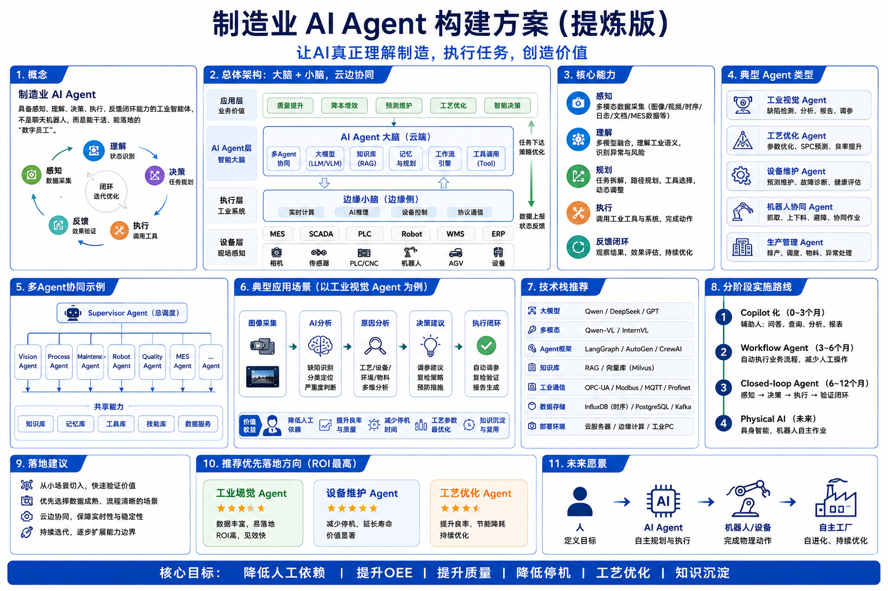

# 制造业AI Agent: 驱动智能升级的关键力量

author: 周均扬

date: 2026.05.28

---

## 1. 引言：制造业正处在转型升级的关键节点
在全球制造格局持续重构的背景下，中国制造业正面临一场深刻的转型升级浪潮。

一方面，原材料和人工成本不断上涨，传统以规模取胜的发展路径难以为继；另一方面，客户需求加速个性化、多样化，交付速度、产品质量与服务响应能力成为新竞争力的关键指标。如何在控制成本的同时，保持产品质量与运营效率，成为制造企业当前最大的挑战。

与此同时，数字化建设在制造企业中取得了一定进展，从ERP、MES 到SCADA、PLM等系统已经在不少工厂落地。然而，这些系统更多承担的是“数据记录”“流程管控”的角色，真正的业务执行仍高度依赖人工操作与经验判断。“系统有人管、流程靠人推”，成为制约效率提升与决策智能化的关键瓶颈。

人工智能的快速发展，尤其是AI Agent（智能体）技术的成熟应用，为制造企业提供了全新的突破路径。AI Agent 不再是一个“被动等待指令的工具”，而是一个可以主动理解任务、调用系统资源、执行流程动作并实时反馈结果的智能助手。它的出现，正在把制造业从“人操作系统”推向“系统自我驱动”的新阶段。

换句话说，AI Agent 正是从传统系统与人之间，架起了一座智能桥梁。它让机器更“懂业务”、流程更“自运转”、决策更“数据驱动”。对于正在进行精益管理、柔性制造、智能运维等转型升级的制造企业来说，AI Agent 并不是锦上添花的“前沿技术”，而是帮助企业穿越不确定性、构建长期竞争力的“关键部件”。

---

## 2. 什么是 AI Agent？制造业如何理解这一概念？

随着人工智能的不断演进，AI Agent（智能体）作为一种具备任务自主执行能力的系统，正逐步从技术讨论走入实际产业场景。

尤其是在制造业这样流程复杂、环节繁多、信息密度高的行业，AI Agent 已不仅是“概念”，而是具备实际落地价值的“数字助手”。

### 1. 通俗解释：从聊天机器人升级为“懂业务、会执行”的虚拟助理

过去大家提起“AI”，想到的大多是语音助手、客服机器人、文本生成工具等——它们“能对话”，但只能被动回应指令、无法理解流程，也不能真正推动业务。

而 AI Agent 是下一代智能系统的代表：它不仅能“听得懂、说得出”，更关键的是“看得清、干得动”——可以理解业务意图、制定执行计划、调取系统资源、完成任务动作，并根据结果调整策略。

比如，在制造业场景中，当你告诉 Agent：“请检查这台设备最近是否有异常预警”，它不仅能调取传感器数据，分析日志，还能结合历史记录判断风险级别，并将结论汇总成一份报告自动发送给设备负责人。

### 2. 技术本质：具备理解、规划、执行、反馈能力的智能系统

从系统架构上看，AI Agent 并非一个单点功能，而是围绕“完成任务”而构建的智能系统，核心包括四个环节：

- 理解能力（Understand）：通过大语言模型、知识图谱、行业知识库等手段，识别用户或系统的真实意图；
- 规划能力（Plan）：将目标任务拆解为多个可执行子任务，排序并组合形成合理的流程路径；
- 执行能力（Execute）：调用企业内部的系统接口（如MES、ERP、SCADA），或外部工具（如邮件、RPA、报表系统）完成动作；
- 反馈能力（Reflect）：实时获取执行结果，并根据状态判断是否需要修正、重试或通知人工介入。

这一逻辑非常契合制造场景中的“闭环作业模式”：从**发现问题** → **指令下发** → **执行任务** → **状态回传**，全流程自动化运行。

### 3. 制造业中的独特理解：Agent 是“生产运营中的数字人”

在制造业中，AI Agent 最直观的比喻就是“虚拟岗位”或“数字员工”：

- 它不是一个工具，而是一位‘不需要培训、不会跳槽’的数字助理；
- 它能值守设备、辅助工程、跟踪交付、分析报表，成为人力资源的延展；
- 更重要的是，它可以在不增加编制的前提下，让流程持续流转，信息自动同步，问题快速定位。

例如：

- 质检Agent每天早上8点自动整理昨日不良率数据并汇总至质量主管；
- 运维Agent监控生产线传感器数据，异常时触发维修工单并通知相关人员；
- 销售支持Agent根据ERP库存和客户订单趋势，预测产能瓶颈并预警至生产计划团队。

---

## 3. 工业制造中的六大典型应用场景

AI Agent 的核心优势在于“理解意图、执行任务、实时反馈”，这使得它天然适用于工业制造中大量需要流程闭环、反应及时、重复性高的任务场景。

以下是当前制造业落地 AI Agent 最具代表性的六大场景：

### 1. 设备巡检与预警 Agent

场景说明：传统设备巡检常依赖人工按周期查看运行状态、记录数据，不仅效率低，且难以及时发现隐性故障。

Agent 能力：

- 实时采集来自 SCADA/MES 系统或 IoT 传感器的运行数据（如温度、振动、电流等）；
- 基于历史标准、模型规则，自动判断是否存在异常波动或故障趋势；
- 主动生成告警信息，并推送给维修工程师或设备负责人；
- 可结合视觉识别技术，对生产现场图像进行分析辅助判断。

### 2. 销售支持 Agent

场景说明：制造业订单复杂，销售人员在处理客户需求时需频繁查阅产品规格、调配库存、预估产能，效率低且易出错。

Agent 能力：

- 自动解析客户需求（如规格、工艺要求），从产品数据库中推荐匹配型号；
- 自动生成技术方案初稿、报价模板、BOM 清单草案；
- 查询实时库存与排产计划，协助销售做交期承诺；
- 自动撰写客户跟进邮件、会议纪要等文档。

### 3. 质量检测与报告生成 Agent

场景说明：质检流程中，常需人工判图、手动录入缺陷信息、撰写质检报告，不仅耗时，还容易遗漏。

Agent 能力：

- 接收来自视觉检测设备或人工上传的图像数据，识别缺陷种类与位置；
- 结合检测标准，自动判断是否合格并记录检测结果；
- 生成结构化检测报告，包括图示、文字说明、追溯编号等；
- 可支持图文混合输入、多语言输出，便于跨工厂协作。

### 4. 工单流转与执行 Agent

场景说明：维修工单、调度请求等常通过人工分派和手动跟踪，存在响应慢、执行效率低的问题。

Agent 能力：

- 接收来自各系统（如MES、设备系统）的任务请求（如异常报告、设备维护提醒）；
- 自动根据故障类型、人员排班、历史处理能力等信息分派工单；
- 跟踪任务执行进度，提醒滞后或异常；
- 与ERP、EAM（资产管理）系统对接，记录维修成本与耗材使用情况。

### 5. 生产数据分析与运营建议 Agent

场景说明：管理层需定期审阅报表、手动分析关键指标，如良品率、设备利用率等，洞察滞后，难以实时优化。

Agent 能力：

- 自动汇总来自MES/ERP等系统的数据，包括产量、工时、停机时长、不良品率等；
- 跨时段/跨车间进行趋势分析，识别产能瓶颈或流程异常；
- 输出图表+文字摘要的运营简报；
- 提出排产建议或人员调度优化策略。

### 6. 员工培训与安全知识问答 Agent

场景说明：一线员工更新安全知识、操作规范频率高，但传统培训形式周期长、覆盖低。

Agent 能力：

- 支持自然语言对话，为员工提供随问随答的知识检索服务（如“灭火器放在哪里？”）；
- 结合岗位角色推送个性化培训内容、考题与任务提醒；
- 自动记录学习情况、测评结果，并同步至人事/培训系统；
- 支持语音输入与移动端接入，便于现场随时使用。

---

## 4. AI Agent 如何融入制造业系统架构？

在制造业日益复杂的流程体系中，AI Agent 若无法嵌入现有IT/OT架构，只能停留在“边缘工具”角色，难以真正发挥价值。

因此，要让 Agent 成为生产与运营的“**智能齿轮**”，其核心任务在于：与企业主干系统深度集成，建立任务驱动闭环，并通过平台化管理支撑多Agent协同执行。

### 1. 对接主流工业系统，实现数据+任务的双向融合

制造企业的核心信息系统主要涵盖以下几个维度：

|系统类型 | 主要功能|	AI Agent 接入价值|
|----------------------|--------------------------------|---------------------------------------------|
|ERP（企业资源计划）|	财务、订单、库存、采购管理	| Agent 可读取工单、库存状态，自动触发采购、生成报表|
|MES（制造执行系统）|	产线排产、进度管理、物料跟踪 |	Agent 可辅助排产分析、监测产能瓶颈、生成产线报告|
|SCADA（监控与数据采集系统）|	设备状态、传感器数据、报警信息 |	Agent 可识别异常信号，触发巡检或维修流程|
|PLM（产品生命周期管理）|	技术资料、BOM管理、设计变更|	Agent 可快速查阅或更新物料信息，协助方案选型|
|SRM（供应商关系管理）|	供应商资质、报价、交期管理 |	Agent 可辅助比价、筛选供应商、生成询价单草稿|

通过与这些系统的数据接口打通，AI Agent 不再只是“收集信息的助手”，而是真正能参与决策和执行的“数字员工”。

### 2. 通过 API 接入，实现任务自动驱动与结果闭环

在集成逻辑上，AI Agent 通常不替代系统本身，而是作为“指挥者”调用系统资源，完成具体业务动作。

示意流程： 业务触发 → Agent 感知意图 → 查询系统数据 → 分析与判断 → 调用系统完成操作 → 返回执行结果或异常状态

### 3. 构建“AI Agent 调度平台”：支撑多Agent的统一管理

随着 Agent 数量增多、角色多样，制造企业将逐渐面临以下挑战：

- 如何统一设置 Agent 权限和行为规则？
- 如何查看每个 Agent 的状态与效果？
- 如何复用已有Agent模板，快速扩展新场景？

这就需要构建一个具备如下能力的 “AI Agent 调度与运营平台”，也可称为“Agent中台”：

|能力模块 |	功能说明 |
|----------------------|--------------------------------------------|
|配置中心 |	管理每个Agent的角色、权限、系统接口、运行环境|
|调度引擎 |	处理跨系统任务流转逻辑，实现任务分发与异步执行|
|监控看板 |	实时查看Agent状态、执行成功率、响应时长、告警信息|
|日志审计与权限管理 |	对接IT审计系统，记录行为轨迹，支持权限回溯与审批|
|知识/Prompt 管理器 |	统一管理不同Agent的Prompt模板、行业知识库与语料|

AI Agent 在制造业中不仅体现在“设备、流程、工单”的底层执行，更正在向客户前线、市场触达、销售支持等方向延伸。

许多制造型企业都有这样的感受： “生产效率提升了，问题是客户越来越难找、订单越来越碎，传统靠展会、电话、邮件的获客方式效率越来越低。”

这正是“营销型 AI Agent”介入的契机。

从产能智能化，到增长智能化，是制造企业下一阶段的关键跃迁。当 Agent 能够帮助企业在 LinkedIn 自动寻找潜在客户、在官网主动推荐解决方案、在客户旅程中编排内容触达节点，制造企业便不再依赖传统人力去“跑客户”，而是逐步形成一个以 Agent 为核心驱动的市场智能引擎。

## 5. 落地建议：制造企业如何启动 AI Agent 项目？

尽管 AI Agent 技术已趋于成熟，但在制造企业这样系统复杂、责任链条严格的场景中，部署任何智能系统都必须谨慎有序，才能真正实现降本增效、可控可用。以下是针对制造企业落地 AI Agent 项目的实用建议：

### 1. 从“非关键流程”试点，快速验证可行性

制造业的核心产线往往责任重大，不宜一上来就做“核心替换”。更稳妥的做法是：

- 从巡检日志撰写、质检报告生成、工单自动派发等非关键但重复性强的流程入手；
- 选取1~2个具体车间、部门或作业场景，部署“轻量型 Agent”，验证实际执行效果；
- 优先选择已有数字系统（如MES、ERP）中已有部分数据接口的场景，以简化接入流程。

### 2. 聚焦“有数据 + 高重复”的典型业务环节

AI Agent 的效率优势，最适合用于具备以下特点的工作流：

- 有结构化数据可供调用与分析（如传感器数据、ERP记录等）；
- 任务重复性高，流程固定或规则清晰（如报表生成、流程通知、初步判断）；
- 对响应时间或准确率要求高，但不涉及复杂主观判断。

### 3. 搭建“人 + Agent”混合流程，保障稳定运行

在AI Agent初期应用中，并不建议“全流程自动化”，而是构建“人机混合”的柔性流程：

- Agent 负责初步数据分析、信息提取、内容草拟、任务推送；
- 人工进行审核、判断与二次确认；
- 对于高风险或复杂异常，设置“人工兜底”机制自动触发干预；
- 重要指标设定“双通道监控”：由Agent与人工分别反馈结果，交叉验证。

### 4. 明确评估指标，用“数据”驱动迭代

试点项目是否成功，不能只靠“感觉好不好用”，而应建立清晰、量化的评估体系，常见指标包括：

|目标方向	| 可量化指标示例|
|--------------------|------------------------------------------|
|效率提升 |	日均任务处理数提升比、报表生成时间缩短比|
|准确性优化 |	错误派单率下降、工单补录减少|
|响应时效	| 故障响应平均时间下降、内容交付时间缩短|
|人力节省 |	每日节省人力工时数、重复任务替代比例|
|用户接受度 |	一线员工满意度、主动调用频次增长率|

企业可设定试点期如1~3个月，围绕这些指标进行数据采集与复盘，从中总结Agent设计优劣、接口配置问题、业务流程瓶颈，并为下一阶段扩展打下基础。

## 6. AI Agent 为制造企业带来的核心价值

随着制造企业加速迈向“数智化车间”与“高效运营体系”的目标，AI Agent 正逐渐成为连接数据、系统与人力之间的关键桥梁。

相比传统工具，Agent 的价值不仅体现在执行力提升，更在于其能重塑流程逻辑、释放组织潜能。

以下四个方面，是制造企业在落地AI Agent后最直观的收益表现：

### 1. 降本提效：释放重复劳动工时，让人力投入更有价值

制造业在设备维护、质量检测、报告编写、数据整理等流程中，普遍存在大量低决策、强重复的任务，严重消耗工程师与中后台人力的时间与注意力。

AI Agent 能够承担这些任务中的 80% 以上重复环节，例如：

- 自动生成巡检日志、质检报告；
- 快速填充BOM模板、匹配物料编号；
- 整合历史报价数据，生成新方案初稿。

### 2. 响应更快：打造“数据驱动”的流程闭环，减少等待与中断

传统制造流程中，很多动作依赖人工触发——等待巡检填写完毕、等工程师开会后下发工单、等品控主管整理完表格再汇报问题。这些“中断”极大拖慢了协作节奏。

AI Agent 的核心优势在于：任务识别 + 系统调度 + 自动执行。一旦集成至MES、ERP或巡检系统：

- 巡检数据出现异常，Agent 可实时通知维修团队；
- 客户下单后，Agent 自动生成对接计划、校对BOM清单、分发任务；
- 外部变更（如物料短缺）时，Agent 能推送排产重排建议并同步相关责任人。

### 3. 提升质量：标准化输出，降低人为偏差与经验依赖

许多制造流程中（如质检、售后文档、客户提案等）依赖于人工经验输出，常见问题包括：

- 新员工不熟流程，填报不规范；
- 不同班组文档口径不一致，影响追溯；
- 信息漏填、错填，导致后续执行误差。

### 4. 增强组织韧性：支持跨班组/跨时区协作，强化企业的“抗扰动能力”

制造企业常面临的另一个难题是：人员变动多、岗位替补难、协作链长。尤其在多地工厂、多时区生产体系中，单靠人工协调难以实现高效对齐。

AI Agent 具备天然的“7×24小时执行力”和任务接力机制：

- 夜班异常数据，Agent可在早班前汇总上报，跨班组无缝衔接；
- 某团队成员请假，Agent仍可协助下游完成标准任务（如报告、派单）；
- 跨国分支在非工作时间提交需求，Agent可先完成预处理，等人上线再审阅。

## 7. 未来展望：制造业 AI Agent 的进阶路径

当前，制造业部署AI Agent仍处在“从0到1”的探索期，试点多为单场景、单任务的替代或优化。然而，随着底层技术的成熟、组织数字素养的提升，以及Agent平台的不断进化，制造企业将在未来迎来一场由“工具级自动化”迈向“系统级智能化”的深度变革。

以下四大发展方向，勾勒出制造业AI Agent未来演进的关键路径：

### 1. 多Agent协同工作流将成主流：重构“端到端”运营链

从巡检、维修、质检，到采购、库存、销售等环节，制造企业的每个环节都具备被Agent重构的可能性。而真正释放AI Agent潜力的，不是孤立部署某一个Agent，而是构建由多个Agent协同联动的“虚拟工作团队”。

典型协同工作流如：

- 设备巡检Agent → 异常诊断Agent → 工单派发Agent：完成从发现问题到处理闭环的自动执行。
- 销售支持Agent → 产能匹配Agent → 交付预测Agent：提升从接单到排产的反应速度与精准度。
- 供应链Agent → 库存优化Agent → 报价Agent：实现供应链波动下的快速应对与报价调整。

### 2. 结合边缘计算与IoT，实现“云边协同”的智能体架构

制造企业在现场设备、传感器、PLC系统中积累了大量数据资产，而这些数据往往无法实时上传至云端进行处理。在这种场景下，“边缘智能”将成为Agent发展的关键趋势。

未来的AI Agent架构将呈现出典型的“云+边+端”协同模式：

- 边缘侧Agent：部署于现场终端或边缘服务器，负责实时采集、分析、预判（如机器震动异常检测、温度预警）；
- 云端Agent：处理复杂决策任务，如全厂级产线排程、跨工厂协同、战略性数据建模；
- IoT协同接口：实现设备→Agent→系统的无缝触发与反馈，保障决策的即时性与可执行性。

### 3. 垂直行业 Agent 平台化发展：形成“知识库+组件库”双轮驱动

未来制造业AI Agent不会再是“一个个单独训练、重复搭建”的项目，而将走向平台化与行业化，尤其是在汽车、医械、电子、新材料等高规范行业，企业将更倾向选择：

- 行业知识库：内嵌标准流程、合规规范、工艺术语等行业经验，保障Agent专业性；
- 功能组件库：封装常见任务模块，如质检报告生成器、BOM比对引擎、巡检流程引擎等，可视化配置、低代码集成；
- 安全权限与运营接口：统一权限管理、审计日志与人工兜底机制，满足大企业级部署要求。

### 4. 从单点部署走向“智能工厂中台”战略：实现企业级 Agent 运营体系

Agent 数量的快速增长、应用范围的不断扩大，将迫使制造企业思考一个核心问题：如何治理与调度这些Agent？

这也将促使制造企业迈向“智能工厂中台”战略——构建统一的 Agent 管理、监控与调优平台，实现：

- Agent 的统一注册、配置、权限控制；
- 多业务线Agent的调用编排与资源调度；
- Agent行为日志追踪、效果评估与迭代优化；
- 多角色（管理、IT、业务部门）的协同管理与反馈通道。

---

## 结语：制造企业的智能进化，从Agent起步
制造业正处在一个向智能化跃迁的转折点，而AI Agent的出现，为这场跃迁带来了新的技术抓手与组织路径。它不仅是自动化的延续，更是智能协作的开端。

---
**制造业AI Agent构建方案**，让AI真正理解制造，执行任务，创造价值。

