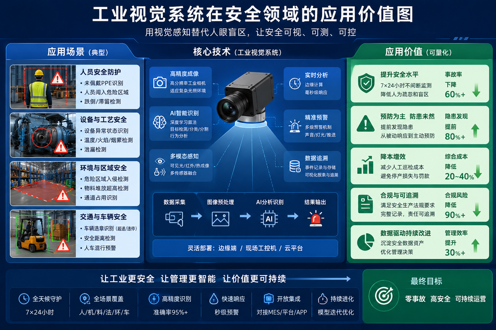

# 工业视觉系统在工业安全领域的应用

author: 周均扬

date： 2026.06.02

---

工业视觉系统（Industrial Vision System, IVS）在工业安全领域的应用正变得越来越关键。结合机器视觉、AI分析和自动化控制，它不仅能替代传统人工巡检，还能在危险环境中提供高精度、安全、高效的监控与预警能力。

---

## **1. 应用场景**

### 1. **设备状态监测**

* **目标**：通过视觉系统实时监控设备运行状态，发现异常情况。
* **实现方式**：

  * 高速工业相机拍摄设备关键部位。
  * AI/算法分析检测异常振动、漏油、过热、磨损、火花等。
* **典型场景**：发电厂、化工厂、矿山机械。

### 2. **人员行为监控**

* **目标**：保障员工安全，防止违章操作。
* **实现方式**：

  * 视觉系统检测佩戴安全帽、手套、防护服等。
  * 利用人体姿态识别检测危险行为，如进入禁区、靠近旋转机械。
* **典型场景**：重工、建筑施工、仓储物流。

### 3. **危险环境监测**

* **目标**：在高温、高压、有毒、有辐射等环境下，实时感知安全隐患。
* **实现方式**：

  * 红外/热成像摄像机检测高温区域。
  * 气体、火焰检测视觉融合，实现早期报警。
* **典型场景**：化工厂、炼油厂、电力变电站。

### 4. **产品安全与缺陷检测**

* **目标**：保障产品符合安全标准，防止安全事故。
* **实现方式**：

  * 检测焊接、装配、封装是否符合规范。
  * 检测机械零件的裂纹、变形、错位。
* **典型场景**：汽车制造、电子装配、食品包装。

### 5. **仓储与物流安全**

* **目标**：降低搬运、堆放、叉车作业事故。
* **实现方式**：

  * 视觉系统监控堆码高度、通道障碍、人员路径。
  * 自动识别危险行为，如叉车超速、堆放不稳。
* **典型场景**：大型仓储中心、港口物流。

---

## **2. 技术优势**

1. **实时性强**

   * 高速相机与GPU加速算法可实现毫秒级响应。
2. **精度高**

   * 结合3D视觉和深度学习，可检测毫米级缺陷或微小异常。
3. **可替代危险人工**

   * 在高温、高压、有毒环境下代替人工巡检。
4. **数据可追溯**

   * 图像和分析结果可存档，便于事后分析和事故责任认定。
5. **可扩展性**

   * 与工业自动化系统、MES、SCADA等系统无缝集成，形成闭环安全管理。

---

## **3. 潜在价值**

| 价值类型      | 具体体现                   |
| --------- | ---------------------- |
| **安全价值**  | 提前发现隐患，减少工伤事故和设备损坏。    |
| **经济价值**  | 降低因事故导致的停机、维修、赔偿成本。    |
| **管理价值**  | 数据化安全管理，实现标准化操作监督。     |
| **社会价值**  | 提高企业安全形象，符合政策法规要求。     |
| **智能化价值** | 为工业数字化、智能化提供基础数据和算法支撑。 |

---

## **4. 发展趋势与前景**

1. **AI与大数据融合**

   * 从规则检测 → AI预测维护和异常预测，提高预测准确性。
2. **3D视觉与多模态融合**

   * 红外、深度、激光点云与普通视觉结合，实现复杂场景监控。
3. **工业安全数字孪生**

   * 将视觉数据融入数字孪生模型，实现虚拟仿真和风险预测。
4. **无人巡检与机器人结合**

   * 工业机器人、巡检无人机搭载视觉系统，实现全覆盖安全巡检。

---

总结来说，工业视觉系统不仅是工业自动化的感知基础，更在工业安全中发挥“智能眼睛”的作用。通过实时监测、风险预警、数据分析，它能显著降低事故发生率、提升设备寿命与运营效率，同时为工业企业的数字化转型和智能化发展提供核心支撑。

---
**“工业视觉系统在安全领域的应用价值图”**

