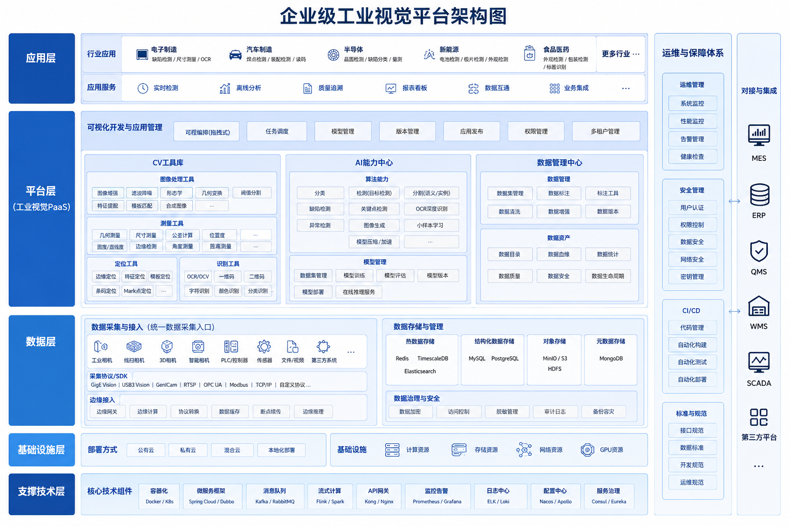

# 企业级工业视觉平台

author: 周均扬

date： 2026.06.05

---

从**企业级工业视觉平台**的整体架构和实现方案入手，覆盖数据采集、算法工具库、AI功能、可扩展性和运维管理。

---

## 1. 平台总体目标

* **统一入口**：整合各类工业相机、3D相机、传感器，实现统一数据采集接口。
* **丰富CV工具库**：提供图像预处理、特征提取、测量、匹配、目标检测等工业视觉常用算法模块。
* **AI能力**：支持目标检测、分割、缺陷识别、预测性维护、视觉定位等AI功能。
* **高可扩展性**：模块化架构，支持插件式功能扩展。
* **可视化与运维**：提供管理控制台、实时数据可视化、日志监控和远程调试能力。

---

## 2. 平台架构设计

### 2.1 系统架构图

```
 ┌─────────────────────────────┐
 │       企业级工业视觉平台       │
 └─────────────────────────────┘
             │
             ▼
 ┌─────────────────────────────┐
 │       数据采集层             │
 │ ┌─────────┐  ┌─────────┐  │
 │ │ 相机SDK │  │ 传感器 │  │
 │ └─────────┘  └─────────┘  │
 │    支持 GigE / USB3 / CoaX │
 └─────────┬───────────────────┘
           │
           ▼
 ┌─────────────────────────────┐
 │      数据处理与工具库层      │
 │ ┌─────────┐ ┌────────────┐ │
 │ │ 图像预处理│ │ 特征提取 │ │
 │ │ 图像增强 │ │ 匹配/测量 │ │
 │ │ 去噪/滤波│ │ 工业算法 │ │
 │ └─────────┘ └────────────┘ │
 └─────────┬───────────────────┘
           │
           ▼
 ┌─────────────────────────────┐
 │       AI功能层               │
 │ ┌────────────┐ ┌─────────┐ │
 │ │ 缺陷检测    │ │ 分割     │ │
 │ │ 目标识别    │ │ 预测维护 │ │
 │ │ 视觉定位    │ │ 质量评估 │ │
 │ └────────────┘ └─────────┘ │
 └─────────┬───────────────────┘
           │
           ▼
 ┌─────────────────────────────┐
 │       可视化与管理层         │
 │ ┌─────────────┐ ┌─────────┐│
 │ │ 实时监控面板 │ │ 日志管理││
 │ │ 任务调度    │ │ 报警管理││
 │ └─────────────┘ └─────────┘│
 └─────────────────────────────┘
```


### 2.2 核心模块设计

#### 数据采集层

* **功能**：统一各类工业设备接口，支持多线程、多相机、高帧率采集。
* **特性**：

  * 标准化接口：提供统一的C++/Python SDK调用方式。
  * 支持零拷贝和异步模式，保证高性能。
  * 数据缓存与回放功能，支持调试与回溯分析。

#### 数据处理与CV工具库

* **功能**：提供工业常用计算机视觉算法，形成基础工具库。
* **模块**：

  * 图像增强：去噪、滤波、HDR、去畸变。
  * 特征处理：边缘检测、角点检测、模板匹配、形态学处理。
  * 测量与校正：亚像素精度标定、几何测量。
  * 视频处理：帧间差分、跟踪算法、多相机同步。

#### AI功能层

* **功能**：工业AI算法，支持训练与推理部署。
* **模块**：

  * 缺陷检测：表面划痕、气泡、裂纹检测。
  * 目标检测：零件定位、分类、计数。
  * 分割：精准分割工业部件轮廓。
  * 预测性维护：分析设备视觉数据预测故障。
* **特性**：

  * 支持GPU加速、TensorRT/ONNX推理。
  * 支持在线学习和持续优化。
  * AI模块插件化，易于增加新模型。

#### 可视化与管理层

* **功能**：可视化控制平台和运维管理。
* **模块**：

  * 实时监控：图像、视频、AI结果。
  * 任务调度：批量采集、分析、报告生成。
  * 报警管理：阈值告警、异常通知。
  * 日志管理：采集日志、AI推理日志、操作日志。
* **接口**：

  * Web/桌面客户端，支持远程访问和操作。
  * API接口：与MES/ERP系统集成。


### 2.3 技术栈建议

| 层级     | 技术选型                                        |
| ------ | ------------------------------------------- |
| 数据采集   | C++ SDK、Python接口、多线程、ZeroMQ数据总线             |
| CV工具库  | OpenCV、Halcon、PCL（3D点云）                     |
| AI功能   | PyTorch、TensorFlow、ONNX Runtime、TensorRT    |
| 数据管理   | PostgreSQL/TimescaleDB、Redis缓存              |
| 可视化与管理 | Vue.js/React + Electron/WebSocket + Grafana |
| 系统与容器化 | Docker/Kubernetes、CI/CD流水线                  |


### 2.4 可扩展性与工业落地

* **插件化架构**：每个AI模型或CV模块可独立升级。
* **多设备支持**：通过抽象设备接口，可接入不同品牌相机。
* **跨平台部署**：支持边缘计算（工控机）和云端部署。
* **安全与权限**：支持用户权限管理和数据访问控制。

---

**完整的企业级工业视觉平台架构图**，把数据流、模块、线程和AI功能直观可视化，方便汇报和团队交流。

