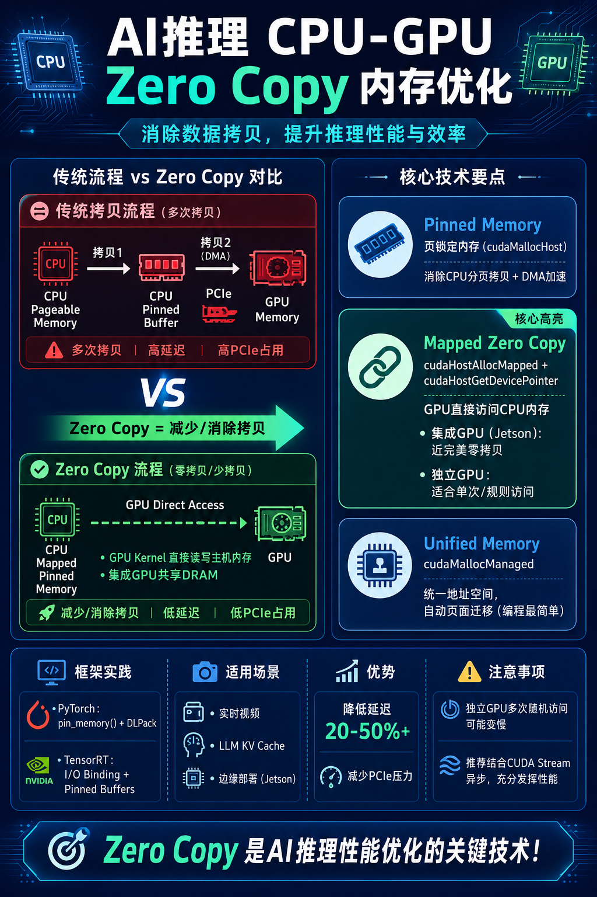

# 在AI推理中CPU和GPU之间的“zero copy”（零拷贝）

author： 周均扬

date: 2026.06.07

---

**在AI推理中，CPU和GPU之间的“zero copy”（零拷贝）是指避免不必要的数据复制操作，直接让GPU访问CPU侧内存（或共享内存），从而减少PCIe传输开销、降低延迟和CPU占用。** 传统流程中，数据从CPU pageable内存 → pinned缓冲 → GPU显存需要多次拷贝，zero copy能显著优化，尤其适合输入/输出频繁或内存受限的推理场景（如实时视频、LLM KV Cache等）。

## 1. 核心技术原理
- **Pinned Memory（页锁定内存）**：基础。通过 `cudaHostAlloc` 或 `cudaMallocHost` 分配不可分页内存，GPU可通过DMA直接访问，避免CPU内部分页拷贝（pageable memory 会额外拷贝到临时pinned缓冲）。
- **Zero-Copy Mapped Memory**：在pinned内存基础上，使用 `cudaHostAlloc(..., cudaHostAllocMapped)` 分配，然后 `cudaHostGetDevicePointer()` 获取GPU可直接访问的设备指针。GPU kernel 可直接读写主机内存（通过PCIe），无需显式 `cudaMemcpy`。
  - **集成GPU（如Jetson系列）**：CPU和GPU共享物理DRAM，zero copy效果最佳，几乎消除拷贝（真正意义上的零拷贝）。
  - **独立GPU（discrete GPU，如RTX系列）**：仍需通过PCIe总线访问主机内存，适合“读/写仅一次”、内存受限或不规则访问场景。多次随机访问性能差（无GPU缓存）。

- **Unified Memory (cudaMallocManaged)**：统一虚拟地址空间，CPU/GPU使用相同指针，系统自动分页迁移。编程简单，但有迁移开销，不是严格zero copy。

## 2. AI推理框架中的实现方式
- **PyTorch**：
  - 使用 `tensor.pin_memory()` 加速H2D传输（异步+DMA）。
  - Jetson等共享内存设备上，结合pinned/zero-copy缓冲避免 `to('cuda')` 拷贝。
  - 高级：DLPack / CUDA Array Interface 实现框架间zero-copy tensor共享；自定义unified tensor支持zero-copy访问。
  - 示例：预分配pinned缓冲，CPU填充数据后直接传设备指针给模型。

- **TensorRT / Torch-TensorRT**：
  - I/O Binding + pinned/CUDA pinned内存实现异步zero-copy输入输出。
  - 预分配输入/输出缓冲，绑定后避免运行时拷贝。

- **ONNX Runtime**：
  - 支持 `CudaPinned` 内存类型，实现异步zero-copy。
  - Device tensors 避免中间结果拷回CPU。

- **其他**：
  - **Android/移动端**（如NCNN GPU）：使用Android Hardware Buffer (AHB) 共享内存实现zero-copy。
  - **存储侧**：GPUDirect Storage (GDS) + RDMA，实现从NVMe/网络直接zero-copy到GPU（绕过CPU内存）。

## 3. 代码示例（CUDA基础）
```cpp
// 分配mapped pinned内存
void* h_data;
cudaHostAlloc(&h_data, size, cudaHostAllocMapped | cudaHostAllocWriteCombined);  // WriteCombined可选优化写
float* d_data;
cudaHostGetDevicePointer(&d_data, h_data, 0);  // 获取GPU指针

// Kernel直接使用d_data（zero copy）
my_kernel<<<grid, block>>>(d_data, ...);
```

**Python/PyTorch** 中可通过 `torch.utils.cpp_extension` 或直接用CUDA扩展实现类似逻辑。

## 4. 注意事项与权衡
- **适用场景**：输入数据大、仅访问一次、预处理在GPU上完成、KV Cache offload 等。多次访问或compute-bound kernel 可能因无缓存而变慢。
- **性能**：集成GPU上提升可达数倍；独立GPU上视访问模式而定（通常20-50%+）。
- **缺点**：GPU直接访问主机内存带宽受PCIe限制；CPU占用可能略高（零拷贝模式下GPU kernel 访问主机内存）。
- **最佳实践**：
  - 结合CUDA Stream异步执行。
  - 预分配缓冲池（避免运行时分配）。
  - 对于LLM：KV Cache 分层（GPU → CPU → NVMe），用zero-copy传输。
  -  profiling 用 Nsight Systems/Compute 检查拷贝瓶颈。

在实际AI推理部署中（如YOLO实时推理、LLM serving），**pinned + mapped zero-copy + GPU preprocess** 是常见优化组合，能显著降低端到端延迟。

----
**AI推理CPU-GPU Zero Copy内存优化**，消除数据拷贝，提升推理性能与效率。

