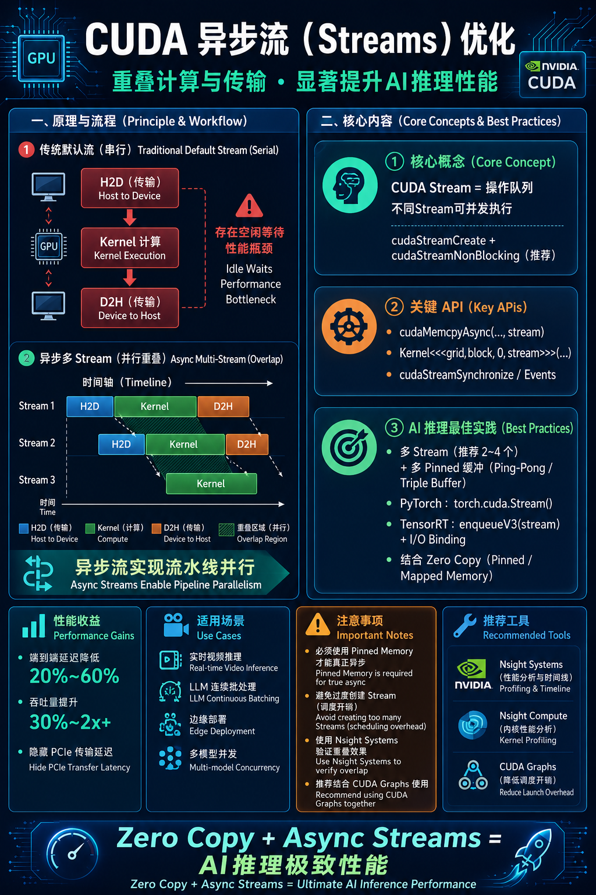

# **CUDA异步流（CUDA Streams）优化**  
——AI推理性能优化的核心并行技术

author: 周均扬

date: 2026.06.07

---

## 1. 为什么需要CUDA Streams？

在GPU上，默认所有操作（kernel执行、内存拷贝、事件）都属于**默认流（Default Stream / NULL Stream）**，这些操作是**串行**的。即使GPU有很强的并行能力，H2D（Host-to-Device）、D2H（Device-to-Host）、Kernel计算之间也无法重叠。

**CUDA Stream** 的核心价值在于：
- **实现异步执行**：不同Stream的操作可以**并发**进行。
- **重叠计算与传输**（Overlap Compute & Transfer）：让数据传输和kernel计算同时进行，隐藏PCIe传输延迟。
- **提升整体吞吐量和降低端到端延迟**：在AI推理中尤其重要（批量处理、流水线、多模型并发等）。

典型收益：在AI推理中，合理使用Stream可将端到端延迟降低 **20%~60%**，吞吐提升 **30%~2x**（取决于模型和硬件）。

### 2. CUDA Stream 基础概念

- **Stream**：一系列操作的队列，这些操作按提交顺序在GPU上执行，但不同Stream之间可以并行
- **默认流**：阻塞式的（同步点多），适合调试。
- **非默认流**：异步的，支持并发。

**关键API**（CUDA Runtime）：
```cpp
cudaStream_t stream;
cudaStreamCreate(&stream);                    // 创建
cudaStreamCreateWithFlags(&stream, cudaStreamNonBlocking);  // 推荐：非阻塞
cudaStreamDestroy(stream);

// 异步操作
cudaMemcpyAsync(d_data, h_data, size, cudaMemcpyHostToDevice, stream);
kernel<<<grid, block, 0, stream>>>(...);
cudaMemcpyAsync(h_out, d_out, size, cudaMemcpyDeviceToHost, stream);
```

## 3. AI推理中的异步流优化实战

### 1. **经典三阶段流水线重叠**
在推理中典型流程：
1. H2D（输入传输）
2. Kernel计算（前向推理）
3. D2H（输出传输）

使用多个Stream + 环形缓冲（Ping-Pong / Triple Buffering）可以实现三者高度重叠。

**推荐架构**（多Stream + 多缓冲）：
- 预分配 N 个 pinned 输入/输出缓冲 + N 个 Stream（N通常取 2~4，过多会增加调度开销）。
- CPU 填充缓冲 → 异步 H2D → 异步 Kernel → 异步 D2H → CPU后处理。

### 2. PyTorch 中的异步流优化
```python
import torch

# 创建Stream
stream = torch.cuda.Stream()

with torch.cuda.stream(stream):
    # 在此Stream中执行
    gpu_tensor = pinned_tensor.to('cuda', non_blocking=True)
    output = model(gpu_tensor)

# 等待特定Stream完成
stream.synchronize()
# 或使用事件
event = torch.cuda.Event(enable_timing=True)
event.record(stream)
event.synchronize()
```

**高级**：`torch.cuda.Stream` 结合 `torch.compile`、`torch.utils.data.DataLoader(pin_memory=True, num_workers=...)` 实现端到端异步流水线。

### 3. TensorRT 中的异步执行
TensorRT 是异步流优化的典范：
```cpp
// 创建执行上下文
IExecutionContext* context = engine->createExecutionContext();

// 绑定多个Stream
cudaStream_t stream;
cudaStreamCreate(&stream);

context->enqueueV3(stream);   // 或 execute_async_v2
cudaStreamSynchronize(stream);
```

结合 **I/O Binding + Pinned Memory + 多Stream** 是工业级高性能推理的标准做法。

## 4. 高级优化技巧

1. **Stream Priority（流优先级）**
   ```cpp
   cudaStreamCreateWithPriority(&high_stream, cudaStreamNonBlocking, -1); // 高优先级
   ```
   适合把关键路径（推理kernel）放入高优先级Stream。

2. **CUDA Events（事件同步）**
   - 用于精细控制依赖关系，而不阻塞整个Stream。
   - `cudaEventRecord`、`cudaEventSynchronize`、`cudaStreamWaitEvent`。

3. **Graph Capture（CUDA Graphs） + Stream**
   - CUDA 10.0+ 引入，捕获一系列kernel操作成Graph，降低CPU launch overhead。
   - 在LLM推理中结合Stream使用，可极大提升小批量推理性能。

4. **多GPU + Multi-Stream**
   - NCCL + Stream 实现数据并行/流水线并行（Pipeline Parallelism）。

5. **Memory Pool + Stream**
   - 使用 `cudaMallocAsync`（CUDA 11.2+）结合Stream，实现异步内存分配，减少分配开销。

## 5. 最佳实践与注意事项

**推荐配置**：
- **Stream数量**：2~4 个（过多收益递减）。
- **缓冲区**：使用 **Pinned + Mapped** 内存（与Zero Copy结合）。
- **Profiling**：必须使用 **Nsight Systems** 查看 Timeline，确认 Compute/Transfer 是否真正重叠。
- **异步程度**：CPU 端使用 `non_blocking=True`，避免频繁 `synchronize()`。

**常见坑**：
- 在默认流中混用同步操作会导致所有Stream阻塞。
- 过多Stream导致GPU调度压力增大。
- 未正确使用Pinned Memory → 异步拷贝实际退化为同步。
- 资源竞争：多个Stream同时访问同一块内存需小心（使用Events同步）。

**性能指标参考**（RTX 4090 / A100 典型场景）：
- 单Stream + 同步：100 ~ 200 FPS（YOLO示例）
- 3 ~ 4 Stream + 异步 + Zero Copy：可达 300~500+ FPS

## 6. 未来趋势

- **CUDA Graphs + Stream** 成为标配（PyTorch 2.0+ 已深度集成）。
- **NVIDIA Hopper/Blackwell** 架构对多Stream和Async Copy（`cudaMemcpyAsync` 硬件加速）支持更强。
- **Unified Memory + Stream** 的智能预取和迁移优化持续改进。

---

**总结**：**Zero Copy 解决“拷贝开销”问题，CUDA Async Stream 解决“串行等待”问题**。两者结合 + CUDA Graphs，是当前AI推理（尤其是实时和LLM serving）最高性能的组合。

**CUDA 异步流优化流程图**，重叠计算与传输，显著提升AI推理性能。

