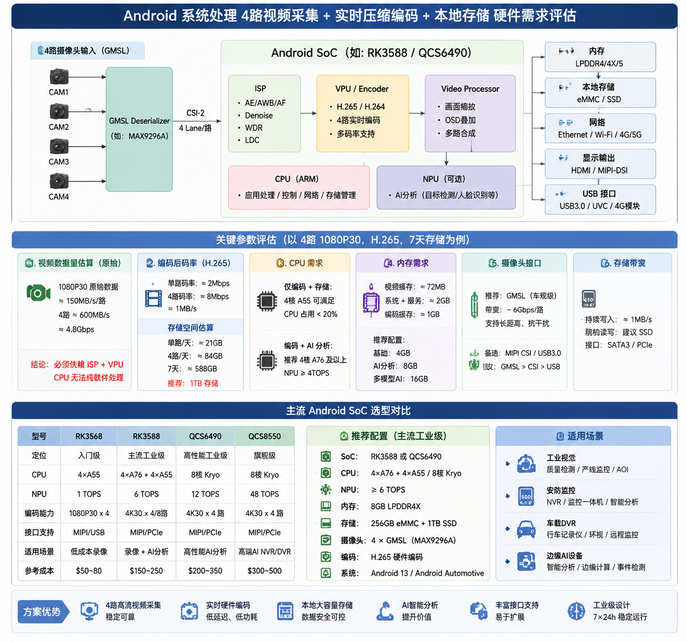

# 工业场景中Android系统资源评估

author： 周均扬

date： 2026.06.10

-----


用工业视觉、安防监控、车载DVR或边缘AI设备的场景评估 Android 系统处理的硬件需求，假设场景需求是“**4路视频采集 + 实时压缩编码 + 本地存储**”。

需要先明确几个关键参数：分辨率、帧率、编码、存储时长。

| 参数   | 低配    | 主流      | 高配     |
| ---- | ----- | ------- | ------ |
| 路数   | 4路    | 4路      | 4路     |
| 分辨率  | 1080P | 2MP~4MP | 4K     |
| 帧率   | 25fps | 30fps   | 60fps  |
| 编码   | H.264 | H.265   | H.265+ |
| 存储时长 | 24h   | 7天      | 30天    |

---

## 1. 视频数据量估算

### 1. 原始视频流

1080P：

```text
1920 × 1080 × 3 Byte ≈ 6 MB/frame
25 fps * 6MB/frame ≈ 150 MB/s
```

单路：≈ 1.2 Gbps; 4路：≈ 4.8 Gbps ≈ 600 MB/s。

意味着： CPU根本无法纯软件处理，必须依赖ISP + VPU。

---

## 2. Android SoC选择

结合任务需求，Android平台主要考虑以下SoC方案：

### 1. 高通方案

#### Snapdragon 8 Gen2

适合：4 × 1080P30, H264/H265编码。  视频引擎： 4K120 Decode, 8K30 Encode； 编码能力：约 250~300 fps 1080P。

完全满足： 4 × 1080P30 = 120 fps。

#### Qualcomm QCM6490（工业级）

支持：4路MIPI Camera, 4K H265 Encode。 适合：智能NVR，工业视觉网关，车载终端。

### 2. 瑞芯微方案

#### RK3588

Rockchip RK3588是目前国产工业视觉热门平台。硬件编码：8K30 H264/H265。 支持：4 × 1080P30， 8 × 1080P30。CPU：4 × A76 + 4 × A55； NPU：6 TOPS。

非常适合：视频采集，视频存储，AI分析。

---

## 3. 资源评估 

### 1. CPU需求评估

- 纯采集+编码， 如果全部走硬件VPU：CPU占用 < 20%， 推荐：4核A55即可。
- 采集+编码+AI分析，例如：人脸检测，目标检测，行为识别，推荐：4 × A76 + NPU ≥ 4TOPS， 例如：RK3588，QCS6490。

### 2. 内存需求

- 视频缓存： 例如1080P：6MB/frame， 则三缓冲：18MB/路；4路：72MB。

- 系统缓存： Android系统：2GB；视频服务：1GB；编码缓存：1GB

推荐：

| 场景    | RAM  |
| ----- | ---- |
| 基础录像  | 4GB  |
| AI分析  | 8GB  |
| 多模型AI | 16GB |


### 3. 存储带宽需求

- H.264： 1080P30，码率：4 Mbps，则4路：16 Mbps ≈ 2 MB/s。

- H.265：码率：2 Mbps，4路：8 Mbps ≈ 1 MB/s。

- 24小时存储量：H.265，单路：2 Mbps ≈ 21 GB/day， 4路：≈ 84 GB/day； H.264，单路 42GB/day, 4路 168GB/day。
- 7天存储： H.265, 84 × 7 ≈ 588 GB; H.264, 1176GB。
```

推荐：1TB SSD。


### 4. 摄像头接口需求

4路摄像头通常采用：

- MIPI CSI: 推荐 4 Lane CSI；带宽 2.5 Gbps/Lane；4 Lane 10 Gbps。足够 4 × 1080P30。

- GMSL： 每路 GMSL1: 1–3 Gbps， 每路 GMSL2: 6 Gbps；4路 1080P30，GMSL1 足够，但为了带宽余量和升级到 4K，需要 GMSL2。

- USB Camera: USB3.0 5 Gbps, 支持 4 × UVC Camera, 但CPU负担更大。

工业场景建议： MIPI > GMSL > USB

---

## 4. 推荐硬件配置

- 方案A：经济型，RK3568 +  4GB RAM + 64GB eMMC；能力 4 × 1080P25 + H264 + 本地录像；成本50~80美元。
- 方案B：主流工业级， RK3588 + 8GB RAM + 256GB SSD；能力 4 × 1080P30 + H265 + AI分析 + 边缘推理；成本150~250美元。
- 方案C：高端AI NVR， Snapdragon QCS8550 + 16GB RAM + 1TB SSD；能力4 × 4K30 + H265 + 多模型AI + 实时分析；成本300~500美元。

工业级推荐结论： 如果目标是：Android + 4路摄像头 + 1080P@30fps + H.265编码 + 7天录像 + 支持AI分析。

推荐配置：

```text
SoC     : RK3588 或 QCS6490
CPU     : 4×A76 + 4×A55
NPU     : ≥6 TOPS
RAM     : 8GB LPDDR4X
Storage : 256GB eMMC + 1TB SSD
Camera  : 4×MIPI CSI
Codec   : H.265 Hardware Encoder
OS      : Android 13+
```

该配置可以支持：4路视频采集 + 4路实时编码 + 本地存储 + YOLO目标检测 + 人脸识别 + RTSP推流 + OTA升级。并保留约 30%～50% 的系统余量，满足工业产品长期稳定运行需求。
---

**Andorid系统硬件资源评估**

