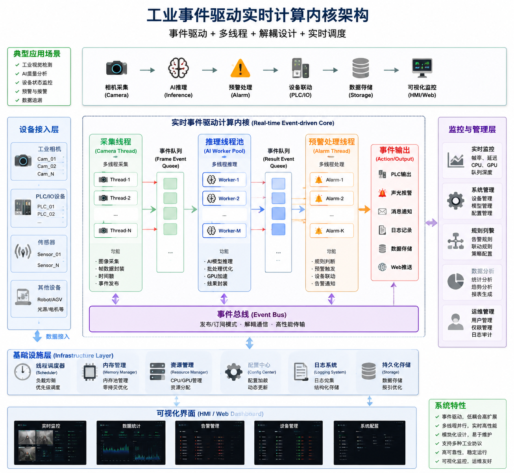

# 工业视觉实时事件驱动计算内核 

author: 周均扬

date: 2026.06.20

---


## 1. TCP Socket/WebSocket：Python后台程序 + 前端Web页面

**Python 后台程序（服务端）**，它可以 **与前端 Web 页面（客户端）通信**，主要功能是 **获取前端发送的字符串、处理，然后反馈字符串**。可以直接在本地或局域网测试。


### 1. Python 后台 Socket 服务端

```python
import socket
import threading

HOST = '127.0.0.1'  # 本机地址，如果局域网访问可改为 '0.0.0.0'
PORT = 5000         # 端口号，可自定义

def handle_client(conn, addr):
    print(f"[INFO] 连接来自 {addr}")
    try:
        while True:
            data = conn.recv(1024)  # 接收前端发送的数据
            if not data:
                print(f"[INFO] {addr} 已断开连接")
                break

            message = data.decode('utf-8')
            print(f"[RECV] {addr}: {message}")

            # 简单处理：把消息改成大写作为示例
            response = f"Server received: {message.upper()}"
            conn.sendall(response.encode('utf-8'))
    except Exception as e:
        print(f"[ERROR] {e}")
    finally:
        conn.close()


def start_server():
    server = socket.socket(socket.AF_INET, socket.SOCK_STREAM)
    server.bind((HOST, PORT))
    server.listen()
    print(f"[INFO] 服务器启动，监听 {HOST}:{PORT}")

    while True:
        conn, addr = server.accept()
        client_thread = threading.Thread(target=handle_client, args=(conn, addr))
        client_thread.start()


if __name__ == "__main__":
    start_server()
```

**说明：**

* 多线程处理多个客户端连接。
* 接收字符串 → 转大写 → 返回前端。
* 可以根据业务逻辑替换字符串处理部分。


### 2️. 前端 Web 页面示例（JavaScript + HTML）

前端可以用 **WebSocket** 或 **AJAX** 进行通信，这里用 **WebSocket** 实现实时双向通信：

```html
<!DOCTYPE html>
<html>
<head>
    <meta charset="utf-8">
    <title>Socket Client</title>
</head>
<body>
    <h2>WebSocket 测试</h2>
    <input type="text" id="inputMsg" placeholder="输入消息">
    <button onclick="sendMessage()">发送</button>
    <p id="response"></p>

    <script>
        const ws = new WebSocket("ws://127.0.0.1:5000/");

        ws.onopen = () => {
            console.log("已连接到服务器");
        };

        ws.onmessage = (event) => {
            document.getElementById("response").innerText = event.data;
        };

        function sendMessage() {
            const msg = document.getElementById("inputMsg").value;
            ws.send(msg);
        }
    </script>
</body>
</html>
```

**注意：**

* 上面的 Python 服务端是 TCP Socket，不直接支持 WebSocket 协议。如果前端要用 WebSocket，需要用 **`websockets` 或 `aiohttp` 库** 写 Python WebSocket 服务端。
* 如果你只想用纯 TCP Socket，前端就需要用 **Electron、Python 前端程序** 或 **浏览器插件支持 TCP**（普通浏览器无法直接连接 TCP）。


### 3. Python WebSocket 版本（前端可直接使用）

```python
# pip install websockets
import asyncio
import websockets

async def handler(websocket):
    async for message in websocket:
        print(f"[RECV] {message}")
        await websocket.send(f"Server received: {message.upper()}")

async def main():
    async with websockets.serve(handler, "127.0.0.1", 5000):
        print("[INFO] WebSocket服务器启动 127.0.0.1:5000")
        await asyncio.Future()  # 永久运行

if __name__ == "__main__":
    asyncio.run(main())
```

* 这个版本前端 **WebSocket 代码无需改动**。
* 可以实现浏览器与 Python 后台的实时字符串通信。

---

## 2. 支持 **多客户端同时连接**


一个 **完整可运行示例**，使用 **Python WebSocket 服务端** + **浏览器前端**，支持：

* 多客户端同时连接
* 任意字符串发送和处理
* 直接在浏览器测试，无需额外安装插件


### 1. Python WebSocket 服务端

```python
# 文件名: server.py
# 安装依赖: pip install websockets
import asyncio
import websockets

connected_clients = set()

async def handler(websocket):
    # 新客户端加入
    connected_clients.add(websocket)
    addr = websocket.remote_address
    print(f"[INFO] 客户端连接: {addr}")
    try:
        async for message in websocket:
            print(f"[RECV] {addr}: {message}")
            
            # 处理消息（示例：命令解析，可自定义逻辑）
            if message.lower() == "hello":
                response = "Hi! This is server."
            else:
                response = f"Server received: {message.upper()}"
            
            # 给当前客户端回传
            await websocket.send(response)

            # 可选：广播给所有其他客户端
            # broadcast = f"[广播] {addr}: {message}"
            # await asyncio.gather(*[c.send(broadcast) for c in connected_clients if c != websocket])

    except websockets.ConnectionClosed:
        print(f"[INFO] 客户端断开: {addr}")
    finally:
        connected_clients.remove(websocket)

async def main():
    server = await websockets.serve(handler, "0.0.0.0", 5000)
    print("[INFO] WebSocket服务器启动 0.0.0.0:5000")
    await server.wait_closed()

if __name__ == "__main__":
    asyncio.run(main())
```

**特点：**

* `connected_clients` 集合支持多客户端同时连接
* 简单命令示例：输入 `hello` → 返回自定义消息
* 其他输入 → 转大写返回
* 可轻松扩展处理逻辑，比如 JSON 命令解析


### 2️.  浏览器前端 HTML

```html
<!-- 文件名: client.html -->
<!DOCTYPE html>
<html lang="en">
<head>
    <meta charset="UTF-8">
    <title>WebSocket Client</title>
</head>
<body>
    <h2>WebSocket 多客户端测试</h2>
    <input type="text" id="inputMsg" placeholder="输入消息">
    <button onclick="sendMessage()">发送</button>
    <div id="log" style="border:1px solid #ccc; padding:10px; margin-top:10px; height:200px; overflow:auto;"></div>

    <script>
        const logDiv = document.getElementById("log");
        const ws = new WebSocket("ws://127.0.0.1:5000/");

        ws.onopen = () => log("已连接到服务器");
        ws.onclose = () => log("服务器已断开");
        ws.onerror = (err) => log("错误: " + err);
        ws.onmessage = (event) => log("收到: " + event.data);

        function sendMessage() {
            const msg = document.getElementById("inputMsg").value;
            ws.send(msg);
            log("发送: " + msg);
        }

        function log(message) {
            const p = document.createElement("p");
            p.innerText = message;
            logDiv.appendChild(p);
            logDiv.scrollTop = logDiv.scrollHeight;
        }
    </script>
</body>
</html>
```

**特点：**

* 可在多个浏览器标签页打开，测试多客户端同时连接
* 实时发送和接收服务器消息
* 日志自动滚动


### 3. 测试步骤

1. 安装依赖：

```bash
pip install websockets
```

2. 启动服务器：

```bash
python server.py
```

3. 打开浏览器，加载 `client.html`
4. 多标签页输入消息测试多客户端同时连接
5. 测试命令：

   * 输入 `hello` → 返回自定义消息
   * 输入其他文字 → 返回大写

---

这个示例几乎 **零依赖、直接可运行**，适合开发调试或实验多客户端通信逻辑。


---


## 3.  可识别多条命令的简易后台控制台系统

一个**“可识别多条命令的简易后台控制台系统”**，本质上已经接近一个轻量级 **远程控制 + 多客户端消息总线（Message Bus）**结构。

特点升级如下：

* 支持多客户端并发连接
* 支持 **命令解析（CLI风格协议）**
* 支持 **服务器控制台输入命令（真正后台控制）**
* 支持 **点对点 / 广播消息**
* 支持 JSON / 字符串混合协议扩展
* 可直接运行测试


### 1️. Python 后台（升级版控制台服务器）

```python
# server.py
# pip install websockets
import asyncio
import websockets
import json
from datetime import datetime

clients = set()


# =========================
# 工具函数
# =========================
def log(msg):
    print(f"[{datetime.now().strftime('%H:%M:%S')}] {msg}")


async def send_to_all(message: str):
    if clients:
        await asyncio.gather(*[c.send(message) for c in clients])


async def send_to_one(target_id, message: str):
    for c in clients:
        if id(c) == target_id:
            await c.send(message)
            return True
    return False


# =========================
# 命令处理核心
# =========================
async def handle_command(websocket, message: str):
    """
    支持命令格式：
    1. 普通文本
    2. JSON命令
    """

    addr = websocket.remote_address

    # -------- JSON命令模式 --------
    try:
        data = json.loads(message)
        if isinstance(data, dict):
            cmd = data.get("cmd")

            # 广播
            if cmd == "broadcast":
                msg = data.get("msg", "")
                await send_to_all(f"[BROADCAST] {msg}")
                return

            # 点对点
            if cmd == "send":
                target = data.get("target")
                msg = data.get("msg", "")
                ok = await send_to_one(target, f"[PRIVATE] {msg}")
                await websocket.send("OK" if ok else "TARGET NOT FOUND")
                return

            # 获取客户端列表
            if cmd == "list":
                await websocket.send(
                    json.dumps([id(c) for c in clients])
                )
                return

    except json.JSONDecodeError:
        pass  # 不是 JSON 就按普通命令处理

    # -------- 文本命令模式 --------
    msg = message.strip()

    if msg == "ping":
        await websocket.send("pong")
    elif msg == "time":
        await websocket.send(datetime.now().isoformat())
    elif msg.startswith("upper "):
        await websocket.send(msg[6:].upper())
    elif msg == "clients":
        await websocket.send(str(len(clients)))
    else:
        await websocket.send(f"[ECHO] {msg}")


# =========================
# WebSocket连接处理
# =========================
async def handler(websocket):
    clients.add(websocket)
    cid = id(websocket)
    log(f"Client connected: {cid}")

    try:
        async for message in websocket:
            log(f"RECV({cid}): {message}")
            await handle_command(websocket, message)

    except websockets.ConnectionClosed:
        pass
    finally:
        clients.remove(websocket)
        log(f"Client disconnected: {cid}")


# =========================
# 后台控制台线程
# =========================
async def console_loop():
    """
    服务器控制台命令（真正后台控制）
    """
    while True:
        cmd = await asyncio.to_thread(input, "SERVER> ")

        if cmd == "help":
            print("""
命令列表:
  clients                 查看连接数
  broadcast <msg>         广播消息
  list                    输出客户端ID列表
  exit                    关闭服务器
            """)

        elif cmd == "clients":
            print(f"在线客户端: {len(clients)}")

        elif cmd.startswith("broadcast "):
            msg = cmd[len("broadcast "):]
            await send_to_all(f"[SERVER BROADCAST] {msg}")

        elif cmd == "list":
            print([id(c) for c in clients])

        elif cmd == "exit":
            print("Shutting down...")
            for c in clients:
                await c.close()
            asyncio.get_event_loop().stop()
            break

        else:
            print("未知命令，输入 help")


# =========================
# 启动
# =========================
async def main():
    server = await websockets.serve(handler, "0.0.0.0", 5000)
    log("WebSocket Server started on ws://0.0.0.0:5000")

    await asyncio.gather(
        server.wait_closed(),
        console_loop()
    )


if __name__ == "__main__":
    asyncio.run(main())
```


### 2️. 前端（升级版控制台客户端）

```html
<!DOCTYPE html>
<html>
<head>
<meta charset="UTF-8">
<title>Command Client</title>
</head>
<body>
<h3>WebSocket Command Console</h3>

<input id="msg" style="width:300px;">
<button onclick="send()">Send</button>

<pre id="log" style="height:300px;overflow:auto;background:#111;color:#0f0;padding:10px;"></pre>

<script>
const ws = new WebSocket("ws://127.0.0.1:5000/");
const log = (m)=>document.getElementById("log").innerText += m + "\n";

ws.onopen = ()=>log("CONNECTED");
ws.onmessage = (e)=>log("RECV: " + e.data);
ws.onclose = ()=>log("CLOSED");

function send(){
    const v = document.getElementById("msg").value;

    // 自动 JSON命令示例
    if(v.startsWith("/b ")){
        ws.send(JSON.stringify({
            cmd:"broadcast",
            msg:v.slice(3)
        }));
    }
    else if(v.startsWith("/to ")){
        const [_, id, ...rest] = v.split(" ");
        ws.send(JSON.stringify({
            cmd:"send",
            target: parseInt(id),
            msg: rest.join(" ")
        }));
    }
    else if(v == "/list"){
        ws.send(JSON.stringify({cmd:"list"}));
    }
    else {
        ws.send(v);
    }
}
</script>
</body>
</html>
```


### 3️. 支持的完整命令体系

####  文本命令

| 输入          | 功能    |
| ----------- | ----- |
| ping        | pong  |
| time        | 返回时间  |
| upper hello | HELLO |
| clients     | 在线数量  |
| 任意文本        | echo  |


####  JSON命令

### 广播

```json
{"cmd":"broadcast","msg":"hello all"}
```

### 私发

```json
{"cmd":"send","target":12345678,"msg":"hi"}
```

### 获取客户端列表

```json
{"cmd":"list"}
```


####  浏览器快捷命令

| 输入         | 行为    |
| ---------- | ----- |
| /b hello   | 广播    |
| /to id msg | 私发    |
| /list      | 客户端列表 |

---

### 4. 系统已经具备：

 - Message Bus（消息总线）
 - RPC-like command layer
 - 多客户端广播系统
 - 服务器主动控制能力（console）

---

## 4.  **控制中枢架构(类似轻量MES/SCADA)**：工业视觉 + 多设备控制 + 实时调度系统

“工业视觉 + 多设备控制 + 实时调度系统”的**工业视觉分布式控制系统（Vision SCADA / Edge Orchestration System）**本质是：

> **Camera / PLC / AI / Storage / Robot = 分布式设备 Agent
> Python = 实时调度控制平面（Control Plane）
> Web = 可视化操作台（HMI）**

按**可落地工程架构 + 最小可运行骨架 + 可扩展设计**完整拆开。


### 1️. 总体架构（工业级实时调度系统）

```
                ┌──────────────────────────────┐
                │        Web HMI Dashboard     │
                │  (状态/控制/报警/调度界面)   │
                └─────────────┬────────────────┘
                              │ WebSocket
                              ▼
┌────────────────────────────────────────────────────────┐
│                Python Control Plane (Core)            │
│  ┌──────────────┐  ┌──────────────┐  ┌─────────────┐  │
│  │ Device Reg   │  │ Scheduler    │  │ Rule Engine │  │
│  │ (注册中心)   │  │ (调度器)     │  │ (策略)      │  │
│  └──────┬───────┘  └──────┬───────┘  └──────┬──────┘  │
│         │                 │                 │           │
│         ▼                 ▼                 ▼           │
│   ┌─────────────── Message Bus (事件总线) ───────────┐ │
│   └───────────────┬───────────────┬──────────────────┘ │
│                   ▼               ▼                    │
│        ┌──────────────┐  ┌──────────────┐            │
│        │ Camera Agent │  │ PLC Agent    │            │
│        └──────────────┘  └──────────────┘            │
│        ┌──────────────┐  ┌──────────────┐            │
│        │ AI Inference │  │ Storage Node │            │
│        └──────────────┘  └──────────────┘            │
└────────────────────────────────────────────────────────┘
```


### 2️. 核心能力拆解


**必须具备的 5 个能力**

#### 1. 设备抽象（Device Agent）

每个设备统一协议：

```json
{
  "id": "camera_01",
  "type": "camera",
  "status": "online",
  "capabilities": ["capture", "trigger", "stream"]
}
```


#### 2. 事件驱动（Event Bus）

所有数据流统一事件模型：

```
Camera → FrameCapturedEvent → AI → ResultEvent → PLC
```


#### 3. 实时调度（Scheduler）

支持：

* trigger capture
* pipeline control
* 帧级调度
* latency control


#### 4. 命令系统（Command DSL）

类似工业控制语言：

```
camera_01.capture
ai_01.infer
plc_01.write(DO1=1)
```


#### 5. Web HMI 控制面板

实时显示：

* 设备状态
* FPS / latency
* AI结果
* 告警信息


### 3️. 最小可运行系统（MVP）

**Python 控制中枢**

```python id="core1"
# pip install websockets
import asyncio
import websockets
import json
from collections import defaultdict

devices = {}          # 注册设备
clients = set()       # Web客户端
event_bus = asyncio.Queue()


# =========================
# 设备注册
# =========================
def register_device(device):
    devices[device["id"]] = device
    print(f"[DEVICE] registered: {device['id']}")


# =========================
# 事件发布
# =========================
async def publish(event):
    await event_bus.put(event)


# =========================
# 事件处理（核心调度器）
# =========================
async def event_loop():
    while True:
        event = await event_bus.get()
        print("[EVENT]", event)

        # 示例调度逻辑
        if event["type"] == "frame":
            # 模拟AI处理
            result = {
                "type": "ai_result",
                "device": event["device"],
                "value": "OK" if event["data"] % 2 == 0 else "NG"
            }
            await publish(result)

        elif event["type"] == "ai_result":
            # 推送给Web
            msg = json.dumps(event)
            await asyncio.gather(*[c.send(msg) for c in clients])


# =========================
# WebSocket Handler
# =========================
async def handler(ws):
    clients.add(ws)
    cid = id(ws)
    print(f"[WEB] connected {cid}")

    try:
        async for msg in ws:
            data = json.loads(msg)

            # ---- 注册设备 ----
            if data["cmd"] == "register":
                register_device(data["device"])
                await ws.send("registered")

            # ---- 模拟设备上报帧 ----
            elif data["cmd"] == "frame":
                await publish({
                    "type": "frame",
                    "device": data["device"],
                    "data": data["value"]
                })

            # ---- 调度命令 ----
            elif data["cmd"] == "run":
                await publish({
                    "type": "command",
                    "device": data["device"],
                    "action": data["action"]
                })

    finally:
        clients.remove(ws)


# =========================
# 启动
# =========================
async def main():
    server = await websockets.serve(handler, "0.0.0.0", 5000)

    await asyncio.gather(
        server.wait_closed(),
        event_loop()
    )


if __name__ == "__main__":
    asyncio.run(main())
```


### 4️. Web HMI（控制面板）

```html id="ui1"
<!DOCTYPE html>
<html>
<head>
<meta charset="UTF-8">
<title>Vision HMI</title>
</head>
<body>

<h3>Industrial Vision Control Panel</h3>

<button onclick="register()">Register Camera</button>
<button onclick="sendFrame()">Send Frame</button>

<pre id="log"></pre>

<script>
const ws = new WebSocket("ws://127.0.0.1:5000/");
const log = (m)=>document.getElementById("log").innerText += m + "\n";

ws.onmessage = (e)=>log("EVENT: " + e.data);

function register(){
    ws.send(JSON.stringify({
        cmd:"register",
        device:{id:"camera_01", type:"camera"}
    }));
}

function sendFrame(){
    ws.send(JSON.stringify({
        cmd:"frame",
        device:"camera_01",
        value: Math.floor(Math.random()*10)
    }));
}
</script>

</body>
</html>
```


### 5️. 这个系统已实现能力

  * 实时事件流:  frame → AI → result → web

  * 设备抽象: camera / plc / ai 统一模型

  * 调度机制: event-driven pipeline

  * 多客户端控制: Web HMI + device simulator

---

## 5. 多线程事件驱动流水线

一个**工业视觉典型的“多线程事件驱动流水线”示例**，包含：

* Camera采图线程
* AI推理线程
* 预警/告警线程
* 线程安全事件队列（Queue）
* 可扩展为多摄像头、多模型

这个结构本质就是一个**轻量实时视觉Pipeline Runtime**。


### 1️. 架构模型（线程事件流水线）

```
Camera Thread  ──┐
                 │ FrameEvent
                 ▼
          [ Frame Queue ]
                 ▼
          AI Inference Thread
                 │ ResultEvent
                 ▼
          [ Result Queue ]
                 ▼
          Alarm Thread → Web / PLC / Log
```


### 2️. 完整可运行 Python 示例（线程版工业视觉流水线）

```python id="vision_thread_pipeline"
import threading
import queue
import time
import random
from dataclasses import dataclass


# =========================
# 事件定义（工业标准化）
# =========================
@dataclass
class FrameEvent:
    camera_id: str
    frame_id: int
    data: int  # 模拟图像（实际可替换 numpy/opencv）


@dataclass
class ResultEvent:
    camera_id: str
    frame_id: int
    result: str
    score: float


# =========================
# 线程安全队列
# =========================
frame_queue = queue.Queue(maxsize=100)
result_queue = queue.Queue(maxsize=100)


# =========================
# Camera线程（采图）
# =========================
class CameraThread(threading.Thread):
    def __init__(self, camera_id, fps=10):
        super().__init__()
        self.camera_id = camera_id
        self.fps = fps
        self.running = True
        self.frame_id = 0

    def run(self):
        while self.running:
            # 模拟采图
            frame = FrameEvent(
                camera_id=self.camera_id,
                frame_id=self.frame_id,
                data=random.randint(0, 255)
            )

            try:
                frame_queue.put(frame, timeout=1)
                print(f"[Camera] push frame {frame.frame_id}")
                self.frame_id += 1
            except queue.Full:
                print("[Camera] queue full, drop frame")

            time.sleep(1 / self.fps)

    def stop(self):
        self.running = False


# =========================
# AI推理线程
# =========================
class AIThread(threading.Thread):
    def __init__(self):
        super().__init__()
        self.running = True

    def run(self):
        while self.running:
            frame = frame_queue.get()

            # ===== 模拟AI推理 =====
            time.sleep(0.05)  # 模拟GPU推理延迟

            score = random.random()
            result = "NG" if score > 0.7 else "OK"

            res = ResultEvent(
                camera_id=frame.camera_id,
                frame_id=frame.frame_id,
                result=result,
                score=score
            )

            result_queue.put(res)
            print(f"[AI] frame {frame.frame_id} -> {result} ({score:.2f})")

    def stop(self):
        self.running = False


# =========================
# 告警线程
# =========================
class AlarmThread(threading.Thread):
    def __init__(self):
        super().__init__()
        self.running = True

    def run(self):
        while self.running:
            result = result_queue.get()

            if result.result == "NG":
                self.raise_alarm(result)
            else:
                print(f"[OK] {result.camera_id}:{result.frame_id}")

    def raise_alarm(self, result):
        print(f"""
        ⚠️ ALARM DETECTED
        Camera : {result.camera_id}
        Frame  : {result.frame_id}
        Score  : {result.score:.2f}
        """)

    def stop(self):
        self.running = False


# =========================
# 主程序
# =========================
if __name__ == "__main__":

    camera = CameraThread("cam_01", fps=5)
    ai = AIThread()
    alarm = AlarmThread()

    camera.start()
    ai.start()
    alarm.start()

    try:
        while True:
            time.sleep(1)
    except KeyboardInterrupt:
        print("Stopping...")

        camera.stop()
        ai.stop()
        alarm.stop()
```


### 3️. 对应真实工业系统：

#### 1. Camera Layer

* GigE / USB / GMSL
* trigger / continuous mode

#### 2. Stream Buffer Layer

* frame_queue = FrameBuffer

#### 3. AI Inference Layer

* GPU batch / TensorRT / ONNX Runtime

#### 3. Event Layer

* ResultEvent / AlarmEvent

#### 4. Action Layer

* PLC trigger / IO output / MES upload


### 4. 总结

线程模型已经是：**工业视觉 Pipeline Runtime 的最小内核（Mini Vision OS Kernel）**

它已经具备：

* 实时性
* 并发性
* 事件驱动
* 流水线结构

---

## 6. 事件驱动结合多线程示例

结合“Camera采集 + AI推理 + 预警”的系统例子，输出一个**结构清晰、工业风格的“事件驱动 + 多线程标准模板”**，重点是：

* 分层清晰（采集 / 推理 / 处理）
* 统一事件模型
* 解耦线程之间依赖
* 可扩展（多Camera、多AI Worker）


### 1. 事件驱动 + 多线程模板

```python
import threading
import queue
import time
import random
from dataclasses import dataclass
from typing import Optional


# =========================================================
# 1️ 事件定义层（Event Model）
# =========================================================

@dataclass
class FrameEvent:
    camera_id: str
    frame_id: int
    data: int  # 模拟图像数据（可替换 numpy / cv2 / GPU buffer）


@dataclass
class InferenceEvent:
    camera_id: str
    frame_id: int
    score: float
    label: str


# =========================================================
# 2️ 全局事件队列（Event Bus）
# =========================================================

class EventBus:
    def __init__(self, maxsize=100):
        self.frame_queue = queue.Queue(maxsize=maxsize)
        self.result_queue = queue.Queue(maxsize=maxsize)


bus = EventBus()


# =========================================================
# 3️ Camera采集线程（Producer）
# =========================================================

class CameraThread(threading.Thread):
    def __init__(self, camera_id: str, fps: float = 10):
        super().__init__(daemon=True)
        self.camera_id = camera_id
        self.fps = fps
        self.running = True
        self.frame_id = 0

    def run(self):
        while self.running:
            frame = FrameEvent(
                camera_id=self.camera_id,
                frame_id=self.frame_id,
                data=random.randint(0, 255)
            )

            try:
                bus.frame_queue.put(frame, timeout=1)
                print(f"[CAMERA] {self.camera_id} -> frame {self.frame_id}")
                self.frame_id += 1
            except queue.Full:
                print("[CAMERA] frame queue full (drop frame)")

            time.sleep(1 / self.fps)

    def stop(self):
        self.running = False


# =========================================================
# 4️ AI推理线程（Consumer + Producer）
# =========================================================

class AIThread(threading.Thread):
    def __init__(self, worker_id: int = 0):
        super().__init__(daemon=True)
        self.worker_id = worker_id
        self.running = True

    def run(self):
        while self.running:
            frame: FrameEvent = bus.frame_queue.get()

            # ===== 模拟AI推理 =====
            time.sleep(0.05)

            score = random.random()
            label = "NG" if score > 0.7 else "OK"

            result = InferenceEvent(
                camera_id=frame.camera_id,
                frame_id=frame.frame_id,
                score=score,
                label=label
            )

            bus.result_queue.put(result)

            print(
                f"[AI-{self.worker_id}] "
                f"{frame.camera_id}:{frame.frame_id} -> {label} ({score:.2f})"
            )

    def stop(self):
        self.running = False


# =========================================================
# 5️ 预警 / 决策线程（Consumer）
# =========================================================

class AlarmThread(threading.Thread):
    def __init__(self):
        super().__init__(daemon=True)
        self.running = True

    def run(self):
        while self.running:
            result: InferenceEvent = bus.result_queue.get()

            if result.label == "NG":
                self.alarm(result)
            else:
                print(f"[OK] {result.camera_id}:{result.frame_id}")

    def alarm(self, result: InferenceEvent):
        print(
            "\n ALARM TRIGGERED\n"
            f"Camera : {result.camera_id}\n"
            f"Frame  : {result.frame_id}\n"
            f"Score  : {result.score:.2f}\n"
        )

    def stop(self):
        self.running = False


# =========================================================
# 6️ 系统启动器（Runtime）
# =========================================================

class VisionRuntime:
    def __init__(self):
        self.camera = CameraThread("cam_01", fps=5)
        self.ai_workers = [AIThread(i) for i in range(2)]
        self.alarm = AlarmThread()

    def start(self):
        print("[SYSTEM] Starting Vision Runtime...")

        self.camera.start()

        for w in self.ai_workers:
            w.start()

        self.alarm.start()

        print("[SYSTEM] Running...")

    def stop(self):
        print("[SYSTEM] Stopping...")

        self.camera.stop()
        for w in self.ai_workers:
            w.stop()
        self.alarm.stop()


# =========================================================
# 7️ main入口
# =========================================================

if __name__ == "__main__":
    runtime = VisionRuntime()
    runtime.start()

    try:
        while True:
            time.sleep(1)
    except KeyboardInterrupt:
        runtime.stop()
```

---

### 2. 工业结构意义

标准工业视觉 pipeline：

#### 1. 事件驱动（Event-driven）

* FrameEvent
* InferenceEvent
* queue = EventBus

完全解耦模块


####  2. 多线程流水线（Pipeline Parallelism）

| 层      | 线程          |
| ------ | ----------- |
| Camera | Producer    |
| AI     | Worker Pool |
| Alarm  | Consumer    |


#### 3. 解耦设计

* Camera 不知道 AI
* AI 不知道 Alarm
* 所有通信 = Queue

这是工业系统标准模式（ROS / Kafka / SCADA同结构）


####  4. 可扩展能力

直接扩展：

##### 1. 多相机

```python
CameraThread(cam_02)
CameraThread(cam_03)
```

##### 2. AI扩展

```python
AIThread(0)
AIThread(1)
AIThread(2)
```

##### 3. 加 WebSocket

* result_queue → Web UI

##### 4. 加 PLC

* NG → PLC DO signal

---


**事件驱动实时计算内核**，事件驱动 + 多线程 + 解耦设计 + 实时调度。

