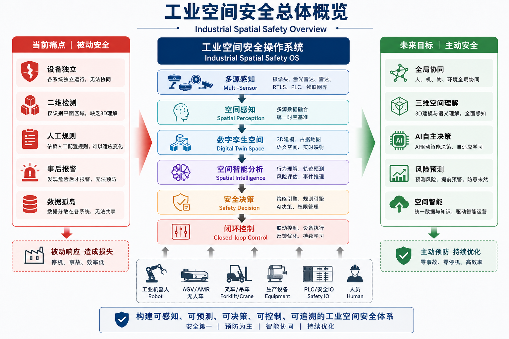

# 工业领域的空间安全

author: 周均扬

date: 2026.06.29

---


工业领域的**空间安全（Industrial Spatial Safety）**正在从传统的"人员防护"快速发展到"数字空间+物理空间+智能空间"融合安全阶段。随着AI、机器人、数字孪生、5G、工业互联网、视觉AI、多机器人协同等技术的发展，空间安全已经成为未来智能工厂（Smart Factory）的核心能力之一。

从国际发展趋势来看，其目标已经不仅是"防止人员进入危险区域"，而是构建 **可感知（Perception）→可预测（Prediction）→可决策（Decision）→可控制（Control）→可追溯（Traceability）** 的闭环空间安全体系。


### 1. 工业空间安全的发展现状

目前主要经历了五个阶段。

| 阶段                   | 主要特点      | 代表技术                                |
| -------------------- | --------- | ----------------------------------- |
| Space Safety 1.0     | 物理隔离      | 围栏、安全门、急停按钮                         |
| Space Safety 2.0     | 区域检测      | 光幕、激光扫描、安全PLC                       |
| Space Safety 3.0     | 视觉安全      | AI Camera、人体检测、行为识别                 |
| Space Safety 4.0     | 数字空间安全    | Digital Twin + RTLS + AGV协同         |
| Space Safety 5.0（未来） | Agent自主安全 | AI Agent + World Model + VLM + 多智能体 |

当前国际主流企业包括：

* Siemens
* ABB
* Rockwell Automation
* Bosch Rexroth
* Omron
* SICK AG
* Keyence

主要聚焦：

* Safety PLC
* Safety Robot
* Safe Motion
* Collaborative Robot
* AI Vision Safety
* Digital Twin Safety

但整体仍然偏"设备级"，真正实现工厂级空间智能安全的案例仍较少。

---

### 2. 当前存在的主要问题

#### 1. 感知碎片化（Perception Fragmentation）

不同设备彼此独立：

```
Camera/LiDAR/Radar/PLC/AGV/Robot -> 各自独立报警
```

问题：

* 数据不能融合
* 无统一坐标系
* 无统一空间模型

例如：

* 机器人不知道人在哪里；
* AGV不知道叉车在哪里；
* MES不知道危险区域是否有人。


#### 2. 二维安全，缺乏三维空间理解

目前绝大多数系统：

```
Camera -> Bounding Box -> 报警
```

不能回答：

这个人：

* 是否进入危险空间？
* 是否靠近机器人工作半径？
* 是否位于吊装物下方？
* 是否遮挡激光扫描器？

缺少真正的3D Occupancy Map。


#### 3. 缺乏动态风险预测

目前："发现危险 -> 报警 -> 停机" 属于事后响应。不能提前预测：

例如：

AGV：未来3秒是否会与叉车发生碰撞？

机器人：未来2秒是否会与人员轨迹交叉？

这是目前最大的痛点之一。


#### 4. 各安全系统彼此孤立

例如：

```
安全门 -> Safety PLC -> 机器人停止
```

与此同时：
Camera：不知道；

MES：不知道；

SCADA：不知道；

Digital Twin：不知道。

导致：整个工厂没有统一安全状态。


#### 5. 缺乏空间语义

AI知道：

```
Person

Forklift

Robot
```

但不知道：

```
Person -> 维修人员 -> 授权进入
```

或者：

```
Visitor ->禁止进入
```

缺乏： Semantic Space。


#### 6. 无法进行空间推理（Spatial Reasoning）

例如：

AI无法回答："这个维修人员是否正在进入机器人维护区域？"

也无法回答："未来5秒是否可能发生碰撞？"

更无法回答："为什么报警？"


#### 7. 数据孤岛

Camera -> 视频

LiDAR -> 点云

PLC -> IO

MES ->订单

ERP ->人员信息

这些数据几乎没有真正融合。

---

### 3. 行业痛点总结

可以归纳为七个核心问题。

```
不会看 -> 不会理解 -> 不会预测 -> 不会推理 -> 不会协同 -> 不会学习 -> 不会闭环
```

或者表示为：

```
Perception -> Understanding -> Prediction -> Reasoning -> Coordination -> Learning -> Execution
```

这是目前工业安全最大的Research Gap。

---

### 4. 未来解决方案——Industrial Spatial Safety OS

建议构建统一的空间安全操作系统（Industrial Spatial Safety OS）。

整体架构如下：

```text
                   Safety Copilot
               (LLM / VLM / Agent)

                       │
──────────────────────────────────────────
          Spatial Decision Engine
──────────────────────────────────────────

 Risk Prediction
 Path Planning
 Space Reasoning
 Policy Engine

──────────────────────────────────────────
         Space Knowledge Graph
──────────────────────────────────────────

Person
Robot
AGV
Forklift
Tool
Zone
Process

──────────────────────────────────────────
          Digital Twin Engine
──────────────────────────────────────────

3D Factory

Occupancy Map

World Model

──────────────────────────────────────────
          Multi-Sensor Fusion
──────────────────────────────────────────

Camera
LiDAR
Radar
RTLS
PLC
IoT

──────────────────────────────────────────
             Device Layer
──────────────────────────────────────────

Robot
AGV
PLC
Safety IO
```

---

### 5. 关键技术路线

建议分六层建设。

#### 第一层：空间感知层（Spatial Perception）

融合：

* RGB Camera
* Stereo Camera
* LiDAR
* Radar
* UWB
* BLE
* RTLS
* IMU
* PLC

输出：统一World Coordinate。


#### 第二层：空间建图（Spatial Mapping）

建立：

```
3D Factory -> Occupancy Map -> Semantic Map -> Navigation Map
```

核心：Space Graph。


#### 第三层：空间理解（Spatial Understanding）

包括：

人体 -> 姿态 -> 轨迹 -> 行为 ->风险等级

同时理解：

* 机器人状态

* AGV状态

* 设备状态

* 区域状态


#### 第四层：空间预测（Spatial Prediction）

预测未来：
* 1秒
* 3秒
* 5秒
* 10秒

包括：

* 人员轨迹；
* 机器人轨迹；
* AGV轨迹；
* 吊车轨迹；
* 物料轨迹。


采用：

* Transformer

* Trajectory Prediction

* Graph Neural Network

* Occupancy Forecast


#### 第五层：空间推理（Spatial Reasoning）

建立：

```
Knowledge Graph + World Model + VLM + LLM ->Reasoning
```

例如：

```
人员 -> 是否授权？ -> 危险等级？ -> 设备状态？ -> 维修状态？ -> 是否允许进入？
```

形成真正的：Industrial Safety Agent。


#### 第六层：空间执行（Closed-loop Safety）

AI直接控制：

```
PLC -> Robot -> AGV ->  Light -> Alarm -> Safety IO
```

形成：

```
感知 -> 预测 -> 推理 -> 控制 -> 反馈 -> 学习
```

---

### 6. 实施路径（Roadmap）

建议采用四阶段演进策略：

| 阶段                                     | 建设目标         | 核心能力                                    | 典型成果                     |
| -------------------------------------- | ------------ | --------------------------------------- | ------------------------ |
| **Phase 1：数字化感知**                      | 建立统一感知平台     | 相机、LiDAR、RTLS、PLC数据接入，统一时间同步（PTP）、统一坐标系 | 多源数据融合平台、实时空间可视化         |
| **Phase 2：空间数字孪生**                     | 构建工厂空间模型     | 三维地图、设备模型、动态占据栅格（Occupancy Grid）、语义区域   | 数字孪生工厂、危险区域管理、事件回放       |
| **Phase 3：智能风险预测**                     | 从"报警"升级到"预测" | 多目标跟踪、轨迹预测、碰撞预测、风险评分、策略引擎               | 风险预警系统、动态安全策略、自适应联锁      |
| **Phase 4：Industrial Safety Agent OS** | 实现自主安全闭环     | 多智能体协同、知识图谱、VLM/LLM推理、自动控制与持续学习         | 工厂级空间安全操作系统，实现感知—推理—控制闭环 |

---

### 7. 未来研究方向（Research Gaps）

结合当前工业AI和智能制造的发展，未来值得重点突破的方向包括：

1. **多模态空间世界模型（Industrial World Model）**：融合视觉、点云、设备状态、工艺流程，形成统一的工业空间表示。
2. **工业空间知识图谱（Industrial Spatial Knowledge Graph）**：建立人员、设备、工艺、区域之间的语义关系，实现上下文感知。
3. **可解释空间推理（Explainable Spatial Reasoning）**：不仅给出风险结论，还能解释"为什么存在风险"及"如何消除风险"。
4. **多智能体安全协同（Multi-Agent Safety Coordination）**：机器人、AGV、无人叉车、固定设备之间形成协同安全机制。
5. **自主学习安全策略（Adaptive Safety Policy Learning）**：根据历史事件和现场变化持续优化安全策略，而非依赖静态规则。
6. **可信工业AI安全（Trustworthy Industrial AI Safety）**：围绕可靠性、鲁棒性、可验证性和功能安全，构建满足工业场景要求的AI安全体系。

---

## 总结

工业空间安全正从**"设备级安全（Device-centric Safety）"**演进到**"空间级智能安全（Space-centric Intelligent Safety）"**。未来的核心竞争力不再只是增加更多传感器，而是建立一个统一的**Industrial Spatial Safety OS**，实现多源感知融合、三维空间理解、风险预测、语义推理和自主闭环控制。

---


**“工业空间安全框架”**

