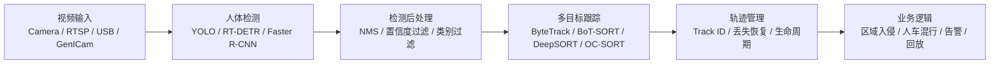
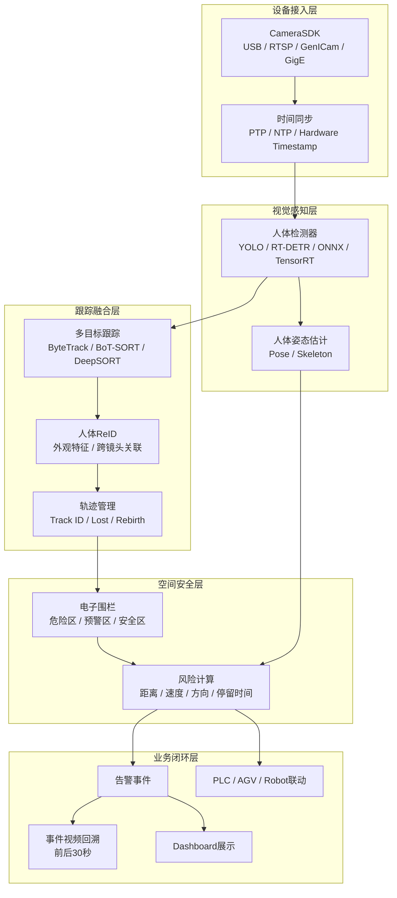
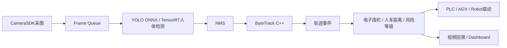

# 工业场景的人物人体识别跟踪

author： 周均扬

date: 2026.07.07


---

提供面向**工业视觉 / 安防 / Pack产线安全 / AGV人车混行**的工业场景的人物人体识别跟踪方案。


### 1. 技术原理

人物人体识别跟踪通常分成四层：



核心思想是：

**检测器**负责回答：这一帧里有没有人、人在哪里。
**跟踪器**负责回答：这一帧的人和上一帧的人是不是同一个人。
**ReID/外观特征**负责回答：遮挡、交叉、短暂消失后，如何尽量恢复原来的身份编号。

现代工程里最常用的是 **Tracking-by-Detection**：每一帧先检测人体框，再用 IoU、运动预测、Kalman Filter、Hungarian 匹配、外观特征等方法把检测框串成轨迹。Ultralytics 的跟踪模式支持 BoT-SORT、ByteTrack、OC-SORT、Deep OC-SORT、FastTracker、TrackTrack 等跟踪器，并输出持续的目标 ID；官方文档中也说明了 ByteTrack、BoT-SORT、ReID、track buffer、match threshold 等参数的作用。([Ultralytics Docs][1])

---

### 2. 常用算法组合

| 场景              | 推荐方案                                    | 说明             |
| --------------- | --------------------------------------- | -------------- |
| 单摄像头、固定机位、实时性优先 | YOLO + ByteTrack                        | 速度快，工程实现简单     |
| 人员密集、遮挡明显       | YOLO + BoT-SORT / Deep OC-SORT + ReID   | ID稳定性更好        |
| AGV人车混行、安全区域入侵  | YOLO + ByteTrack + 电子围栏                 | 重点关注位置、轨迹、区域关系 |
| 机器人协作区          | YOLO-Pose / RTMPose + 跟踪                | 不只检测人，还分析人体姿态  |
| 多摄像头跨区域跟踪       | Detection + Tracking + ReID + 相机标定      | 需要跨相机身份关联      |
| 工业部署            | C++ + TensorRT / OpenVINO / ONNXRuntime | 低延迟、高稳定性       |

ByteTrack 的核心优势是：不仅使用高置信度检测框，还会利用低置信度检测框参与二阶段关联，从而减少遮挡或检测分数下降造成的轨迹断裂。原论文报告 ByteTrack 在 MOT17 上达到 80.3 MOTA、77.3 IDF1，并能在单 V100 GPU 上达到 30 FPS。([arXiv][2])

DeepSORT 则是在 SORT 的运动模型基础上加入外观特征，用 ReID embedding 来降低遮挡和交叉场景下的 ID switch。([arXiv][3])

---

### 3. 工程解决方案

#### 3.1 工业级系统架构



#### 3.2 推荐技术栈

**Python 原型验证：**

```text
OpenCV + Ultralytics YOLO + ByteTrack / BoT-SORT
```

**C++ 工业部署：**

```text
CameraSDK + OpenCV / ONNXRuntime / TensorRT + ByteTrack C++ + Event Bus
```

**边缘部署：**

```text
NVIDIA Jetson / x86 GPU / 工控机
TensorRT FP16 / INT8
多线程采集 + 推理 + 跟踪 + 告警
```

OpenCV DNN 模块可用于加载不同框架导出的模型，并支持 ONNX 模型读取、blobFromImage 预处理、NMSBoxes 后处理以及 CUDA 后端/目标设备枚举。([OpenCV 文档][4])

---

### 4. Python 示例：YOLO + ByteTrack 人体跟踪

适合快速验证：摄像头 / 视频文件 / RTSP 均可。

#### 4.1 安装

```bash
pip install ultralytics opencv-python numpy
```

#### 4.2 代码：人体检测 + 多目标跟踪 + 区域告警

```python
import cv2
import numpy as np
from ultralytics import YOLO


class HumanTracker:
    def __init__(
        self,
        model_path="yolo26n.pt",
        tracker_cfg="bytetrack.yaml",
        conf=0.25,
        iou=0.5,
    ):
        self.model = YOLO(model_path)
        self.tracker_cfg = tracker_cfg
        self.conf = conf
        self.iou = iou

        # 示例危险区域：根据实际相机画面修改
        self.danger_zone = np.array(
            [
                [200, 150],
                [600, 150],
                [700, 500],
                [120, 500],
            ],
            dtype=np.int32,
        )

    def point_in_zone(self, point):
        return cv2.pointPolygonTest(self.danger_zone, point, False) >= 0

    def process_frame(self, frame):
        # classes=[0] 表示只检测 COCO 中的 person 类别
        results = self.model.track(
            frame,
            persist=True,
            tracker=self.tracker_cfg,
            classes=[0],
            conf=self.conf,
            iou=self.iou,
            verbose=False,
        )

        result = results[0]
        vis = frame.copy()

        # 绘制危险区域
        cv2.polylines(vis, [self.danger_zone], True, (0, 0, 255), 2)

        if result.boxes is None or result.boxes.id is None:
            return vis

        boxes = result.boxes.xyxy.cpu().numpy()
        track_ids = result.boxes.id.cpu().numpy().astype(int)
        confs = result.boxes.conf.cpu().numpy()

        for box, track_id, score in zip(boxes, track_ids, confs):
            x1, y1, x2, y2 = box.astype(int)
            cx = int((x1 + x2) / 2)
            cy = int((y1 + y2) / 2)

            inside = self.point_in_zone((cx, cy))

            color = (0, 0, 255) if inside else (0, 255, 0)
            label = f"Person ID:{track_id} {score:.2f}"

            cv2.rectangle(vis, (x1, y1), (x2, y2), color, 2)
            cv2.circle(vis, (cx, cy), 4, color, -1)
            cv2.putText(
                vis,
                label,
                (x1, max(20, y1 - 8)),
                cv2.FONT_HERSHEY_SIMPLEX,
                0.6,
                color,
                2,
            )

            if inside:
                cv2.putText(
                    vis,
                    f"ALARM: Person {track_id} in danger zone",
                    (30, 40),
                    cv2.FONT_HERSHEY_SIMPLEX,
                    0.9,
                    (0, 0, 255),
                    3,
                )

        return vis


def main():
    # 0 表示本地摄像头，也可以换成 video.mp4 或 rtsp://...
    source = 0

    cap = cv2.VideoCapture(source)
    if not cap.isOpened():
        raise RuntimeError(f"Cannot open video source: {source}")

    tracker = HumanTracker(
        model_path="yolo26n.pt",
        tracker_cfg="bytetrack.yaml",
        conf=0.25,
        iou=0.5,
    )

    while True:
        ret, frame = cap.read()
        if not ret:
            break

        vis = tracker.process_frame(frame)

        cv2.imshow("Human Detection + Tracking", vis)

        if cv2.waitKey(1) & 0xFF == 27:
            break

    cap.release()
    cv2.destroyAllWindows()


if __name__ == "__main__":
    main()
```

Ultralytics 官方文档当前示例使用 `model.track()`，默认可用 BoT-SORT，也可以通过 `tracker="bytetrack.yaml"` 切换到 ByteTrack；文档还说明跟踪结果会包含目标 ID，并支持通过配置文件调整 track buffer、match threshold、ReID 等参数。([Ultralytics Docs][1])

> 说明：如果你的环境没有 `yolo26n.pt`，可替换成已有的 `yolov8n.pt`、`yolo11n.pt` 或你自己训练的 `best.pt`。

---

### 5. C++ 示例：OpenCV HOG 人体检测 + IoU 多目标跟踪

这个 C++ 示例不依赖深度学习模型，适合作为**教学版 / 工程骨架**。生产环境建议把 HOG 检测器替换成 YOLO ONNX / TensorRT 检测器。

#### 5.1 main.cpp

```cpp
#include <opencv2/opencv.hpp>
#include <opencv2/objdetect.hpp>

#include <algorithm>
#include <cctype>
#include <iostream>
#include <string>
#include <vector>


struct Track
{
    int id = -1;
    cv::Rect2d box;
    int missed = 0;
    int age = 0;
};


double IoU(const cv::Rect2d& a, const cv::Rect2d& b)
{
    double interArea = (a & b).area();
    double unionArea = a.area() + b.area() - interArea;
    if (unionArea <= 0.0)
        return 0.0;
    return interArea / unionArea;
}


class SimpleIoUTracker
{
public:
    explicit SimpleIoUTracker(double iouThreshold = 0.3, int maxMissed = 15)
        : iouThreshold_(iouThreshold), maxMissed_(maxMissed)
    {
    }

    void update(const std::vector<cv::Rect>& detections)
    {
        std::vector<int> detMatched(detections.size(), 0);
        std::vector<int> trackMatched(tracks_.size(), 0);

        // Step 1: greedy IoU matching
        for (size_t t = 0; t < tracks_.size(); ++t)
        {
            double bestIou = 0.0;
            int bestDet = -1;

            for (size_t d = 0; d < detections.size(); ++d)
            {
                if (detMatched[d])
                    continue;

                double iou = IoU(tracks_[t].box, detections[d]);
                if (iou > bestIou)
                {
                    bestIou = iou;
                    bestDet = static_cast<int>(d);
                }
            }

            if (bestDet >= 0 && bestIou >= iouThreshold_)
            {
                tracks_[t].box = detections[bestDet];
                tracks_[t].missed = 0;
                tracks_[t].age++;
                detMatched[bestDet] = 1;
                trackMatched[t] = 1;
            }
        }

        // Step 2: unmatched tracks
        for (size_t t = 0; t < tracks_.size(); ++t)
        {
            if (!trackMatched[t])
            {
                tracks_[t].missed++;
                tracks_[t].age++;
            }
        }

        // Step 3: create new tracks
        for (size_t d = 0; d < detections.size(); ++d)
        {
            if (!detMatched[d])
            {
                Track tr;
                tr.id = nextId_++;
                tr.box = detections[d];
                tr.missed = 0;
                tr.age = 1;
                tracks_.push_back(tr);
            }
        }

        // Step 4: remove dead tracks
        tracks_.erase(
            std::remove_if(
                tracks_.begin(),
                tracks_.end(),
                [this](const Track& tr)
                {
                    return tr.missed > maxMissed_;
                }),
            tracks_.end());
    }

    const std::vector<Track>& tracks() const
    {
        return tracks_;
    }

private:
    int nextId_ = 1;
    double iouThreshold_ = 0.3;
    int maxMissed_ = 15;
    std::vector<Track> tracks_;
};


bool isInsidePolygon(const std::vector<cv::Point>& polygon, const cv::Point& p)
{
    return cv::pointPolygonTest(polygon, p, false) >= 0;
}


int main(int argc, char** argv)
{
    std::string source = "0";
    if (argc > 1)
        source = argv[1];

    cv::VideoCapture cap;

    if (source.size() == 1 && std::isdigit(source[0]))
        cap.open(std::stoi(source));
    else
        cap.open(source);

    if (!cap.isOpened())
    {
        std::cerr << "Failed to open source: " << source << std::endl;
        return -1;
    }

    // OpenCV HOG people detector
    cv::HOGDescriptor hog;
    hog.setSVMDetector(cv::HOGDescriptor::getDefaultPeopleDetector());

    SimpleIoUTracker tracker(0.3, 15);

    // 示例危险区域，可按现场相机画面修改
    std::vector<cv::Point> dangerZone = {
        {200, 150},
        {600, 150},
        {700, 500},
        {120, 500},
    };

    cv::Mat frame;

    while (true)
    {
        cap >> frame;
        if (frame.empty())
            break;

        std::vector<cv::Rect> detections;
        std::vector<double> weights;

        // HOG人体检测
        hog.detectMultiScale(
            frame,
            detections,
            weights,
            0,
            cv::Size(8, 8),
            cv::Size(32, 32),
            1.05,
            2.0,
            false);

        // 简单过滤过小框
        std::vector<cv::Rect> filtered;
        for (const auto& box : detections)
        {
            if (box.width > 30 && box.height > 80)
                filtered.push_back(box);
        }

        tracker.update(filtered);

        // 绘制危险区域
        const cv::Point* pts = dangerZone.data();
        int npts = static_cast<int>(dangerZone.size());
        cv::polylines(frame, &pts, &npts, 1, true, cv::Scalar(0, 0, 255), 2);

        for (const auto& tr : tracker.tracks())
        {
            if (tr.missed > 0)
                continue;

            cv::Rect box = tr.box;
            cv::Point center(
                box.x + box.width / 2,
                box.y + box.height / 2);

            bool alarm = isInsidePolygon(dangerZone, center);

            cv::Scalar color = alarm ? cv::Scalar(0, 0, 255) : cv::Scalar(0, 255, 0);

            cv::rectangle(frame, box, color, 2);
            cv::circle(frame, center, 4, color, -1);

            std::string label = "Person ID:" + std::to_string(tr.id);
            cv::putText(
                frame,
                label,
                cv::Point(box.x, std::max(20, box.y - 8)),
                cv::FONT_HERSHEY_SIMPLEX,
                0.6,
                color,
                2);

            if (alarm)
            {
                cv::putText(
                    frame,
                    "ALARM: Person in danger zone",
                    cv::Point(30, 40),
                    cv::FONT_HERSHEY_SIMPLEX,
                    0.9,
                    cv::Scalar(0, 0, 255),
                    3);
            }
        }

        cv::imshow("C++ Human Detection + IoU Tracking", frame);

        int key = cv::waitKey(1);
        if (key == 27)
            break;
    }

    return 0;
}
```

#### 5.2 CMakeLists.txt

```cmake
cmake_minimum_required(VERSION 3.16)

project(HumanTrackingDemo CXX)

set(CMAKE_CXX_STANDARD 17)
set(CMAKE_CXX_STANDARD_REQUIRED ON)

find_package(OpenCV REQUIRED)

add_executable(human_tracking_demo main.cpp)

target_link_libraries(human_tracking_demo PRIVATE ${OpenCV_LIBS})
```

#### 5.3 编译运行

```bash
mkdir build
cd build
cmake ..
cmake --build . --config Release
./human_tracking_demo 0
```

或运行视频文件：

```bash
./human_tracking_demo test.mp4
```

OpenCV 的 CSRT 单目标跟踪器提供 `init()` 初始化目标框、`update()` 更新目标框、`create()` 创建实例等接口；它适合教学或单目标跟踪，但工业多人体跟踪更推荐 Detection + MOT 的方案。([OpenCV 文档][5])

---

### 6. 工业生成的改造建议

上面的 C++ HOG 示例建议升级为：



#### 6.1 C++ 模块划分

```text
HumanTrackingSystem/
├── include/
│   ├── HumanDetector.h
│   ├── HumanTracker.h
│   ├── HumanTrack.h
│   ├── SafetyZone.h
│   └── TrackingEvent.h
├── src/
│   ├── HumanDetectorONNX.cpp
│   ├── ByteTrackAdapter.cpp
│   ├── SafetyZone.cpp
│   └── main.cpp
├── models/
│   └── human_detector.onnx
└── CMakeLists.txt
```

#### 6.2 核心数据结构

```cpp
struct HumanDetection
{
    int class_id = 0;
    float confidence = 0.0f;
    cv::Rect2f box;
};

struct HumanTrack
{
    int track_id = -1;
    cv::Rect2f box;
    cv::Point2f center;
    float confidence = 0.0f;
    int age = 0;
    int missed = 0;
};

struct SafetyEvent
{
    int track_id = -1;
    std::string event_type;
    std::string zone_id;
    int64_t timestamp_ns = 0;
    float risk_score = 0.0f;
};
```

---

### 7. 算法选型

#### 1. 固定摄像头 + Pack产线安全

推荐：

```text
YOLO人体检测 + ByteTrack + 电子围栏 + 事件回放
```

优点：

* 延迟低
* ID稳定性足够
* 易部署
* 易与 PLC / AGV / Robot 联动

#### 2. 人员密集 / 遮挡严重

推荐：

```text
YOLO人体检测 + BoT-SORT / Deep OC-SORT + ReID
```

适合：

* 多人交叉
* 通道狭窄
* 机器人作业区
* 人车混行区域

#### 3. 需要姿态安全判断

推荐：

```text
YOLO-Pose / RTMPose + Track ID + 姿态规则
```

可判断：

* 人是否弯腰进入设备
* 手臂是否越过安全边界
* 是否跌倒
* 是否靠近机器人末端执行器

---

### 8. 落地关键点

| 问题    | 建议                                           |
| ----- | -------------------------------------------- |
| 漏检    | 提高召回率，降低检测阈值，结合 ByteTrack 二阶段关联              |
| 误检    | 加入 ROI 区域过滤、尺寸过滤、NMS优化                       |
| ID跳变  | 使用 BoT-SORT / DeepSORT / Deep OC-SORT / ReID |
| 遮挡    | 增大 track buffer，加入 ReID，增加相机视角               |
| 夜间/逆光 | 工业相机补光、HDR、红外、ISP优化                          |
| 多摄像头  | 做相机标定、地面坐标映射、跨相机 ReID                        |
| 实时性   | TensorRT FP16/INT8、异步采集、多线程推理                |
| 业务闭环  | 输出标准事件：track_id、区域、风险等级、时间戳、视频片段             |

---


[1]: https://docs.ultralytics.com/modes/track "YOLO Multi-Object Tracking in Video | Ultralytics"
[2]: https://arxiv.org/abs/2110.06864 "ByteTrack: Multi-Object Tracking by Associating Every Detection Box"
[3]: https://arxiv.org/abs/1703.07402 "Simple Online and Realtime Tracking with a Deep ..."
[4]: https://docs.opencv.org/4.x/d6/d0f/group__dnn.html "OpenCV: Deep Neural Network module"
[5]: https://docs.opencv.org/4.x/d2/da2/classcv_1_1TrackerCSRT.html "OpenCV: cv::TrackerCSRT Class Reference"

