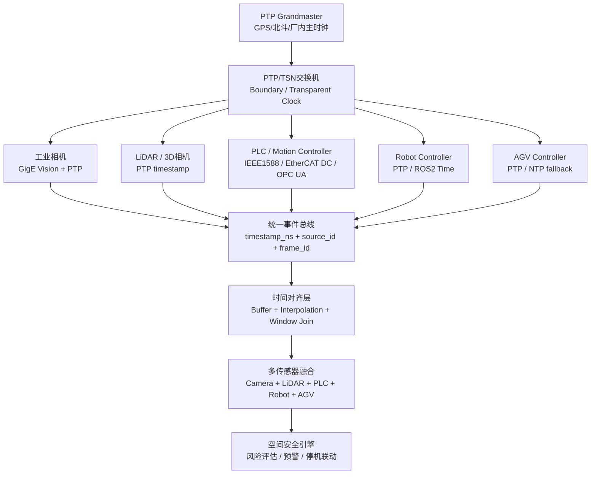
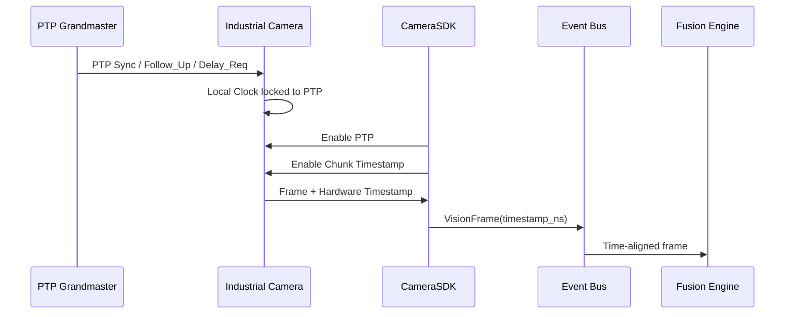
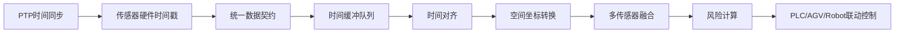
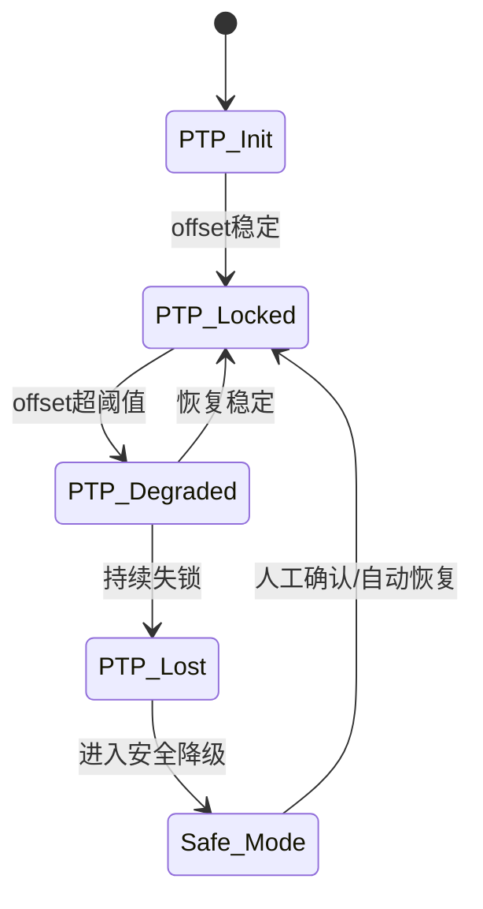

# 工业传感器集成PTP

author： 周均扬

date： 2026/07.07


---


工业传感器集成并融合 PTP（IEEE 1588）的核心目标是：**让 Camera、LiDAR、PLC、AGV、Robot、IMU、编码器等设备共享同一套高精度时间基准，并在统一时间轴上完成数据对齐、事件重建和多传感器融合**。

IEEE 1588-2019 定义了 Precision Time Protocol，用于网络化测量与控制系统中的高精度时钟同步；工业 Linux 侧常用 `linuxptp` 实现，其中 `ptp4l` 负责 PTP 协议同步，`phc2sys` 通常用于把网卡 PTP Hardware Clock 同步到系统时钟。([IEEE Standards Association][1])

---

## 1. 总体架构



---

## 2. 集成原则

### 核心原则

**不要用数据到达服务器的时间做融合，而要用传感器硬件采样时刻的 PTP 时间戳做融合。**

也就是说：

```text
错误方式：
server_receive_time = now()

正确方式：
sensor_capture_time = hardware_ptp_timestamp
```

工业现场中，网络抖动、驱动缓存、SDK回调延迟、GPU推理排队都会导致接收时间不稳定。PTP 的价值就是把每个传感器的真实采样时刻统一到同一时间轴。

---

## 3. PTP 在工业传感器中的三种集成层级

| 层级         | 说明                       |          精度 | 适用场景             |
| ---------- | ------------------------ | ----------: | ---------------- |
| 软件时间戳      | 数据进入应用层时打时间戳             |        ms 级 | 非关键日志、低速状态采集     |
| 网卡硬件时间戳    | NIC PHC 对报文打时间戳          | μs/sub-μs 级 | 工业视觉、AGV、PLC事件   |
| 传感器内部硬件时间戳 | 相机/雷达/控制器内部采样时刻打 PTP 时间戳 |     ns/μs 级 | 多相机同步、机器人安全、运动控制 |

工业传感器融合建议至少使用 **硬件时间戳**。对于高速相机、3D相机、LiDAR、编码器、机器人控制器，最好使用设备内部 timestamp。

---

## 4. 网络侧集成方案

### 推荐拓扑

```text
GPS/北斗/厂内时钟
        |
PTP Grandmaster
        |
PTP/TSN 工业交换机
        |
-------------------------------------------------
|        |          |          |          |
Camera   LiDAR      PLC        Robot      Edge IPC
PTP      PTP        PTP        PTP        linuxptp
```

### 网络设备要求

1. **Grandmaster Clock**

   * 作为全厂统一时间源。
   * 可接 GPS、北斗、IRIG-B 或厂内时钟系统。

2. **PTP 工业交换机**

   * 支持 Boundary Clock 或 Transparent Clock。
   * 普通交换机会引入不可控排队延迟，不适合高精度同步。

3. **PTP 网卡**

   * 边缘计算机建议使用 Intel i210/i225/i350、工业 TSN 网卡或支持 PHC 的网卡。
   * Linux 下用 `ethtool -T eth0` 检查是否支持硬件时间戳。

4. **传感器**

   * 工业相机：GigE Vision + PTP。
   * LiDAR/3D相机：PTP timestamp 或 PPS + timestamp。
   * PLC/运动控制器：IEEE 1588、EtherCAT Distributed Clocks、PROFINET IRT、TSN。
   * Robot Controller：PTP、ROS2 time、厂商 SDK timestamp。

GigE Vision 是工业相机常见 Ethernet 接口标准，不同厂商设备可通过该标准互操作；很多 GigE Vision 工业相机支持 PTP，用于多相机时间同步和采集时间戳。([Automate][2])

---

## 5. Linux 边缘端配置示例

### 1）检查网卡硬件时间戳能力

```bash
ethtool -T eth0
```

重点看是否支持：

```text
hardware-transmit
hardware-receive
hardware-raw-clock
```

### 2）启动 PTP 同步

```bash
sudo ptp4l -i eth0 -m -H
```

含义：

```text
-i eth0   指定网卡
-m        打印同步日志
-H        使用硬件时间戳
```

### 3）同步系统时钟到网卡 PHC

```bash
sudo phc2sys -s eth0 -c CLOCK_REALTIME -O 0 -m
```

`ptp4l` 负责网卡 PHC 与 Grandmaster 同步，`phc2sys` 负责把系统时钟同步到网卡硬件时钟；这是 Linux PTP 现场部署的常见组合。([Linux PTP][3])

---

## 6. 传感器数据契约设计

建议所有传感器数据进入系统后统一成如下结构：

```cpp
struct SensorTimestamp
{
    uint64_t timestamp_ns;        // PTP统一时间，单位ns
    uint64_t sequence_id;         // 设备内部序号
    std::string clock_domain;     // PTP domain，例如 domain 0
    std::string timestamp_type;   // HARDWARE / SOFTWARE / SENSOR_INTERNAL
    int64_t sync_offset_ns;       // 与GM偏差
    bool ptp_locked;              // 是否锁定PTP
};

struct SensorFrame
{
    std::string source_id;        // camera_01 / lidar_01 / plc_01
    std::string sensor_type;      // CAMERA / LIDAR / PLC / ROBOT / AGV
    SensorTimestamp ts;

    std::vector<uint8_t> payload; // 图像、点云、状态、事件
    std::map<std::string, std::string> metadata;
};
```

关键字段不是 `payload`，而是：

```text
timestamp_ns
timestamp_type
ptp_locked
sync_offset_ns
clock_domain
```

这些字段决定数据是否可用于高可靠融合。

---

## 7. 工业相机 PTP 集成流程

以 CameraSDK 为例，建议流程如下：



工业相机侧需要做几件事：

1. 开启 PTP。
2. 等待 PTP 状态进入 `Locked` 或 `Slave`。
3. 开启 Chunk Data。
4. 读取 Frame Timestamp。
5. 把相机 timestamp 转换为统一 `timestamp_ns`。
6. 数据进入事件总线。

示例结构：

```cpp
struct VisionFrame
{
    cv::Mat image;
    uint64_t frame_id = 0;
    uint64_t timestamp_ns = 0;      // PTP hardware timestamp
    std::string camera_id;
    bool ptp_locked = false;
    int64_t ptp_offset_ns = 0;
};
```

相机回调中不要重新用 `std::chrono::system_clock::now()` 覆盖时间戳：

```cpp
void onCameraFrame(const VendorFrame& raw)
{
    VisionFrame frame;

    frame.image = raw.toCvMatZeroCopy();
    frame.frame_id = raw.frame_id;

    // 正确：使用相机硬件PTP时间戳
    frame.timestamp_ns = raw.hardware_timestamp_ns;

    frame.camera_id = raw.camera_id;
    frame.ptp_locked = raw.ptp_status == PtpStatus::Locked;
    frame.ptp_offset_ns = raw.ptp_offset_ns;

    eventBus.publish(frame);
}
```

---

## 8. 多传感器时间融合方法

### 8.1 时间窗口对齐

对于不同频率的传感器：

| 传感器    |              频率 | 数据类型      |
| ------ | --------------: | --------- |
| Camera |   30/60/120 FPS | 图像帧       |
| LiDAR  |        10/20 Hz | 点云        |
| IMU    | 100/200/1000 Hz | 加速度/角速度   |
| PLC    |    10/50/100 Hz | 状态/IO     |
| Robot  | 100/250/1000 Hz | 关节位置/末端位姿 |
| AGV    |     10/20/50 Hz | 位置/速度/状态  |

融合时应使用统一时间轴：

```text
target_time = camera_frame.timestamp_ns

查找：
- 最近的 LiDAR scan
- 插值后的 Robot pose
- 最近的 PLC 状态
- 最近的 AGV pose
- 插值后的 IMU 状态
```

### 8.2 对齐策略

| 数据类型             | 推荐策略       |
| ---------------- | ---------- |
| 图像 vs 图像         | 精确帧同步或最近邻  |
| 图像 vs 点云         | 最近邻 + 时间窗口 |
| 图像 vs Robot Pose | 线性/SE(3)插值 |
| 图像 vs IMU        | 积分/预积分     |
| 图像 vs PLC状态      | 最近有效状态     |
| AGV轨迹            | 时间插值       |
| 安全事件             | 时间窗口 Join  |

---

## 9. Python 时间对齐示例

```python
from dataclasses import dataclass
from typing import List, Optional
import bisect

@dataclass
class SensorMsg:
    source_id: str
    timestamp_ns: int
    payload: object
    ptp_locked: bool = True


class TimeBuffer:
    def __init__(self, max_size: int = 1000):
        self.timestamps = []
        self.messages = []
        self.max_size = max_size

    def push(self, msg: SensorMsg):
        idx = bisect.bisect_left(self.timestamps, msg.timestamp_ns)
        self.timestamps.insert(idx, msg.timestamp_ns)
        self.messages.insert(idx, msg)

        if len(self.messages) > self.max_size:
            self.timestamps.pop(0)
            self.messages.pop(0)

    def nearest(self, timestamp_ns: int, tolerance_ns: int) -> Optional[SensorMsg]:
        if not self.timestamps:
            return None

        idx = bisect.bisect_left(self.timestamps, timestamp_ns)
        candidates = []

        if idx < len(self.timestamps):
            candidates.append(idx)
        if idx > 0:
            candidates.append(idx - 1)

        best = None
        best_dt = None

        for i in candidates:
            dt = abs(self.timestamps[i] - timestamp_ns)
            if dt <= tolerance_ns and (best_dt is None or dt < best_dt):
                best = self.messages[i]
                best_dt = dt

        return best


# 示例：以相机帧为主时钟，对齐 LiDAR 和 Robot 数据
camera_msg = SensorMsg(
    source_id="camera_01",
    timestamp_ns=1720000000123456789,
    payload="image_frame"
)

lidar_buffer = TimeBuffer()
robot_buffer = TimeBuffer()

lidar_buffer.push(SensorMsg("lidar_01", 1720000000123451000, "point_cloud"))
robot_buffer.push(SensorMsg("robot_01", 1720000000123459000, "robot_pose"))

lidar_msg = lidar_buffer.nearest(
    camera_msg.timestamp_ns,
    tolerance_ns=5_000_000  # 5 ms
)

robot_msg = robot_buffer.nearest(
    camera_msg.timestamp_ns,
    tolerance_ns=2_000_000  # 2 ms
)

fusion_packet = {
    "timestamp_ns": camera_msg.timestamp_ns,
    "camera": camera_msg.payload,
    "lidar": lidar_msg.payload if lidar_msg else None,
    "robot": robot_msg.payload if robot_msg else None,
}

print(fusion_packet)
```

---

## 10. C++ 融合数据包示例

```cpp
struct FusionPacket
{
    uint64_t timestamp_ns;

    std::optional<VisionFrame> camera_frame;
    std::optional<PointCloudFrame> lidar_frame;
    std::optional<RobotPose> robot_pose;
    std::optional<AgvPose> agv_pose;
    std::optional<PlcState> plc_state;

    bool time_aligned = false;
    int64_t max_time_error_ns = 0;
};
```

融合逻辑：

```cpp
FusionPacket FusionEngine::buildPacket(const VisionFrame& ref)
{
    FusionPacket packet;
    packet.timestamp_ns = ref.timestamp_ns;
    packet.camera_frame = ref;

    packet.lidar_frame = lidarBuffer.nearest(ref.timestamp_ns, 5_ms);
    packet.robot_pose  = robotBuffer.interpolate(ref.timestamp_ns);
    packet.agv_pose    = agvBuffer.interpolate(ref.timestamp_ns);
    packet.plc_state   = plcBuffer.nearest(ref.timestamp_ns, 10_ms);

    packet.max_time_error_ns = computeMaxTimeError(packet);
    packet.time_aligned = packet.max_time_error_ns < 5'000'000; // 5ms

    return packet;
}
```

---

## 11. 工业安全场景中的融合例子

### 场景：AGV + Robot + Camera + PLC 安全联动

```text
Camera timestamp:  t = 100.000 ms
AGV pose:          t = 99.800 ms
Robot TCP pose:    t = 100.100 ms
PLC safety state:  t = 100.000 ms
LiDAR obstacle:    t = 99.950 ms
```

系统将这些数据统一对齐到：

```text
fusion_time = 100.000 ms
```

然后计算：

```text
person_position_world
agv_position_world
robot_tcp_position_world
danger_zone_state
distance(person, agv)
distance(person, robot_tcp)
risk_level
```

输出安全事件：

```json
{
  "event_id": "evt_20260707_0001",
  "event_type": "SPATIAL_SAFETY_RISK",
  "timestamp_ns": 1720000000123456789,
  "ptp_locked": true,
  "risk_level": "L2_SLOWDOWN",
  "source": {
    "camera": "camera_01",
    "agv": "agv_03",
    "robot": "robot_02",
    "plc": "plc_pack_line_01"
  },
  "time_alignment": {
    "max_error_ns": 3200000,
    "tolerance_ns": 5000000
  },
  "action": {
    "agv": "slowdown",
    "robot": "speed_limit",
    "plc": "warning_output"
  }
}
```

---

## 12. PTP + 空间融合的完整流程



这里要注意：

```text
PTP 解决的是时间统一问题
外参标定解决的是空间统一问题
数据契约解决的是系统工程集成问题
融合算法解决的是感知一致性问题
安全策略解决的是控制闭环问题
```

PTP 不是单独使用的，它必须和以下模块一起构成完整系统：

```text
PTP 时间同步
+ Sensor Hardware Timestamp
+ Sensor Data Contract
+ Extrinsic Calibration
+ Event Bus
+ Time Buffer
+ Spatial Fusion
+ Safety State Machine
```

---

## 13. PTP 融合中的关键工程指标

| 指标                      |                      建议目标 |
| ----------------------- | ------------------------: |
| PTP offset              | < 1 μs，普通工业视觉可放宽到 < 10 μs |
| Camera timestamp jitter |   < 1 frame interval 的 5% |
| 多传感器最大时间误差              |             安全场景建议 < 5 ms |
| Robot pose 插值误差         |               与速度、加速度约束绑定 |
| PLC 状态延迟                |       建议纳入事件时间戳，而不是仅靠轮询时间 |
| PTP lock 状态             |                  必须进入健康监控 |
| Grandmaster 切换          |               必须记录并触发系统降级 |

---

## 14. 异常与降级策略

工业现场必须考虑 PTP 失锁：



建议策略：

| 状态             | 处理                  |
| -------------- | ------------------- |
| PTP Locked     | 正常融合                |
| Offset Warning | 提高时间窗口，降低控制激进程度     |
| PTP Degraded   | 停止高精度融合，只做保守安全判断    |
| PTP Lost       | 进入安全模式，禁止依赖时间精确性的联动 |
| GM 切换          | 记录事件，触发融合质量重新评估     |


---


## 15. 关键结论

工业传感器融合 PTP 的本质不是“把设备连上 PTP”，而是建立一条完整链路：

```text
统一时钟源
→ PTP交换网络
→ 传感器硬件时间戳
→ 统一 timestamp_ns 数据契约
→ 时间缓冲与对齐
→ 空间外参融合
→ 风险计算
→ PLC / AGV / Robot 设备安全联动
```

PTP 应该作为 **工业空间安全系统的时间底座**。没有 PTP，系统只能做“近似实时监控”；有 PTP，系统才能做“可追溯、可解释、可联动、可审计”的工业级多源融合安全闭环。


---

## 参考资料

[1]: https://standards.ieee.org/standard/1588-2019.html?utm_source=chatgpt.com "IEEE SA - IEEE 1588-2019"
[2]: https://www.automate.org/vision/vision-standards/vision-standards-gige-vision?utm_source=chatgpt.com "GigE Vision Standard"
[3]: https://linuxptp.sourceforge.net/?utm_source=chatgpt.com "The Linux PTP Project"

---
