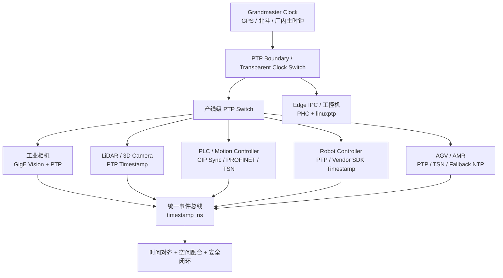
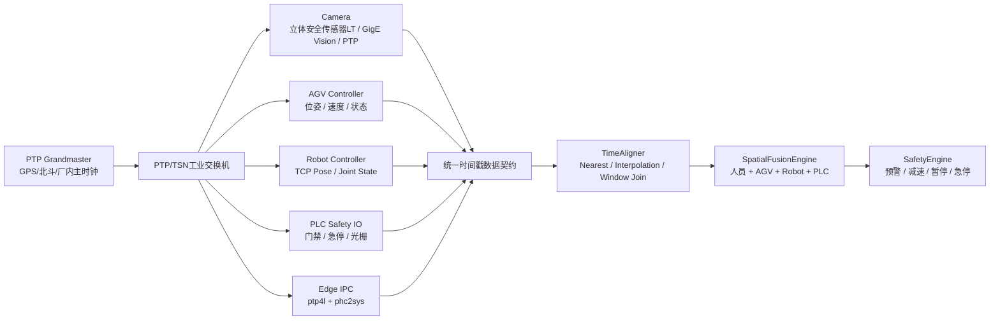

# PTP的发展演进历史及在工业领域的部署实践案例

author： 周均扬

date： 2026.07.07

---

从 **发展演进历史** 和 **工业部署实践案例** 两个维度阐述 PTP（Precision Time Protocol，IEEE 1588）在工业领域的发展与落地。


## 1. PTP的发展演进历史

### 1. PTP 的发展主线

PTP 的发展可以概括为一句话： **从“网络时间同步协议”演进为“工业实时系统的统一时间底座”。**

在早期工业系统中，设备同步主要依赖 GPS、IRIG-B、PPS、NTP 或厂商私有现场总线时钟。但随着 Ethernet 进入工业控制、机器视觉、运动控制、智能电网和 TSN 网络，工业系统开始需要一种可以在标准以太网上实现 **微秒级甚至亚微秒级同步** 的通用协议。IEEE 1588 就是在这个背景下形成的。IEEE 1588-2002 最初面向 networked measurement and control systems，并在 2002 年正式发布；NIST 资料也明确指出，2002 版后来演进为 IEEE 1588-2008，即工业界常说的 PTP Version 2。([IEEE Standards Association][1])


### 2. PTP 发展演进时间线

| 阶段            |         时间 | 标准 / 技术                                             | 关键变化                         | 工业意义                                      |
| ------------- | ---------: | --------------------------------------------------- | ---------------------------- | ----------------------------------------- |
| 前 PTP 阶段      | 1990s–2002 | GPS、IRIG-B、NTP、私有总线时钟                               | 时间同步与控制网络割裂                  | 适合电力、实验室、IT 网络，但难以统一工业 Ethernet           |
| PTP v1        |       2002 | IEEE 1588-2002                                      | 定义 Precision Time Protocol   | 面向网络化测量与控制系统，开始把时间同步带入 Ethernet 控制网络      |
| PTP v2        |       2008 | IEEE 1588-2008                                      | 精度、鲁棒性、profile 机制增强          | 成为工业自动化、运动控制、电力、视觉同步的主流基础                 |
| 行业 Profile 扩展 |      2010s | CIP Sync、Power Profile、802.1AS/gPTP、GigE Vision PTP | 不同行业基于 IEEE 1588 定义约束子集      | PTP 从通用协议变成可工程部署的行业规范                     |
| TSN 融合阶段      | 2011–2020s | IEEE 802.1AS / 802.1AS-2020                         | gPTP 成为 TSN 时间同步基础           | 为 OPC UA over TSN、确定性 Ethernet、智能制造网络奠定基础 |
| PTP v2.1      |  2019/2020 | IEEE 1588-2019                                      | 增强 profile 隔离、监控、安全、单播/组播混合等 | 支撑更复杂、更大规模、更安全的工业和关键基础设施网络                |
| 新一代工业时间网络     |   2020s–现在 | TSN、5G-TSN、边缘 AI、工业视觉融合                             | 从单纯设备同步走向系统级时间语义             | 支撑工业空间安全、AGV 协同、机器人协作、多传感器融合              |

IEEE 1588-2008 官方定义 PTP 用于同步网络化分布式系统中的实时钟；IEEE 1588-2019 是后续版本，继续定义用于设备实时钟精确同步的网络协议。IEEE 802.1AS-2020 则明确是 IEEE 1588 的一个 profile，用于支持 time-sensitive network applications，包括音视频和时间敏感控制。([IEEE Standards Association][2])


### 3. 技术演进：PTP 不只是“校时”，而是“时间控制架构”

#### 3.1 从 NTP 到 PTP：精度等级变化

NTP 更适合 IT 网络中的系统时间同步，通常用于日志、数据库、服务器集群等场景。PTP 的设计目标不同，它面向测量、控制、工业设备和实时系统，核心优势是可以利用 **硬件时间戳、PTP-aware switch、Grandmaster、Boundary Clock、Transparent Clock** 来降低网络抖动影响。Rockwell 的 CPwE Time 设计指南也明确将 CIP Sync 和 IEEE 1588-2008 用于本地和工厂级 IACS 应用，面向高于 NTP 能力的高精度时间同步需求。([Rockwell Automation][3])

#### 3.2 从软件时间戳到硬件时间戳

PTP 的工程落地经历了三个层级：

```text
应用层软件时间戳
    ↓
网卡硬件时间戳 / PHC
    ↓
传感器内部硬件采样时间戳
```

工业融合场景中，真正有价值的是第三层：**传感器在曝光、采样、扫描、IO 变化、机器人位姿采样瞬间产生的硬件时间戳**。如果只是服务器收到数据后 `now()` 打时间戳，网络排队、SDK 回调、驱动缓冲和 GPU 推理都会破坏时间一致性。

#### 3.3 从普通交换机到 PTP-aware Switch

PTP v2 的一个重要工程演进是对交换网络的处理能力增强。Transparent Clock 会测量 PTP 报文在交换机内部停留的 residence time，并把该延迟补偿进 PTP 报文；这可以显著降低普通交换转发带来的路径延迟误差。TI 的技术资料明确说明，IEEE 1588 v2 引入了 Transparent Clock，作为多端口交换设备中 Boundary Clock 的替代或补充方案。([Texas Instruments][4])

#### 3.4 从“时间同步”到“确定性网络”

在 TSN 中，时间同步不是附属功能，而是前提条件。IEEE 802.1AS-2020 规定了支持时间敏感网络应用同步需求的协议、过程和管理对象，并包括 IEEE 1588 的一个 profile。换句话说，TSN 的时隙调度、时间感知整形、确定性转发，都需要共同时间基准。([IEEE Standards Association][5])


---

## 2. PTP的工业部署实践案例

### 1. PTP 在工业领域的典型部署架构

标准工业部署通常是下面这种结构：



工程上通常分为四层：

| 层级    | 关键设备                         | 主要任务                                         |
| ----- | ---------------------------- | -------------------------------------------- |
| 时间源层  | GPS/北斗/铷钟/厂内主时钟              | 提供 Grandmaster 时间                            |
| 网络同步层 | PTP/TSN 交换机                  | 传播 PTP，支持 Boundary Clock / Transparent Clock |
| 设备采样层 | Camera、LiDAR、PLC、Robot、AGV   | 产生硬件采样时间戳                                    |
| 应用融合层 | Edge IPC、AI Server、Safety OS | 按统一时间轴对齐数据并做融合决策                             |

---

### 2. 工业部署实践案例

#### 案例 1：EtherNet/IP + CIP Sync，用于运动控制和分布式控制

CIP Sync 是 ODVA 在 Common Industrial Protocol 体系中的时间同步机制，它兼容 IEEE 1588，并面向工业自动化中需要绝对时间同步的分布式智能设备和控制系统。ODVA 资料称，CIP Sync 可在两个设备之间实现小于 100 ns 的同步精度，并可运行在基于交换机的常规 Ethernet 架构上。([ODVA][6])

典型应用包括：

```text
多轴运动控制
高速分拣
高速检测
飞拍检测
分布式 IO
机器级事件顺序记录
```

Rockwell 的部署资料将 PTP/CIP Sync 放在 Converged Plantwide Ethernet 架构中，用于工厂级 IACS 网络的可扩展时间分发，并强调它用于需要高精度、超过 NTP 能力范围的本地和工厂级工业控制应用。([Rockwell Automation][3])

**工程实践要点：**

| 项目           | 建议                                   |
| ------------ | ------------------------------------ |
| Grandmaster  | 使用支持 CIP Sync / IEEE 1588 的控制器或专用时钟源 |
| 交换机          | 选择支持 PTP 的工业交换机                      |
| PLC / Motion | 确保控制器、伺服驱动、IO 模块在同一 PTP domain       |
| 验证指标         | offset、jitter、GM 切换时间、伺服同步误差         |
| 典型风险         | 混用非 PTP 交换机、VLAN/QoS 配置错误、GM 选举不稳定   |


#### 案例 2：GigE Vision 2.0 + PTP，用于多工业相机同步

机器视觉是 PTP 在工业现场非常典型的应用。GigE Vision 2.0 将 IEEE 1588 PTP 作为多相机系统的重要能力，Basler 的资料明确说明，PTP 用于在网络中精确同步多个相机；支持 PTP 的相机会在网络中确定主从时钟关系。([Basler AG][7])

典型应用包括：

```text
多相机同步拍照
3D 重建
立体视觉
产线飞拍
高速尺寸测量
Pack 产线人员/设备空间安全感知
机器人引导与手眼协同
```

Basler 的产品文档也说明，PTP 功能可用于同步同一网络中的多个 GigE 相机，且其相机支持 IEEE 1588-2008，即 PTP Version 2。([docs.baslerweb.com][8])

**工程实践要点：**

```text
1. 工业相机开启 PTP
2. 相机进入 Slave / Locked 状态
3. 开启 Chunk Timestamp
4. 每帧图像携带 camera hardware timestamp
5. CameraSDK 输出 timestamp_ns
6. 多相机 / 相机+机器人 / 相机+AGV 按 PTP 时间轴融合
```

在 Pack 产线安全系统中，这一点非常关键。比如人员检测相机、AGV 位姿、机器人 TCP 位姿、PLC 安全 IO 必须在同一时间轴上对齐，否则“人是否进入危险区”“机器人当时是否在运动”“AGV 当时速度是多少”这些安全判断都会产生时间歧义。


#### 案例 3：电力数字化变电站，IEC/IEEE 61850-9-3 Power Utility Profile

电力行业是 PTP 的重度应用场景之一。IEC/IEEE 61850-9-3:2016 定义了适用于 power utility automation 的 PTP profile，基于 IEC 61588:2009 / IEEE 1588-2008，并用于满足 IEC 61850-5 和 IEC 61869-9 中最高同步等级要求。([IEEE Standards Association][9])

典型应用包括：

```text
合并单元 Merging Unit
保护继电器
采样值 Sampled Values
GOOSE 事件
广域相量测量 PMU
故障录波
断路器事件顺序记录
```

IEEE C37.238-2017 也定义了在电力系统保护、控制、自动化和数据通信应用中使用 IEEE 1588-2008 PTP 的扩展 profile。([IEEE Standards Association][10])

**工程实践要点：**

| 项目  | 推荐做法                                                |
| --- | --------------------------------------------------- |
| 时间源 | GPS/北斗 Grandmaster，必要时双主时钟                          |
| 网络  | PRP/HSR 或冗余以太网                                      |
| 交换机 | 支持 Power Profile、Boundary Clock 或 Transparent Clock |
| 终端  | 合并单元、保护装置、测控装置均接入 PTP                               |
| 验证  | 采样值同步误差、GOOSE 时间戳、故障录波对齐                            |
| 降级  | GNSS 丢失时 holdover；GM 切换必须可审计                        |

电力案例对工业制造很有启发：它不是简单“校准系统时间”，而是把时间作为保护、控制和事故追溯的基础设施。Pack 产线安全系统同样需要这种思路：每个安全事件不仅要知道“发生了什么”，还要知道“在统一时间轴上何时发生”。


#### 案例 4：PROFINET IRT / PTCP，用于等时实时控制

PROFINET IRT 使用共享时钟实现等时实时通信。PROFINET University 的资料说明，IRT 的共享时钟由 IEEE 1588v2 提供，PROFINET 在其基础上扩展出 PTCP，即 Precision Transparent Clock Protocol，用于共享实时钟并计算交换机和线缆带来的延迟。([PROFINET University][11])

典型应用包括：

```text
伺服驱动同步
包装机械
高速装配
机器人与输送线同步
运动控制与 IO 等时刷新
```

**工程实践要点：**

```text
PROFINET IRT 不是简单依赖普通以太网转发，
而是通过时间同步 + 调度通信窗口实现等时控制。
```

这类系统的关键不是平均延迟，而是 **确定性 jitter**。对于高节拍产线，PTP/IRT 的意义在于让控制器、驱动器、IO、传感器在同一个控制周期内协同动作。


#### 案例 5：TSN + OPC UA PubSub，用于新一代工业互联

TSN 的核心是把标准 Ethernet 扩展为支持确定性通信的工业网络。IEEE 802.1AS 是 TSN 的时间同步基础；IEEE 官方资料说明，802.1AS 支持 time-sensitive network applications 的同步需求，并且包括 IEEE 1588 的 profile。([IEEE Standards Association][5])

在工业自动化中，OPC UA PubSub over TSN 被视为一种面向多厂商互操作的未来方案。相关研究指出，OPC UA PubSub 与 TSN 是工业网络从传统 fieldbus 向 IIoT/Industry 4.0 演进的重要方向，IEEE 802.1AS/802.1AS-Rev 定义了面向小 footprint 系统的 IEEE 1588 PTP profile。([ScienceDirect][12])

典型应用包括：

```text
跨厂商控制器互联
边缘控制器实时通信
运动控制 + 视觉 + 机器人协同
AGV/AMR 与产线设备协同
工业 AI 事件总线
统一数据采集与确定性控制网络
```

**工程实践要点：**

| 模块                  | 作用        |
| ------------------- | --------- |
| IEEE 802.1AS / gPTP | 提供统一时间    |
| IEEE 802.1Qbv       | 基于时间的门控调度 |
| IEEE 802.1Qci       | 流过滤与监管    |
| OPC UA PubSub       | 统一工业数据语义  |
| TSN Switch          | 执行确定性调度   |
| Edge Controller     | 做实时融合与控制  |

TSN 阶段的 PTP 已经不只是设备之间“时钟一样”，而是网络调度、数据发布、控制闭环和事件追溯的共同基础。


#### 案例 6：Linux 边缘工控机 + PTP Hardware Clock，用于 AI 视觉和传感器融合

在工业 AI 边缘计算中，常见做法是使用支持 PHC 的网卡，并在 Linux 上部署 `linuxptp`。Red Hat 文档说明，`linuxptp` 包含 `ptp4l` 和 `phc2sys`；`ptp4l` 可实现 PTP ordinary clock 和 boundary clock，并在硬件时间戳模式下将网卡 PTP Hardware Clock 同步到 master clock。([红帽文档][13])

典型边缘部署如下：

```text
Grandmaster
    ↓
PTP Switch
    ↓
Edge IPC with PHC NIC
    ├── ptp4l: 同步网卡 PHC
    ├── phc2sys: 同步系统时钟
    ├── CameraSDK: 读取相机硬件时间戳
    ├── LiDARSDK: 读取点云时间戳
    ├── RobotSDK: 读取机器人位姿时间戳
    └── FusionEngine: 基于 timestamp_ns 融合
```

**常见命令：**

```bash
ethtool -T eth0
sudo ptp4l -i eth0 -m -H
sudo phc2sys -s eth0 -c CLOCK_REALTIME -O 0 -m
```

这类部署非常适合工业视觉、Pack 产线安全、AGV 协同、机器人空间安全等场景。


### 3. 部署实践中的关键经验

#### 1. 不要只看“协议支持”，要看“时间戳位置”

同样标称支持 PTP，工程效果可能完全不同：

| 时间戳位置            | 质量 | 说明                  |
| ---------------- | -- | ------------------- |
| 应用层软件时间戳         | 低  | 受 OS 调度、SDK 回调、缓存影响 |
| 网卡硬件时间戳          | 中高 | 可用于网络同步和报文时间戳       |
| 传感器内部采样时间戳       | 高  | 最适合视觉、LiDAR、机器人融合   |
| FPGA / 传感器采集级时间戳 | 最高 | 适合高速测量、科学仪器、强实时控制   |

工业融合系统应优先使用 **传感器采样瞬间的硬件时间戳**。

---

#### 2. 不要混用非 PTP 交换路径

PTP 对网络路径非常敏感。普通交换机虽然可以转发 PTP 报文，但不能补偿报文在交换机内的驻留时间，也不能稳定处理路径延迟。工业现场如果需要亚微秒级或低微秒级同步，应使用支持 Boundary Clock 或 Transparent Clock 的工业交换机。


#### 3. PTP domain 必须规划

大型工厂可能同时存在：

```text
产线控制 PTP domain
机器视觉 PTP domain
电力系统 PTP domain
TSN domain
实验测试 domain
```

如果 domain 混乱，会出现错误 Grandmaster、跨系统抢主、时间源污染等问题。因此应在网络设计阶段明确：

```text
domainNumber
profile
priority1 / priority2
clockClass
GM 选举策略
VLAN / QoS
冗余路径
```


#### 4. PTP 状态必须进入系统健康监控

PTP 不应只是后台服务，而应成为系统健康状态的一部分。建议监控：

```text
ptp_locked
gm_identity
offset_from_master
mean_path_delay
steps_removed
clock_class
clock_accuracy
grandmaster_change_count
sync_loss_count
```

对于安全系统，PTP 状态应直接影响控制策略：

| PTP 状态         | 系统策略               |
| -------------- | ------------------ |
| Locked         | 正常融合               |
| Offset Warning | 提高时间窗口，降低控制激进度     |
| Degraded       | 只做保守风险判断           |
| Lost           | 禁止依赖精确时间的联动，进入安全降级 |
| GM Changed     | 记录事件并重新评估同步质量      |


### 4. 面向 Pack 产线工业安全的部署建议

对于**AGV + Robot + Camera 融合系统**，PTP 建议这样落地：



建议分三步实施：

#### 第一阶段：时间底座建设

```text
1. 选定 Grandmaster
2. 选型 PTP/TSN 工业交换机
3. 工控机网卡支持 PHC
4. 部署 ptp4l / phc2sys
5. 打通 Camera / Robot / PLC / AGV 时间戳读取
```

#### 第二阶段：统一数据契约

所有传感器消息都必须带：

```json
{
  "source_id": "camera_01",
  "sensor_type": "CAMERA",
  "timestamp_ns": 1720000000123456789,
  "timestamp_type": "HARDWARE",
  "ptp_locked": true,
  "ptp_offset_ns": 320,
  "clock_domain": 0
}
```

#### 第三阶段：融合与安全闭环

```text
以 Camera/LT 感知帧为主时间：
- 对齐 AGV 位姿
- 插值 Robot TCP 位姿
- 对齐 PLC Safety IO
- 对齐 LiDAR / 3D 点云
- 输出统一风险事件
```

---

## 3. 发展趋势判断

PTP 在工业领域的发展方向非常明确：

| 方向              | 说明                                                       |
| --------------- | -------------------------------------------------------- |
| 从设备同步到系统同步      | 不再只同步 PLC 或相机，而是同步 Camera、LiDAR、Robot、AGV、PLC、AI Server  |
| 从单协议到 Profile 化 | CIP Sync、Power Profile、gPTP、GigE Vision PTP 都是行业 profile |
| 从控制网络到数据网络融合    | TSN + OPC UA PubSub 推动控制流、数据流、AI 流统一                     |
| 从实时控制到可追溯安全     | 安全事件需要统一时间轴支撑审计和回放                                       |
| 从有线到有线+无线协同     | AGV/AMR、5G-TSN、Wireless TSN 对时间同步提出新要求                   |
| 从可信内网到安全时间同步    | PTP 安全、GM 防伪、延迟攻击检测会越来越重要                                |

---

## 4. 核心结论

PTP 的工业价值不是“把设备时间调准”，而是建立一套 **工业实时系统的统一时间语义**：

```text
统一时间源
→ PTP-aware 工业网络
→ 传感器硬件采样时间戳
→ 统一 timestamp_ns 数据契约
→ 多源时间对齐
→ 空间融合
→ 实时控制
→ 安全审计与事件回放
```

对于AGV/Robot/Camera 融合、工业视觉检测、数字化变电站、运动控制和 TSN 工厂网络，PTP 已经从底层通信协议演进为 **工业实时感知、控制与安全闭环的基础设施**。

[1]: https://standards.ieee.org/ieee/1588/3140/?utm_source=chatgpt.com "IEEE 1588-2002"
[2]: https://standards.ieee.org/standard/1588-2008.html?utm_source=chatgpt.com "IEEE 1588-2008"
[3]: https://literature.rockwellautomation.com/idc/groups/literature/documents/td/enet-td016_-en-p.pdf?utm_source=chatgpt.com "Deploying Scalable Time Distribution within a Converged ..."
[4]: https://www.ti.com/lit/pdf/snla104?utm_source=chatgpt.com "AN-1838 IEEE 1588 Boundary Clock and Transparent ..."
[5]: https://standards.ieee.org/standard/802_1AS-2020.html?utm_source=chatgpt.com "IEEE SA - IEEE 802.1AS-2020"
[6]: https://www.odva.org/technology-standards/distinct-cip-services/cip-sync/?utm_source=chatgpt.com "CIP Sync™ | Common Industrial Protocol"
[7]: https://www.baslerweb.com/en-us/learning/multi-camera-systems-gige-vision-2-0/?utm_source=chatgpt.com "GigE Vision 2.0 for Multi-Camera Systems"
[8]: https://docs.baslerweb.com/precision-time-protocol?utm_source=chatgpt.com "Precision Time Protocol - Basler Product Documentation"
[9]: https://standards.ieee.org/standard/61850-9-3-2016.html?utm_source=chatgpt.com "IEEE/IEC 61850-9-3-2016"
[10]: https://standards.ieee.org/ieee/C37.238/6650/?utm_source=chatgpt.com "IEEE C37.238-2017"
[11]: https://profinetuniversity.com/profinet-basics/isochronous-real-time-irt-communication/?utm_source=chatgpt.com "Isochronous Real-Time (IRT) Communication"
[12]: https://www.sciencedirect.com/org/science/article/pii/S1742737122000394?utm_source=chatgpt.com "OPC UA TSN: a next-generation network for Industry 4.0 ..."
[13]: https://docs.redhat.com/en/documentation/red_hat_enterprise_linux/7/html/system_administrators_guide/ch-configuring_ptp_using_ptp4l?utm_source=chatgpt.com "Chapter 20. Configuring PTP Using ptp4l"
