# Mermaid使用手册

author： 周均扬

date: 2026.07.09

---


## 1. 基本结构

最小可运行结构如下：

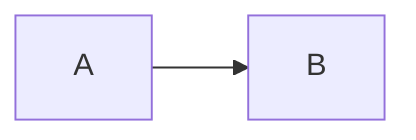

含义：

```text
声明图类型与方向
定义节点 A
定义节点 B
A 指向 B
```

完整写法：

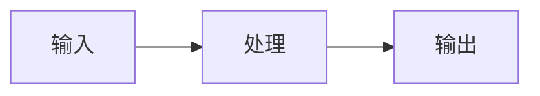

建议规则：

| 项目    | 推荐写法          | 说明       |
| ----- | ------------- | -------- |
| 图类型   | `flowchart`   | 新版推荐写法   |
| 方向    | `LR` / `TB`   | 控制整体布局   |
| 节点 ID | 英文、数字、下划线     | 稳定，不容易报错 |
| 中文内容  | 放在 `["中文"]` 中 | 中文显示更稳定  |
| 换行    | `<br/>`       | 适合做汇报图   |

---

## 2. 节点写法

Mermaid flowchart 支持多种节点形状，官方文档也列出了矩形、圆角、圆形、菱形、圆柱形等多种节点形状。([美人鱼图表][1])

### 1. 普通矩形节点

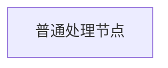

常用于：

```text
模块、功能、步骤、系统组件
```


### 2. 圆角节点


常用于：

```text
开始、结束、入口、出口
```


### 3. 菱形判断节点

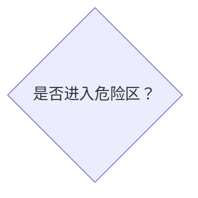

常用于：

```text
是 / 否判断
条件分支
风险等级判断
```


### 4. 圆柱形数据库节点

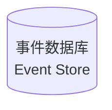

常用于：

```text
数据库、数据湖、缓存、日志仓库
```


### 5. 子程序 / 模块节点

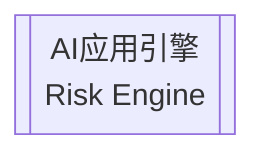

常用于：

```text
核心模块
算法引擎
平台服务
```

---

## 3. 连线写法

Mermaid 的节点之间通过 link / edge 连接，官方文档说明 flowchart 支持不同类型的连线，也可以给连线附加文字。([美人鱼图表][1])

### 1. 普通箭头

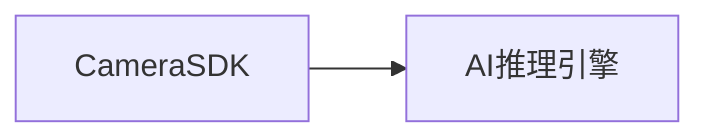

含义：

```text
A 指向 B
```


### 2. 无箭头连线

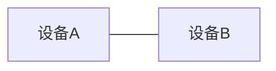

适合表示：

```text
关联关系
连接关系
非方向性关系
```


### 3. 带文字的箭头

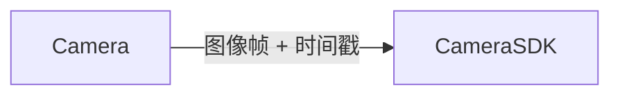

适合表示：

```text
数据内容
接口协议
触发条件
控制命令
```


### 4. 虚线箭头

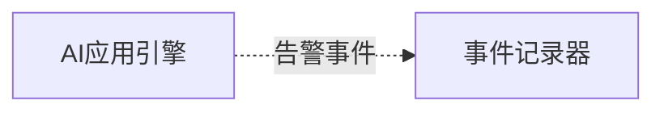

适合表示：

```text
异步事件
日志流
非主流程
辅助关系
```


### 5. 粗箭头

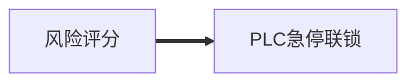

适合表示：

```text
关键控制链路
强约束动作
安全闭环
核心主链路
```


### 6. 多节点链式写法

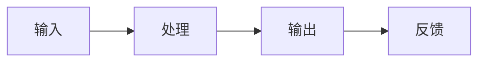

适合快速表达线性流程。

但复杂图不建议过度使用一行链式写法，否则后续维护困难。工程图建议一条边一行。

---

## 4. 分支判断写法

### 1. 基础判断

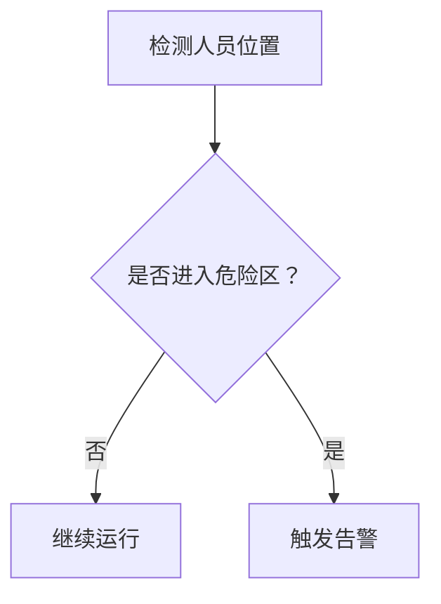


### 2. 多级风险判断

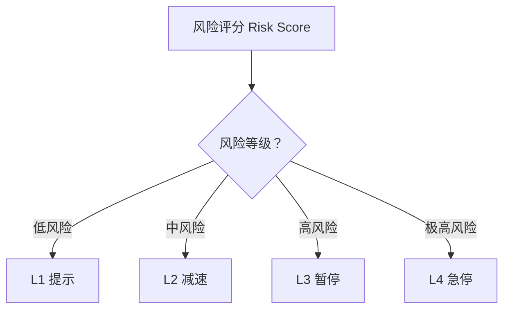

---

## 5. `subgraph` 分组

`subgraph` 用于把多个节点放在一个逻辑分组里。官方语法形式是 `subgraph title ... end`，也可以为 subgraph 设置显式 ID；flowchart 还支持从 subgraph 连到外部节点。([美人鱼图表][1])

### 1. 基础分组

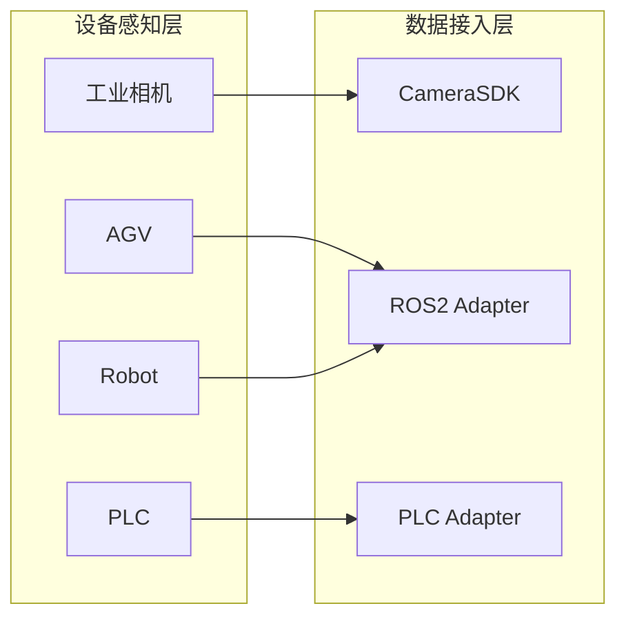


### 2. 多层系统架构图

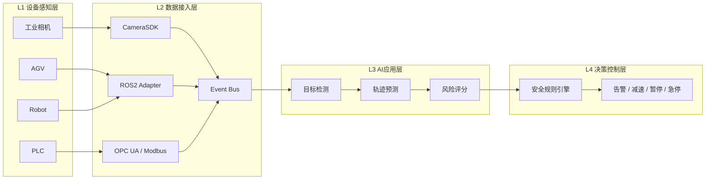


### 3. subgraph 方向限制

Mermaid 支持在 subgraph 内使用 `direction` 指定子图方向，但官方文档特别说明：如果子图中的节点与外部节点相连，子图方向可能会被忽略，并继承父图方向。([美人鱼图表][1])

例如：

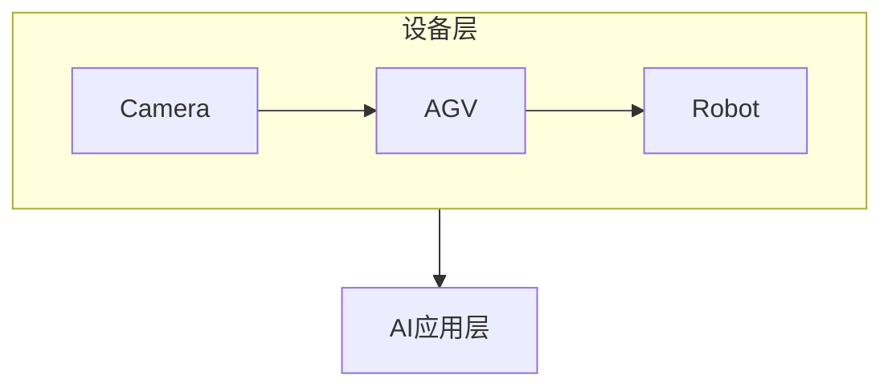

实际渲染时，子图不一定完全按 `direction LR` 排列。

工程建议：

```text
1. 不要过度依赖 subgraph 内部 direction。
2. 复杂架构图优先用整体 LR。
3. 复杂流程图优先用整体 TB。
4. 如需精确排版，拆成多张 Mermaid 图。
```

---

## 6. 样式：`classDef` 与 `class`

Mermaid 推荐使用 `classDef` 定义样式，再通过 `class` 绑定到节点；官方文档也说明，外部 CSS 不如 `classDef` 稳定，推荐直接使用 Mermaid 内部样式机制。([美人鱼图表][1])

### 1. 基础样式

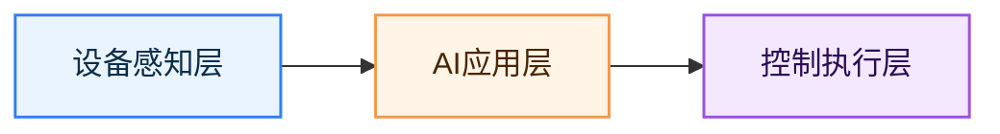

---

### 2. 多节点绑定同一类

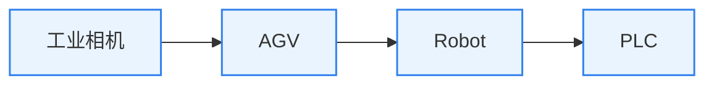

---

### 3. 使用 `:::` 简写样式

```mermaid
flowchart LR
    A["设备感知层"]:::sensor --> B["AI应用层"]:::ai

    classDef sensor fill:#EAF4FF,stroke:#2F80ED,stroke-width:1.5px;
    classDef ai fill:#FFF4E6,stroke:#F2994A,stroke-width:1.5px;
```

---

## 7. 注释写法

Mermaid 支持使用 `%%` 写注释，注释需要单独成行，解析器会忽略这些内容。([美人鱼图表][1])

```mermaid
flowchart LR
    %% 这是设备接入部分
    A["Camera"] --> B["CameraSDK"]

    %% 这是AI处理部分
    B --> C["AI应用引擎"]
```

建议在复杂图中保留注释，方便后续维护。

---

## 8. 中文、特殊字符与换行

官方文档建议 Unicode 文本使用双引号包起来；如果节点文本包含特殊字符，也建议用引号避免语法问题。([美人鱼图表][1])

### 推荐写法

```mermaid
flowchart LR
    A["工业相机<br/>人员/AGV/机器人感知"]
    B["AI应用引擎<br/>检测/跟踪/预测/评分"]

    A --> B
```

### 不推荐写法

```mermaid
flowchart LR
    工业相机 --> AI应用引擎
```

原因：

```text
中文直接作为节点 ID 时，后续连线、样式绑定、修改会比较不稳定。
```

建议规范：

```text
节点 ID 用英文：Camera, AIEngine, RiskScore
节点显示文本用中文：["工业相机"]
多行文本用 <br/>
复杂文本加双引号
```

---

## 9. 线条样式：`linkStyle`

`linkStyle` 可以按连线顺序设置样式。官方文档说明，linkStyle 通过连线定义的顺序编号来匹配连线。([美人鱼图表][1])

```mermaid
flowchart LR
    A["感知"] --> B["AI应用"]
    B --> C["风险评分"]
    C --> D["PLC急停"]

    linkStyle 2 stroke:#ff0000,stroke-width:3px;
```

注意：

```text
linkStyle 2 表示第 3 条边。
Mermaid 的边编号通常从 0 开始。
```

所以：

```text
第 0 条：A --> B
第 1 条：B --> C
第 2 条：C --> D
```

---


## 10. 常用语法速查表

| 功能    | 写法                 | 示例    |
| ----- | ------------------ | ----- |
| 声明横向图 | `flowchart LR`     | 左到右   |
| 声明纵向图 | `flowchart TB`     | 上到下   |
| 矩形节点  | `A["文本"]`          | 普通模块  |
| 圆角节点  | `A("文本")`          | 开始/结束 |
| 判断节点  | `A{"文本"}`          | 条件分支  |
| 数据库节点 | `A[("文本")]`        | 数据库   |
| 子程序节点 | `A[["文本"]]`        | 核心模块  |
| 普通箭头  | `A --> B`          | 有方向   |
| 无箭头线  | `A --- B`          | 关联    |
| 带文字箭头 | `A -- "文本" --> B`  | 数据/条件 |
| 虚线箭头  | `A -.-> B`         | 异步/辅助 |
| 粗箭头   | `A ==> B`          | 关键链路  |
| 分组    | `subgraph ... end` | 分层架构  |
| 注释    | `%% 注释`            | 维护说明  |
| 定义样式  | `classDef xxx ...` | 样式模板  |
| 应用样式  | `class A xxx;`     | 节点绑定  |

---

## 11. 选择 `LR` 还是 `TB` 的判断方法

### 选 `flowchart LR` 的情况

当你的图是下面这种逻辑：

```text
左边输入，右边输出
前面是底层，后面是上层
前面是数据源，后面是应用
前面是阶段1，后面是阶段2
```

例如：

```text
设备层 → 接入层 → AI层 → 控制层 → 应用层
MVP → Pilot → Scale → Platform
Camera → SDK → AI → PLC
```

就用：

```mermaid
flowchart LR
    A["输入"] --> B["处理"] --> C["输出"]
```


### 选 `flowchart TB` 的情况

当你的图是下面这种逻辑：

```text
上面是开始，下面是结束
上级到下级
流程一步步向下执行
判断分支向下展开
```

例如：

```text
开始 → 检测 → 判断 → 动作 → 记录
CEO → CTO → 能力中心
需求 → 设计 → 开发 → 测试 → 发布
```

就用：

```mermaid
flowchart TB
    A["开始"] --> B["处理"] --> C["结束"]
```

---

## 12. 工程级 Mermaid 编写规范

建议你在 Pack 产线工业安全项目中统一采用下面规范：

```text
1. 图类型统一用 flowchart，不用旧写法 graph。
2. 架构图优先用 LR。
3. 流程图、状态升级图、组织图优先用 TB。
4. 节点 ID 使用英文，例如 Camera、CameraSDK、RiskEngine。
5. 中文显示文本放在 ["..."] 中。
6. 多行文本使用 <br/>。
7. 所有模块尽量使用 subgraph 分层。
8. 所有颜色使用 classDef 统一管理。
9. 不建议在节点 ID 中直接写中文、空格、括号、斜杠。
10. 复杂图不要追求一张图装下所有内容，建议拆成“总体图 + 局部图”。
```

---

## 13. 推荐给 ChatGPT 的 Mermaid 生成提示词

```text
请根据以下内容生成 Mermaid flowchart。

主题：工业空间安全系统架构
图类型：flowchart
方向：LR
要求：
1. 使用 subgraph 分层
2. 节点 ID 使用英文
3. 节点显示文本使用中文
4. 中文节点使用 ["..."] 包裹
5. 多行文本使用 <br/>
6. 使用 classDef 定义颜色
7. 架构图风格：咨询汇报、工业4.0、蓝白科技风
8. 输出可直接复制运行的 Mermaid 代码
9. 不要输出解释，只输出代码

内容：
- 设备感知层：工业相机、AGV、Robot、PLC
- 数据接入层：CameraSDK、ROS2 Adapter、PLC Adapter、Event Bus
- AI应用层：目标检测、轨迹预测、风险评分
- 决策控制层：规则引擎、安全动作、控制命令
- 平台应用层：Dashboard、事件回溯、安全报表
```


[1]: https://mermaid.ai/open-source/syntax/flowchart.html "Flowcharts Syntax | Mermaid"
