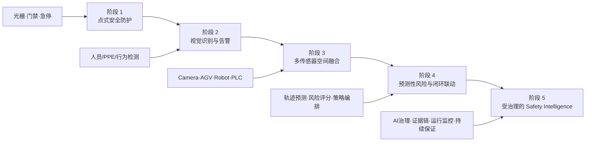
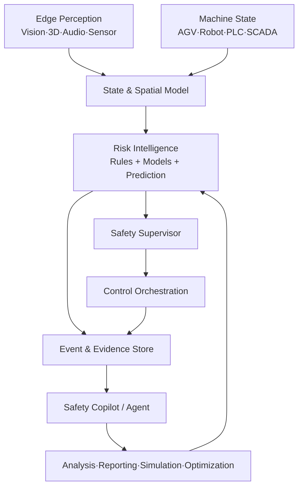

# AI + Safety 技术发展趋势

author： 周均扬

date: 2026.07.12

---

## 1. 研究范围

本文中的 AI + Safety 主要指 AI 技术用于工业人员安全、设备与工艺风险识别、安全运营和决策辅助，同时也关注 AI 自身的可靠性、可解释性、网络安全和治理问题。

它不同于仅讨论大模型对齐的狭义“AI Safety”，更接近以下交叉领域：

```text
Industrial Safety + Functional Safety + Machine Safety + AI Assurance + Cybersecurity + AI Governance + Safety Operations
```

## 2. 技术演进



## 3. 五个主要趋势

### 趋势一：从二维识别走向三维空间理解

人员检测将与深度、点云、姿态、轨迹和区域拓扑结合，系统判断重点从“是否看见人”转变为“人在何处、正在靠近什么、未来可能发生什么”。

### 趋势二：从单模型告警走向多源状态融合

安全判断需要结合 AGV 速度和路径、Robot 工作区、PLC 工艺状态、高压状态、门禁权限和现场区域配置。AI 模型输出只是风险证据之一，而不是完整结论。

### 趋势三：从事后告警走向预测性安全

基于 TTC、停车距离、轨迹交叠、行为意图和设备能量状态，安全系统可提前识别冲突并采用渐进式策略：提示、限速、暂停和进入安全状态。

### 趋势四：从“模型精度”走向“系统保证”

工业安全不会只以 mAP 或准确率验收，还需要验证：

- ODD 与场景覆盖；
- 端到端延迟和抖动；
- 数据与模型版本；
- 不确定性和失效模式；
- 降级与恢复；
- 事件证据与可审计性；
- 网络安全与供应链安全。

### 趋势五：从项目制算法走向 Safety OS 平台

统一数据模型、设备适配、空间引擎、风险规则、控制网关、事件回放、模型管理和策略运营，将成为跨场景复用的基础平台。

## 4. 典型应用

| 应用 | AI 能力 | 安全闭环 |
|---|---|---|
| 人车混行 | 人员/车辆检测、3D 轨迹、TTC | 提示、AGV 降速或暂停 |
| 机器人区域 | 人员侵入、姿态、扫掠体关系 | Robot 暂停、门禁联动 |
| PPE 与行为 | PPE、跌倒、攀爬、越界 | 告警、现场确认、事件留证 |
| 预测性维护 | 异常检测、趋势预测 | 降载、检修计划、风险抑制 |
| 安全运营 | 事件聚类、根因分析、知识检索 | 策略优化、培训和整改 |

## 5. 技术架构趋势



安全 Agent 更适合承担知识检索、事件解释、报告生成、规则建议、测试生成和运维辅助；对于实时高等级安全动作，应由经过约束和验证的确定性路径负责。

## 6. 关键挑战

### 数据长尾

真正危险事件稀缺，数据分布高度不平衡。需要仿真、合成数据、场景重放、主动学习和持续现场验证。

### 分布漂移

灯光、遮挡、工装、工艺和人员行为变化会导致模型性能变化，必须建立运行监控、漂移检测和回退策略。

### 可解释与可审计

安全事件必须能够回答：输入是什么、模型和规则版本是什么、为何升级风险、发出了什么命令、设备是否执行。

### AI 与功能安全边界

AI 可提供增强感知和风险证据，但是否承担安全功能需要根据风险等级、架构分解、独立监督、验证证据和适用标准进行论证。

### 网络与供应链安全

边缘设备、模型文件、远程升级、消息总线和控制接口都可能成为攻击面，需要零信任、身份、签名、最小权限、分区分域和安全更新。

## 7. 推荐研究方向

1. 3D 空间 Occupancy 与人体/机器人联合建模。
2. 基于不确定性的风险评分与动态安全裕量。
3. 多模态基础模型在工业长尾事件理解中的应用。
4. Safety Supervisor 与运行时保证架构。
5. 场景生成、数字孪生和仿真驱动 V&V。
6. 模型、规则、数据和控制链的统一证据图谱。
7. AI Agent 用于安全运营、标准映射与验证自动化。
8. 跨工厂迁移、持续学习与变更影响分析。

## 8. 落地原则

- 先明确风险与安全功能，再选择 AI。
- 先建立观察和证据闭环，再扩大自动控制范围。
- 模型、规则和传统传感器采用互补架构。
- 对高风险动作设置独立安全监督与确定性约束。
- 将数据治理、网络安全和变更管理纳入完整生命周期。

---
