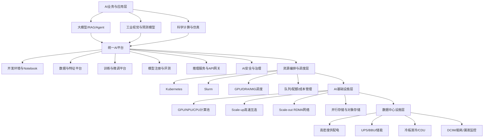

# 普通数据中心与AI数据中心：本质区别、技术趋势及实施方案

author： 周均扬

date: 2026.07.20

---

## 1. 核心结论

**普通数据中心是“应用承载平台”，AI数据中心是“算力生产系统”。**

普通数据中心主要解决：

> 如何稳定、安全、低成本地运行数据库、ERP、网站、虚拟机和企业应用。

AI数据中心主要解决：

> 如何让大量GPU、加速器、网络和存储协同工作，以最短时间、最低能耗完成模型训练、微调和推理。

因此，AI数据中心并不是简单地在普通数据中心里增加GPU服务器，而是从**计算架构、网络拓扑、数据存储、供配电、制冷、资源调度和运维指标**等方面进行系统性重构。

---

## 2. 本质区别

### 1. 总体对比

以下功率密度属于常见工程设计参考值，具体取决于芯片、服务器形态和冗余设计。传统数据中心大量存量机架仍处于较低密度，而当前AI机架已经普遍向30～100 kW以上发展，部分机架级系统达到约132 kW。([Vertiv][1])

| 维度     | 普通数据中心             | AI数据中心                                    |
| ------ | ------------------ | ----------------------------------------- |
| 核心目标   | 高可用地承载业务应用         | 最大化有效AI算力产出                               |
| 典型业务   | ERP、数据库、Web、OA、虚拟机 | 大模型训练、微调、推理、工业视觉、AI4S                     |
| 计算核心   | CPU为主              | GPU、NPU、TPU、ASIC等加速器为主                    |
| 计算模式   | 松耦合、单机或小规模集群       | 大规模并行、强同步、紧耦合集群                           |
| 主要流量   | 用户访问产生的南北向流量       | GPU之间的东西向通信流量                             |
| 网络要求   | 10/25/100GbE通常可以满足 | 200/400/800GbE、InfiniBand、RoCE、Scale-up互连 |
| 存储重点   | 容量、可靠性、随机IOPS      | 高吞吐、并行读写、元数据、Checkpoint性能                 |
| 常见机架功率 | 约5～15 kW           | 约30～150 kW以上                              |
| 制冷方式   | 风冷、冷热通道            | 冷板液冷、后门换热、浸没式、风液混合                        |
| 调度对象   | 虚拟机、容器、CPU和内存      | GPU拓扑、显存、网络、作业、数据集、模型                     |
| 资源分配   | 单机资源分配为主           | 多节点Gang Scheduling和拓扑感知调度                 |
| 核心指标   | SLA、可用性、PUE、虚机利用率  | GPU利用率、训练时间、Tokens/s、Tokens/W、扩展效率        |
| 故障影响   | 单台服务器故障通常可局部迁移     | 单节点或网络异常可能导致整个训练作业失败                      |
| 建设逻辑   | 服务器中心              | 集群、网络、存储、电力和制冷协同设计                        |

---

### 2. 计算架构不同

普通数据中心通常以CPU、内存和本地存储为基本资源单元，应用之间相对独立。

AI训练则需要几十、几百甚至更多加速器共同完成一次计算任务。其性能不仅取决于单张GPU，还取决于：

* GPU之间的互连带宽；
* 跨服务器通信延迟；
* AllReduce、All-to-All等集合通信效率；
* 数据加载速度；
* Checkpoint写入速度；
* 集群调度和故障恢复能力。

因此，AI数据中心的基本资源单元逐渐从“服务器”变为：

> **GPU节点 → GPU机架 → AI Pod → AI Cluster → AI Factory**

NVIDIA的AI集群参考架构已经明确将计算系统、高性能网络、管理网络以及高性能存储作为统一系统进行设计；其存储架构还区分高性能训练存储和用户存储。([NVIDIA Docs][2])

---

### 3. 网络架构不同

普通应用更多是客户端访问服务器，即南北向流量。

AI训练中的主要通信发生在GPU、节点和机架之间，即东西向流量。网络出现拥塞、丢包或尾延迟时，可能造成大量GPU等待，形成“昂贵的空转”。

AI网络通常需要：

* Scale-up：机架内GPU高速互连；
* Scale-out：机架间、节点间高速互连；
* RDMA和零拷贝传输；
* 无损或近无损网络；
* 自适应路由和拥塞控制；
* 多平面网络隔离；
* 计算、存储、管理网络分离。

Ultra Ethernet Consortium于2025年发布UEC 1.0，针对AI和HPC对以太网协议栈、拥塞控制、多路径和低延迟通信进行了专门优化，说明高性能以太网正在成为InfiniBand之外的重要AI网络路线。([Ultra Ethernet Consortium][3])

---

### 4. 存储目标不同

普通数据中心存储通常重点关注容量、可靠性和随机IOPS。

AI数据中心则需要同时解决四类问题：

1. 海量原始数据和训练数据集；
2. 多节点并行读取；
3. 大量小文件及元数据访问；
4. 模型Checkpoint和权重文件的快速写入。

一个典型AI存储体系应包含：

* 对象存储：原始数据、数据湖；
* 并行文件系统：训练热数据；
* 本地NVMe：缓存和临时数据；
* 模型仓库：模型权重、版本和制品；
* 归档存储：历史数据、低频模型；
* 数据目录及元数据管理。

GPUDirect Storage可以减少CPU中转，让NVMe或高性能存储的数据更直接地进入GPU内存，从而降低延迟和CPU开销。([NVIDIA Docs][2])

---

### 5. 电力与制冷发生结构性变化

AI芯片单位面积功耗持续提高，传统风冷逐渐难以有效处理高密度机架。

OCP认为，随着功率密度上升，液冷特别是温水液冷正在成为更有效的散热方式，并建立了CDU、液体分配和数据中心水系统连接等标准化工作组。([Open Compute Project][4])

AI数据中心通常需要重新设计：

* 变电容量；
* UPS和备用电源；
* 母线槽和机架PDU；
* 单机架供电回路；
* 液冷一次侧和二次侧；
* CDU冗余；
* 漏液检测；
* 水质管理；
* 应急排液；
* 热回收和闭环水系统。

这意味着很多普通数据中心即使有足够机房面积，也可能因为**电力容量、楼板承重、管路空间或散热能力不足**，无法直接升级为高密度AI数据中心。

---

## 2. AI数据中心的技术发展趋势

### 趋势一：从Data Center转向AI Factory

未来AI基础设施不再仅用服务器数量衡量，而是按照“有效AI产出”衡量，例如：

* 每秒训练样本数；
* 每秒生成Token数；
* 单位能耗Token数；
* 模型训练完成时间；
* GPU有效利用率；
* 单位模型任务成本。

这会推动基础设施、AI平台、模型服务和业务应用一体化设计。

---

### 趋势二：训练和推理解耦

训练与推理正在形成两类不同的数据中心架构。

#### 训练集群

特点是：

* 大规模GPU；
* 强同步；
* 高速Scale-up和Scale-out网络；
* 高吞吐并行存储；
* 作业持续时间长；
* 对故障恢复和Checkpoint要求高。

#### 推理集群

特点是：

* 对首Token时延和尾延迟敏感；
* 需要动态扩缩容；
* 需要模型量化、批处理和KV Cache管理；
* 需要多模型共享GPU；
* 更接近用户和业务系统。

企业应避免用一套硬件和调度策略同时覆盖所有训练与推理工作负载。

---

### 趋势三：液冷成为高密度AI设施的主流方向

当前主流路线包括：

1. 冷板式直接液冷；
2. 后门换热器；
3. 风液混合冷却；
4. 单相浸没式液冷；
5. 双相液冷；
6. 温水液冷和干冷器闭环。

冷板液冷最适合当前企业级AI集群渐进式落地，因为可以保留部分现有机柜、网络和运维体系。浸没式液冷密度更高，但服务器兼容性、维修流程和供应链要求也更高。

---

### 趋势四：网络向800G、高性能以太网和多平面架构演进

AI网络将形成三类平面：

* 前端业务网络；
* 后端GPU计算网络；
* 存储和管理网络。

2026年的新一代AI系统已经出现单端口800 Gb/s网络能力，UEC也在推动多厂商高性能AI以太网生态。([NVIDIA Docs][5])

未来建设不应仅关注端口速率，还应重点评估：

* 无阻塞比；
* Oversubscription；
* AllReduce性能；
* 拥塞控制；
* ECMP及自适应路由；
* 光模块功耗；
* 网络遥测；
* 多租户隔离。

---

### 趋势五：资源解耦与池化

未来计算、内存、存储和加速器将进一步解耦。

CXL提供CPU、内存扩展和加速器之间的缓存一致性互连，可支持资源共享、内存扩展和后续内存池化架构。CXL 4.0进一步提升了带宽并增强了内存RAS能力。([Compute Express Link -][6])

这将推动数据中心从固定服务器配置转向：

> 按任务动态组合计算、显存、内存、网络和存储资源。

---

### 趋势六：异构加速器长期共存

未来AI数据中心不会只有一种GPU，而会同时存在：

* 通用GPU；
* 推理ASIC；
* NPU；
* FPGA；
* CPU推理节点；
* 边缘AI芯片；
* 针对科学计算或特定模型的专用芯片。

因此，平台层必须建立硬件抽象，避免AI应用直接绑定某一种硬件型号。

建议统一支持：

* Kubernetes Device Plugin或DRA；
* Slurm Generic Resource；
* 容器化运行环境；
* ONNX等模型交换格式；
* 多推理引擎适配；
* 统一模型服务API。

Kubernetes DRA已经进入稳定阶段，并开始支持按设备属性、拓扑和分区能力进行更细粒度的加速器分配。([Kubernetes][7])

---

### 趋势七：能源成为AI算力发展的首要约束

IEA预计，全球为数据中心供电所需的发电量将从2024年的约460 TWh增长到2030年的超过1,000 TWh；2025年全球数据中心用电量同比增长约17%，AI数据中心增长速度更快。([IEA][8])

因此，AI数据中心规划将从“先选服务器，再配电力”转变为：

> 电力资源、土地、网络、冷却和算力平台共同规划。

关键能力包括：

* 功率封顶；
* 电价感知调度；
* 可再生能源匹配；
* 储能系统；
* 负载迁移；
* 训练任务错峰；
* 热回收；
* 每瓦有效AI性能优化。

---

## 4. 企业AI数据中心实施方案

### 1. 首先确定建设模式

企业可选择三种模式。

#### 模式A：改造现有数据中心

适用于：

* 推理为主；
* 工业视觉、RAG和Agent应用；
* 中小规模模型微调；
* 单机架功率不超过约20～30 kW；
* 已有机房具备一定供电和制冷余量。

优点是投入较低、实施较快。

主要风险是现有供电、空调、楼板和网络架构可能成为长期瓶颈。

---

#### 模式B：建设独立AI Pod或AI专区

适用于：

* 有持续训练和微调需求；
* 需要数十至数百张加速卡；
* 需要30～100 kW以上高密度机架；
* 对数据安全和自主可控要求较高。

这是多数大型制造企业、科研机构和集团型企业较合理的路线。

建议将AI Pod设计成可复制单元：

* 计算机架；
* Leaf-Spine或Fat-Tree网络；
* 高性能存储；
* CDU和液冷；
* 独立供电；
* 独立管理域；
* AI平台和监控系统。

---

#### 模式C：云、托管机房和本地混合部署

适用于：

* 需求波动大；
* 芯片迭代风险高；
* 暂时无法获得足够电力；
* 大规模训练频率较低；
* 推理和敏感数据需要留在本地。

推荐策略是：

* 本地：敏感数据、实时推理、工业控制；
* 托管机房：稳定的训练和推理算力；
* 公有云：峰值训练、临时实验和新芯片验证。

---

### 2. 推荐的总体架构

---

## 5. 分阶段实施路线

### 阶段0：需求和容量评估，2～4周

不要先采购GPU，应先形成工作负载画像。

需要统计：

* 训练、微调、推理和仿真任务；
* 模型参数规模；
* 数据集规模；
* 并发用户和请求量；
* 首Token时延；
* 推理吞吐量；
* 模型更新时间；
* 数据保留周期；
* 数据安全等级；
* 未来三年增长率。

核心输出物：

* 《AI工作负载清单》；
* 《三年算力需求预测》；
* 《AI数据中心容量规划》；
* 《自建、托管和云方案对比》；
* 《投资回报与TCO分析》。

---

### 阶段1：PoC验证，约2～3个月

建议先建设一个小型AI Pod，验证端到端能力，而不是只测试GPU峰值性能。

验证范围应包括：

* 典型模型训练；
* 模型微调；
* 多模型推理；
* GPU间通信；
* 存储读取；
* Checkpoint恢复；
* GPU共享；
* 故障注入；
* 功耗和温升；
* 平台调度；
* 运维监控。

关键验收指标：

| 类别  | 建议指标                   |
| --- | ---------------------- |
| 计算  | GPU有效利用率、训练吞吐、推理吞吐     |
| 网络  | AllReduce带宽、时延、丢包、拥塞   |
| 存储  | 顺序吞吐、并发吞吐、元数据性能        |
| 平台  | 排队时间、资源分配时间、任务成功率      |
| 可靠性 | 故障恢复时间、Checkpoint恢复成功率 |
| 能源  | PUE、单机架功率、Tokens/W     |
| 成本  | 单次训练成本、百万Token推理成本     |

---

### 阶段2：生产级AI Pod，约3～6个月

生产级建设应完成：

#### 基础设施

* 独立AI配电回路；
* 高密度母线和rPDU；
* 冷板液冷与CDU；
* 漏液检测；
* 机架承重评估；
* 电力和冷却冗余；
* DCIM和BMS集成。

#### 计算网络

* 加速器服务器；
* 高速计算网络；
* 独立管理网络；
* 高性能存储网络；
* 带外管理；
* 拓扑标准化。

#### AI平台

* Kubernetes与Slurm；
* 镜像仓库；
* 数据版本管理；
* 训练流水线；
* 模型注册；
* 推理服务；
* 监控告警；
* 成本计量；
* 权限和配额。

---

### 阶段3：规模化扩展，6～18个月

此阶段不应再按单台服务器扩容，而应按标准化AI Pod复制。

重点能力包括：

* 多Pod统一调度；
* 多地域训练和推理；
* GPU资源池；
* 训练与推理分池；
* 跨集群模型发布；
* 数据生命周期管理；
* 碳排和能耗优化；
* 自动故障处理；
* 容量预测；
* GPU利用率优化。

---

## 6. 适合制造企业的推荐架构

对于工业视觉、数字孪生、设备预测、工业Agent和安全系统，推荐采用：

> **中心AI算力池 + 工厂边缘推理节点 + 云上弹性算力**

## 中心AI算力池

负责：

* 模型训练和微调；
* 多工厂数据治理；
* 模型注册和评测；
* 算法研发；
* 仿真和AI4S计算；
* 企业知识模型。

## 工厂边缘节点

负责：

* 低时延视觉推理；
* 设备状态分析；
* AGV、机器人和PLC数据处理；
* 实时安全判断；
* 断网自治；
* 本地数据缓存。

## 云或托管算力

负责：

* 突发训练需求；
* 大模型基础能力调用；
* 新硬件和新模型验证；
* 短期大规模计算。

这一架构可以避免在每个工厂重复建设昂贵的训练集群，同时保证工业控制和安全推理的实时性。

---

## 7. 建设时最容易出现的误区

### 误区1：只看GPU数量

GPU数量不等于有效算力。网络、存储或调度不足时，GPU可能长期等待。

### 误区2：沿用传统数据中心网络

普通Leaf-Spine网络即使带宽足够，也可能因为拥塞控制、超卖比和尾延迟不适合大规模训练。

### 误区3：先采购设备，再考虑供电和液冷

AI服务器到货后才发现无法上架，是高密度AI项目最常见的失败原因之一。

### 误区4：只建设硬件，不建设AI平台

没有统一调度、模型管理、数据管理和资源计量，GPU会迅速演变成各部门独占的“昂贵孤岛”。

### 误区5：把训练与推理混在一起

训练任务可能占用全部GPU和网络资源，直接影响生产推理服务。

### 误区6：用PUE作为唯一效率指标

PUE只能说明设施效率，不能说明GPU是否有效工作。

AI数据中心还应考核：

* GPU利用率；
* 每瓦训练吞吐；
* 每瓦Token数；
* 作业完成时间；
* 集群扩展效率；
* 单位任务成本。

---

## 8. 建议

对于大多数企业，不建议一开始建设超大规模AI数据中心。更合理的路线是：

1. 先完成AI工作负载和三年容量预测；
2. 建设小型标准化AI Pod；
3. 优先打通计算、网络、存储和AI平台；
4. 对高密度机架采用液冷就绪设计；
5. 将训练、推理和边缘计算分层部署；
6. 采用“本地核心算力＋托管稳定算力＋云上弹性算力”；
7. 按AI Pod复制扩展，而不是零散采购GPU服务器；
8. 将GPU利用率、Tokens/W和单位任务成本作为核心经营指标。

需要持续跟踪时，可以设置每月一次的AI数据中心芯片、液冷、网络、能源和行业标准趋势简报。

---

[1]: https://www.vertiv.com/en-us/insights/articles/blog-posts/must-read-research-its-the-data-center-economy-stupid-or-is-it/ "Must-read research: It's the data center economy, stupid! Or ..."
[2]: https://docs.nvidia.com/dgx-superpod/reference-architecture/scalable-infrastructure-h200/latest/_downloads/bbd08041e98eb913619944ead1f92373/RA-11336-001-DSPH200-ReferenceArch.pdf "DGX SuperPOD Reference Architecture"
[3]: https://ultraethernet.org/ultra-ethernet-consortium-uec-launches-specification-1-0-transforming-ethernet-for-ai-and-hpc-at-scale/ "Ultra Ethernet Consortium (UEC) Launches Specification ..."
[4]: https://www.opencompute.org/community/cooling-environments "Cooling Environments - Open Compute Project"
[5]: https://docs.nvidia.com/enterprise-reference-architectures/nvl72-ai-factory/latest/components.html "System Hardware & Components — NVIDIA NVL72 AI ..."
[6]: https://computeexpresslink.org/ "Compute Express Link: Homepage"
[7]: https://kubernetes.io/docs/concepts/scheduling-eviction/dynamic-resource-allocation/ "Dynamic Resource Allocation"
[8]: https://www.iea.org/reports/energy-and-ai/energy-supply-for-ai "Energy supply for AI"
