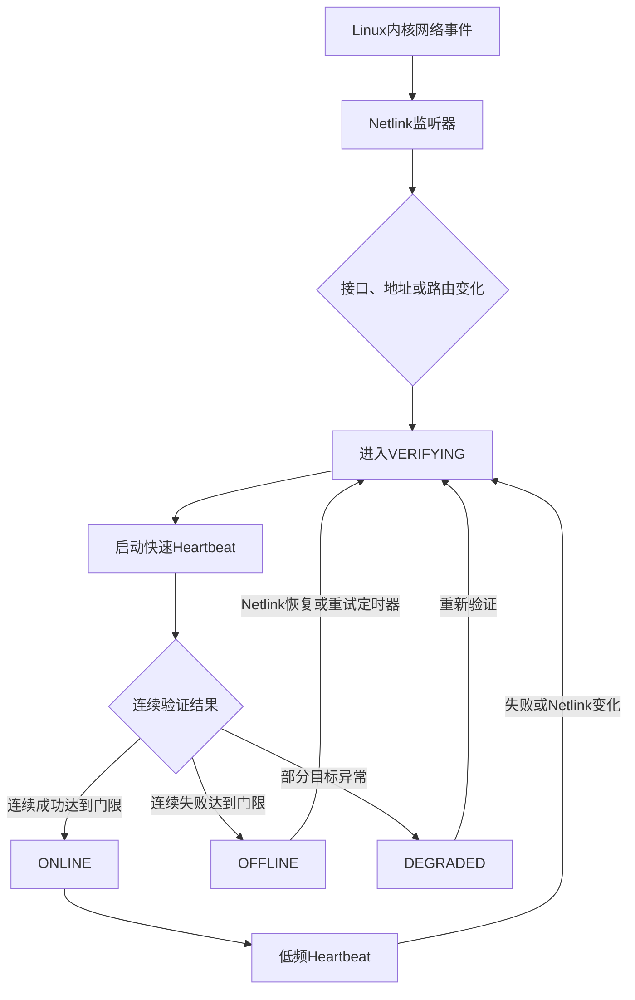

# 嵌入式 Linux 网络变化监测方案： Netlink Socket 与 Heartbeat

author: 周均扬

date: 2026.08.10

---


Netlink Socket 与 Heartbeat 并不是完全替代关系，它们监测的是不同层级：

* Netlink Socket：观察“本机 Linux 网络栈发生了什么变化”。
* Heartbeat：验证“本机到目标设备或目标服务的实际通信是否正常”。

因此，工程上最可靠的方案通常不是二选一，而是组合使用。

## 1. 本质区别

| 对比项      | Netlink Socket       | Heartbeat              |
| -------- | -------------------- | ---------------------- |
| 监测层级     | 操作系统网络接口层、网络配置层      | 传输层、应用层、业务层            |
| 核心机制     | Linux 内核主动发送网络变化事件   | 本机周期发送探测请求，对端应答        |
| 典型对象     | 网卡、Carrier、IP、路由、邻居表 | 网关、服务器、PLC、AGV、机器人、云平台 |
| 工作方式     | 事件驱动                 | 周期探测                   |
| 是否需要对端配合 | 不需要                  | 通常需要                   |
| 能否判断业务可用 | 不能直接判断               | 可以                     |
| 平台相关性    | Linux 专用             | 基本可跨平台                 |
| 空闲期开销    | 很低                   | 持续产生定时器、报文和对端处理开销      |

可以将两者理解为：

```text
Netlink：网卡、IP、路由“看起来是否正常”
Heartbeat：目标设备或服务“实际上是否可用”
```

---

## 2. Netlink Socket 方案

### 2.1 工作原理

Linux 内核通过 Netlink Socket 向用户空间发送网络事件。应用订阅特定事件组后，可以收到以下变化：

* 网卡创建、删除；
* 网卡启用、禁用；
* 网线插入、拔出；
* Carrier UP/DOWN；
* IPv4/IPv6 地址增加或删除；
* 默认路由、静态路由变化；
* 网关或邻居表变化；
* Wi-Fi、VLAN、Bond、Bridge 等接口变化。

常用协议和订阅组包括：

```cpp
socket(AF_NETLINK, SOCK_RAW, NETLINK_ROUTE);
```

```cpp
RTMGRP_LINK
RTMGRP_IPV4_IFADDR
RTMGRP_IPV6_IFADDR
RTMGRP_IPV4_ROUTE
RTMGRP_IPV6_ROUTE
RTMGRP_NEIGH
```

典型事件：

| Netlink 消息     | 含义             |
| -------------- | -------------- |
| `RTM_NEWLINK`  | 网卡创建或状态发生变化    |
| `RTM_DELLINK`  | 网卡被删除          |
| `RTM_NEWADDR`  | IP 地址增加        |
| `RTM_DELADDR`  | IP 地址删除        |
| `RTM_NEWROUTE` | 路由增加或变化        |
| `RTM_DELROUTE` | 路由删除           |
| `RTM_NEWNEIGH` | ARP/NDP 邻居状态变化 |
| `RTM_DELNEIGH` | 邻居项删除          |

### 2.2 Netlink 可以识别的状态

Netlink 可以帮助区分：

```text
接口不存在
    ↓
接口存在但管理状态 DOWN
    ↓
接口管理状态 UP，但没有 Carrier
    ↓
接口 UP 且 Carrier UP，但没有 IP
    ↓
接口有 IP，但没有默认路由
    ↓
接口、IP、路由均正常
```

常见接口标志：

| 标志              | 含义                      |
| --------------- | ----------------------- |
| `IFF_UP`        | 接口被管理员启用                |
| `IFF_RUNNING`   | 驱动认为接口可以运行              |
| `IFF_LOWER_UP`  | 底层链路已建立，通常对应 Carrier UP |
| `IFF_LOOPBACK`  | 回环接口                    |
| `IFF_BROADCAST` | 支持广播                    |
| `IFF_MULTICAST` | 支持组播                    |

需要特别注意：

```text
IFF_UP = 1
```

只说明执行过类似操作：

```bash
ip link set eth0 up
```

它不代表网线已连接。

而：

```text
IFF_LOWER_UP = 1
```

通常表示物理链路或底层虚拟链路已建立，但仍不表示网关、服务器或业务服务可用。

### 2.3 Netlink 的优点

#### 反应速度快

网卡、地址或路由发生变化时，由内核立即通知用户空间。通常不需要等待轮询周期。

适合检测：

* 网线拔插；
* USB 网卡插拔；
* 网卡重新初始化；
* DHCP 地址更新；
* 4G/5G 拨号接口创建或删除；
* 默认路由切换；
* 主备网卡切换；
* VLAN、Bridge、Bond 状态变化。

#### 资源开销低

没有网络变化时，进程可以阻塞在：

```cpp
recv()
```

或者：

```cpp
poll()
epoll_wait()
```

不会持续轮询 `/sys/class/net` 或执行外部命令。因此非常适合嵌入式设备。

#### 不需要对端配合

只依赖 Linux 内核，不需要服务器、PLC或其他设备提供心跳服务。

#### 能获得变化原因

Netlink 不只告诉应用“通信失败”，还可以提供更具体的本地原因：

* 接口被关闭；
* Carrier 丢失；
* IP 地址被删除；
* 默认路由变化；
* 网卡被移除；
* 邻居项进入失败状态。

这有利于故障诊断和日志审计。

### 2.4 Netlink 的缺点

#### 不能证明端到端通信正常

以下情况下，Netlink 可能显示“一切正常”，但业务仍然不可用：

* 交换机上联端口故障；
* 网关故障；
* 中间路由器故障；
* VLAN 配置错误；
* 防火墙阻断；
* 对端服务器宕机；
* 对端进程卡死；
* 对端业务端口未监听；
* DNS 服务不可用；
* TCP 建连失败；
* 应用协议异常。

例如：

```text
eth0: IFF_UP + IFF_LOWER_UP
IP: 192.168.10.20
Default Route: 存在
```

这只能说明本机网络配置看起来正常，不能说明：

```text
192.168.10.100:9000
```

上的设备或服务可用。

#### 只能在 Linux 中使用

Netlink 是 Linux 内核接口。若系统需要同时支持：

* Linux；
* Windows；
* RTOS；
* QNX；
* Android；
* 裸机控制器；

则需要为不同平台提供不同实现。

#### 主要提供“变化事件”，不是完整初始状态

应用启动时，如果网络已经处于某个状态，不能只等后续事件。生产实现必须先获取一次完整快照：

```text
RTM_GETLINK
RTM_GETADDR
RTM_GETROUTE
RTM_GETNEIGH
```

然后再监听增量变化。

否则可能出现：

```text
进程启动时 eth0 已经断网
→ 没有新的变化事件
→ 应用一直不知道当前状态
```

#### 事件可能丢失

当用户空间处理过慢或接收缓冲区不足时，Netlink 可能出现：

```text
ENOBUFS
```

这意味着部分事件可能已经丢失。生产程序应：

1. 增大接收缓冲区；
2. 检测 `ENOBUFS`；
3. 触发一次完整状态重建；
4. 避免在 Netlink 接收线程执行耗时操作。

---

## 3. Heartbeat 方案

### 3.1 工作原理

Heartbeat 由监测端周期发送探测报文，对端收到后返回响应。

基本流程：

```text
监测端发送 Heartbeat Request
             ↓
       网络与对端处理
             ↓
对端返回 Heartbeat Response
             ↓
监测端计算 RTT、连续成功数和失败数
```

Heartbeat 可以基于不同协议实现。

| Heartbeat 类型      | 验证能力               |
| ----------------- | ------------------ |
| ICMP Ping         | 验证目标主机及基本 IP 路径    |
| ARP 探测            | 验证同一二层网络中的目标       |
| UDP Echo          | 验证 UDP 路径和对端进程     |
| TCP Connect       | 验证 TCP 连接及目标端口     |
| HTTP `/health`    | 验证 HTTP 服务         |
| gRPC Health Check | 验证 gRPC 服务         |
| MQTT Ping/Pong    | 验证 MQTT 会话和 Broker |
| OPC UA Read       | 验证 OPC UA 服务与数据访问  |
| Modbus TCP Read   | 验证 PLC 或设备业务通信     |
| 自定义业务请求           | 验证真实业务处理链路         |

Heartbeat 的价值取决于探测深度。

例如：

```text
ICMP Ping 成功
```

并不一定意味着：

```text
OPC UA 服务正常
```

同样：

```text
TCP 端口连接成功
```

也不一定意味着：

```text
PLC 数据更新正常
```

### 3.2 Heartbeat 的优点

#### 可以验证端到端路径

Heartbeat 可以覆盖：

```text
本机网卡
→ 交换机
→ 网关
→ 路由
→ 防火墙
→ 对端网卡
→ 对端协议栈
→ 对端业务进程
```

Netlink 只能观察其中靠近本机的一小部分。

#### 可以验证真实业务服务

如果使用应用层 Heartbeat，可以进一步发现：

* 对端进程退出；
* 线程死锁；
* 端口未监听；
* 服务内部依赖异常；
* 数据停止更新；
* 应用响应超时；
* 协议状态异常；
* 主从连接断开；
* PLC 通信虽然连接存在，但数据冻结。

例如，工业平台不应只判断：

```text
PLC TCP 502端口可以连接
```

还应判断：

```text
PLC状态寄存器是否能够读取
数据时间戳是否持续更新
通信序列号是否递增
```

#### 可以获得链路质量指标

Heartbeat 除了在线/离线，还能统计：

* RTT；
* 超时率；
* 丢包率；
* 抖动；
* 连续失败次数；
* 恢复时间；
* 可用率；
* P95/P99 响应时间。

这些指标可用于：

* 网络质量监测；
* 主备链路选择；
* 无线网络质量评估；
* 异常趋势预警；
* SLA 统计；
* 安全系统降级决策。

#### 跨平台

Heartbeat 可以基于标准 UDP、TCP、HTTP 等协议实现，适用于 Linux、Windows、QNX、RTOS 和微控制器。

### 3.3 Heartbeat 的缺点

#### 存在检测延迟

假设参数为：

```text
周期：5秒
超时：1秒
连续3次失败判定离线
```

最坏检测时间大约为：

$$T_{\text{detect}} \approx (N-1)T_{\text{interval}} + T_{\text{timeout}}$$

代入后：

$$T_{\text{detect}} \approx 2 \times 5 + 1 = 11\text{秒}$$

若周期过长，故障发现慢；周期过短，则增加资源消耗和误报概率。

#### 持续占用网络和系统资源

每次 Heartbeat 都需要：

* 定时器唤醒；
* 网络报文收发；
* 协议栈处理；
* 对端线程或服务处理；
* 日志及状态更新。

对于以太网设备，通常问题不大。但对于：

* 4G/5G；
* NB-IoT；
* 电池供电设备；
* 深度休眠设备；
* 大规模物联网终端；

高频 Heartbeat 可能显著增加：

* 功耗；
* 流量费用；
* 无线模组唤醒次数；
* 服务端并发压力。

例如，10,000 台设备每秒一次心跳会产生每秒 10,000 次请求，且可能出现同步惊群。

#### 容易因短时丢包误判

单次超时不应立即判定离线，因为可能只是：

* 网络瞬时拥塞；
* 无线信号波动；
* CPU 短时高负载；
* 服务端 GC 或调度暂停；
* 路由短时收敛；
* 报文偶发丢失。

因此 Heartbeat 必须采用防抖策略：

```text
连续失败 N 次 → Offline
连续成功 M 次 → Online
```

并且通常满足：

```text
恢复门限 ≥ 2
```

避免链路在 Online 和 Offline 之间反复跳变。

#### 需要定义“对端正常”的语义

收到响应不一定代表真正正常。例如服务器可能返回：

```json
{
  "status": "ok"
}
```

但其数据库、消息总线或设备连接已经失败。

所以业务级 Heartbeat 应包含：

* 服务状态；
* 依赖状态；
* 数据更新时间；
* 设备状态；
* 服务实例 ID；
* 版本号；
* 单调递增序列号；
* 对端时间戳；
* 降级状态。

---

## 4. 故障检测能力对比

| 故障场景       | Netlink |       Heartbeat |
| ---------- | ------: | --------------: |
| 网卡被管理员关闭   |       能 |          能，存在延迟 |
| 网线拔出       |  能，通常很快 |        能，存在超时延迟 |
| USB 网卡被拔出  |       能 |          能，存在延迟 |
| DHCP 地址丢失  |       能 |         通常能间接发现 |
| 默认路由删除     |       能 |         通常能间接发现 |
| 主备路由切换     |   能明确识别 |     只能从探测结果间接识别 |
| 交换机本端端口关闭  |     通常能 |               能 |
| 交换机上联故障    |    通常不能 |               能 |
| 网关故障       |  不能直接判断 |               能 |
| 中间路由故障     |      不能 |               能 |
| 防火墙阻断业务端口  |      不能 |               能 |
| DNS 故障     |  不能直接判断 |        使用域名探测时能 |
| 对端主机宕机     |      不能 |               能 |
| 对端业务进程退出   |      不能 | 应用层 Heartbeat 能 |
| 对端线程死锁     |      不能 |         取决于心跳实现 |
| TCP 连接半开   |      不能 |       TCP/应用心跳能 |
| PLC 数据停止更新 |      不能 |         业务数据心跳能 |
| 本机网络配置变化原因 |   能明确识别 |        通常不能明确识别 |
| 网络 RTT 增大  |      不能 |               能 |
| 丢包率升高      |      不能 |               能 |
| 网络抖动       |      不能 |               能 |

---

## 5. 实时性对比

### Netlink 检测时间

Netlink 是事件驱动，理论检测时间为：

$$ T_{\text{netlink}} =  T_{\text{kernel-event}} + T_{\text{schedule}} + T_{\text{user-process}} $$

通常是毫秒级，但取决于：

* 网卡驱动是否及时报告 Carrier；
* 内核调度；
* 用户空间进程优先级；
* Netlink 接收线程是否被阻塞。

注意，一些网卡或无线驱动的链路状态上报本身可能较慢。

### Heartbeat 检测时间

Heartbeat 检测时间主要由以下参数决定：

$$ T_{\text{heartbeat}} = (N-1)T_i + T_o $$

其中：

* $T_i$：心跳周期；
* $T_o$：单次响应超时；
* $N$：连续失败门限。

举例：

|     周期 |     超时 | 失败门限 | 最坏检测时间 |
| -----: | -----: | ---: | -----: |
| 500 ms | 300 ms |    3 |  1.3 s |
|    1 s | 500 ms |    3 |  2.5 s |
|    2 s |    1 s |    3 |    5 s |
|    5 s |    1 s |    3 |   11 s |
|   30 s |    2 s |    3 |   62 s |

因此，单纯使用低频 Heartbeat 无法满足快速故障发现要求。

---

## 6. 资源占用对比

### Netlink

稳定期间基本没有报文和处理任务：

```text
CPU：接近零
网络流量：零
对端负载：零
定时器唤醒：不需要
```

其主要资源是：

* 一个 Netlink Socket；
* 接收缓冲区；
* 一个事件循环或 epoll 文件描述符；
* 少量状态缓存。

### Heartbeat

若有 (D) 台设备、每台监测 (P) 个目标、周期为 (T)，每秒请求量约为：

$$R = \frac{D \times P}{T}$$


例如：

$$D=10000,\quad P=2,\quad T=5s$$


则：

$$R = 4000\text{ 次/秒}$$


若设备同时启动，可能形成 Heartbeat 惊群。因此应加入随机抖动：

$$ T_{\text{actual}} = T_{\text{base}} + U(-J,J)$$


其中 (J) 可以取基础周期的 5%～20%。

---

## 7. 可靠性与误判对比

### Netlink 的典型误判

Netlink 最常见的问题是“假在线”：

```text
Carrier UP
IP 地址存在
默认路由存在
```

但实际情况可能是：

```text
网关不可达
服务器宕机
业务端口阻断
应用进程卡死
```

因此 Netlink 的 Online 更准确地说应该叫：

```text
LOCAL_NETWORK_READY
```

而不应该直接叫：

```text
SERVICE_ONLINE
```

### Heartbeat 的典型误判

Heartbeat 最常见的问题是“假离线”：

* 单个报文丢失；
* 短时拥塞；
* 无线网络抖动；
* 服务端暂时忙；
* 调度延迟超过超时；
* 探测目标自身故障，但其他业务仍正常。

因此不应采用：

```text
一次超时 → 整个网络离线
```

建议采用：

```text
连续失败门限
连续恢复门限
多目标验证
状态滞回
冷却时间
```

---

## 8. 多目标 Heartbeat 的重要性

只探测一个服务器可能把“目标服务器故障”误判成“网络故障”。

推荐至少区分三个目标：

| 目标    | 验证范围         |
| ----- | ------------ |
| 本地网关  | 本机到局域网出口     |
| 核心服务器 | 工业业务链路       |
| 备用服务器 | 判断是否只是主服务器故障 |

示例判定：

| 网关 | 主服务器 | 备服务器 | 建议状态           |
| -: | ---: | ---: | -------------- |
| 成功 |   成功 |   成功 | 网络及服务正常        |
| 成功 |   失败 |   成功 | 主服务器或主路径故障     |
| 成功 |   失败 |   失败 | 上游、防火墙或服务集群故障  |
| 失败 |   失败 |   失败 | 本地网络或网关链路故障    |
| 失败 |   成功 |   成功 | 网关禁止响应或探测策略不合理 |

最后一种情况说明不能把 ICMP Ping 当成唯一依据。

---

## 9. 嵌入式平台适用性

### Netlink 更适合

* Linux 网关；
* 工业边缘计算设备；
* ARM Linux 控制器；
* 车载 Linux；
* 多网卡主备切换设备；
* 需要低功耗或低资源占用的设备；
* 需要监测本机接口、IP、路由变化的场景。

### Heartbeat 更适合

* 检测 PLC、AGV、Robot 或服务器在线状态；
* 检测业务进程是否存活；
* 跨平台设备互联；
* 网络质量评估；
* 服务 SLA 监测；
* 主备服务器选择；
* 云边通信状态监测。

### 需要特别处理的嵌入式场景

| 场景          | 设计建议                       |
| ----------- | -------------------------- |
| eMMC 寿命敏感   | 状态变化才记录日志，禁止每次心跳写盘         |
| 低功耗设备       | 稳定期降低心跳频率                  |
| 4G/5G 网络    | 使用较长超时，避免无线抖动误判            |
| 多网卡设备       | 使用 `SO_BINDTODEVICE` 或策略路由 |
| 只读根文件系统     | 配置只读，运行状态放入 tmpfs          |
| Watchdog 系统 | 网络故障不应直接等同于进程故障            |
| 实时系统        | Netlink 线程只接收事件，不执行耗时恢复动作  |
| 大规模终端       | 心跳增加随机抖动与指数退避              |

---

## 10. 安全系统中的使用原则

对于Safety OS 或工业空间安全系统，将网络状态分层定义：

| 状态            | 含义               | 建议动作       |
| ------------- | ---------------- | ---------- |
| `UNKNOWN`     | 尚未完成网络验证         | 禁止关键动作放行   |
| `LOCAL_DOWN`  | 网卡或 Carrier 异常   | 立即进入通信降级   |
| `CONFIGURING` | IP或路由正在变化        | 暂停依赖该链路的决策 |
| `VERIFYING`   | Netlink 触发后正在验证  | 保持保守状态     |
| `ONLINE`      | Heartbeat 连续验证成功 | 允许正常通信     |
| `DEGRADED`    | 部分目标不可达或质量下降     | 限制能力、扩大安全区 |
| `OFFLINE`     | 连续多次验证失败         | 执行安全降级     |
| `RECOVERING`  | 网络恢复但尚未满足恢复门限    | 禁止立即自动放行   |

关键原则是：

```text
Netlink 可以触发降级，但不能单独触发恢复放行。
```

例如，网线重新插入时：

```text
Carrier UP
→ IP恢复
→ 路由恢复
```

不能直接从 `OFFLINE` 切换到 `ONLINE`，必须继续完成：

```text
Heartbeat连续成功
→ 业务数据恢复更新
→ 时间同步有效
→ 状态一致性检查通过
→ ONLINE或RECOVERY_CHECK
```

---

## 11. 推荐组合架构



建议职责划分：

* Netlink 监听器：产生网络变化事件；
* Heartbeat Manager：维护探测目标和 RTT；
* Network State Machine：执行门限、防抖和状态迁移；
* Supervisor：决定降级、切换、重连或安全动作；
* Event Recorder：记录证据和状态变化。

---

## 12. 最终选型建议

### 只使用 Netlink

适合：

* 只关心网卡、网线、IP和路由变化；
* 不需要知道服务器是否可用；
* 极度受限的 Linux 嵌入式设备。

不适合：

* 工业控制；
* 云边通信；
* PLC/AGV/机器人在线判断；
* 安全相关系统。

### 只使用 Heartbeat

适合：

* 非 Linux 平台；
* 只关心一个确定服务是否可用；
* 不需要区分本地接口、路由和对端故障。

不足是：

* 故障定位能力较弱；
* 物理断网检测依赖超时；
* 稳定期持续消耗资源。

### Netlink + 固定高频 Heartbeat

可靠性较高，但长期资源开销偏大。适合：

* 对检测时间要求严格；
* 设备数量有限；
* 有线网络；
* 功耗和流量不敏感。

### Netlink + 快速验证 + 低频 Heartbeat

这是嵌入式工业平台的推荐方案：

```text
Netlink负责快速发现
Heartbeat负责真实性验证
低频Heartbeat负责持续确认
状态机负责防抖、降级和恢复
```

默认参数：

| 参数               |  有线工业网络建议值 |
| ---------------- | ---------: |
| Netlink 变化后的快速周期 | 500 ms～1 s |
| 快速验证超时           | 300～800 ms |
| 连续失败门限           |          3 |
| 连续恢复门限           |        2～3 |
| 稳定期心跳周期          |    10～30 s |
| Offline 重试周期     |     2～10 s |
| 状态切换冷却时间         |      2～5 s |
| 随机抖动             | 周期的 5%～10% |

最终可概括为：Netlink 判断本机网络环境是否发生变化，Heartbeat 判断端到端业务链路是否真正可用。对于嵌入式工业和安全系统，应以 Netlink 作为快速事件源，以应用层 Heartbeat 作为最终验证依据。
