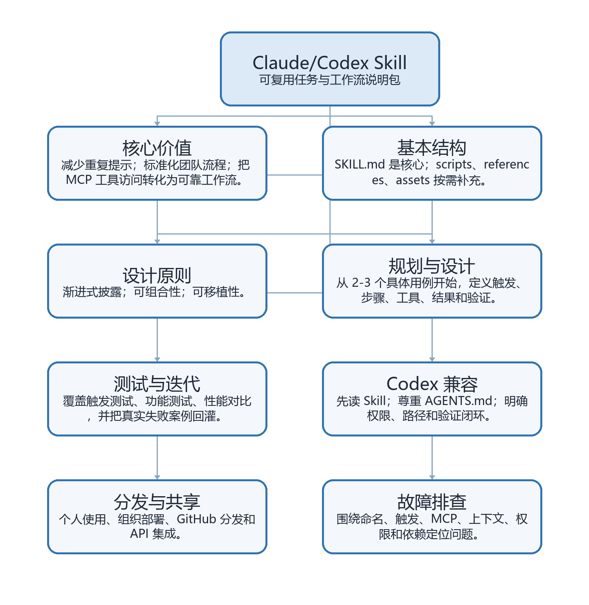

# 《The Complete Guide to Building Skills for Claude》中文整理版

author： 周均扬

date：2026.08.29

---

来源：Anthropic PDF - [The Complete Guide to Building Skills for Claude](https://resources.anthropic.com/hubfs/The-Complete-Guide-to-Building-Skill-for-Claude.pdf)

说明：本文档是对原 PDF 的中文译述与结构化整理，不是逐段逐句的全文翻译。它保留原文的章节脉络、关键概念、技术要求、测试方法和实践模式，并补充了 Codex 环境中的落地写法。

## 目录

- [一句话概括](#一句话概括)
- [适用对象](#适用对象)
- [基础概念](#1-基础概念)
- [Skill 与 MCP 的关系](#2-skill-与-mcp-的关系)
- [规划与设计](#3-规划与设计)
- [技术要求](#4-技术要求)
- [Codex 兼容要点](#5-codex-兼容要点)
- [测试与迭代](#6-测试与迭代)
- [分发与共享](#7-分发与共享)
- [常见模式](#8-常见模式)
- [故障排查](#9-故障排查)
- [知识图谱](#10-知识图谱)
- [可复制模板](#11-可复制模板)
- [实操检查清单](#12-实操检查清单)

## 一句话概括

Claude Skill 是一个打包成文件夹的指令集合，用来教 Claude 如何稳定执行某类任务或工作流。放到 Codex 语境中，它也是一种把“什么时候用、怎么做、用哪些工具、如何验证、输出放哪里”写成可复用操作规程的机制。

核心价值不是省几句提示词，而是把重复的偏好、流程、领域知识、质量标准和工具调用方式沉淀下来，让模型在相关任务中自动加载并遵循。

## 适用对象

- 希望 Claude 或 Codex 稳定遵循特定流程的开发者。
- 希望减少重复提示的高级用户。
- 希望在组织内标准化 AI 工作流的团队。
- 已经构建 MCP 连接器，希望把“工具访问”升级为“可靠工作流”的集成开发者。
- 需要把内部 SOP、代码规范、交付标准、评审流程固化到 Agent 行为中的团队。

## 1. 基础概念

### 什么是 Skill

一个 Skill 本质上是一个文件夹，通常包含：

- `SKILL.md`：必需。主说明文件，使用 Markdown 编写，并包含 YAML frontmatter。
- `scripts/`：可选。存放 Python、Bash、PowerShell 等可执行脚本，用于确定性处理、验证或自动化。
- `references/`：可选。存放较长的参考文档，Claude 或 Codex 在需要时再读取。
- `assets/`：可选。存放模板、字体、图标、示例文件等输出资产。

### 三个核心设计原则

**Progressive Disclosure（渐进式披露）**

Skill 采用三层加载机制：

- 第一层：YAML frontmatter。始终进入模型的系统提示，用来判断何时触发 Skill。
- 第二层：`SKILL.md` 正文。模型判断相关后加载，包含主要流程和操作指南。
- 第三层：链接文件。`references/`、脚本和资产等只在需要时读取。

这种机制的目标是降低 token 消耗，同时保留专业能力。

**Composability（可组合性）**

模型可以同时加载多个 Skill。一个好的 Skill 不应假设自己是唯一能力，而要能与其他 Skill 协同。例如，处理 DOCX 时可能同时用到 `documents`、`pdf`、`visualize` 等技能。

**Portability（可移植性）**

Skill 设计为可在 Claude.ai、Claude Code、API 以及类似 Codex 的 Agent 环境中复用。真正影响可移植性的通常不是 Markdown 本身，而是脚本依赖、路径约定、网络权限、沙盒权限和外部服务连接。

## 2. Skill 与 MCP 的关系

如果 MCP 提供的是“工具访问层”，包括数据、服务和可调用 API，那么 Skill 提供的是“工作流知识层”，即应该以什么顺序、什么约束、什么验证标准使用这些工具。

MCP 解决的是模型能做什么；Skill 解决的是模型应该怎么做。

没有 Skill 时，用户可能不知道连接器下一步怎么用，每次对话都要重新解释流程，结果也会因提示方式不同而不一致。有 Skill 后，预置工作流可以在需要时自动触发，工具调用更稳定，最佳实践也会嵌入每次交互。

## 3. 规划与设计

### 从 2-3 个具体用例开始

在写 Skill 之前，先定义清楚它要支持的少数具体任务。一个好的用例定义应包括：

- 用户目标：用户想完成什么。
- 触发语句：用户可能怎么说。
- 步骤：模型需要执行哪些动作。
- 工具：需要内置能力、命令行工具、MCP 工具还是外部 API。
- 结果：完成后应该交付什么。
- 验证：如何知道结果真的完成。

示例结构：

```text
Use Case: 项目冲刺规划
Trigger: 用户说“帮我规划这个 sprint”或“创建 sprint 任务”
Steps:
1. 从 Linear 获取当前项目状态
2. 分析团队速度与容量
3. 建议任务优先级
4. 在 Linear 中创建带标签和估算的任务
Result: 完成 sprint 规划并创建任务
Verification: Linear 中任务数量、标签、关联关系和负责人正确
```

### 三类常见 Skill

**类别 1：文档与资产创建**

用于稳定生成高质量输出，例如文档、演示、应用、设计、代码等。常见技巧包括嵌入风格指南、品牌规范、模板结构和交付前检查清单。

**类别 2：工作流自动化**

用于多步骤流程，尤其是需要一致方法论、验证关卡和迭代修正的任务。典型做法是把流程拆成明确步骤，并在关键节点加入检查。

**类别 3：MCP 增强**

用于给 MCP 工具访问叠加工作流知识。例如，连接器本身只提供 API 能力，而 Skill 可以规定调用顺序、错误处理、领域判断和交付格式。

## 4. 技术要求

### 推荐文件结构

```text
your-skill-name/
├── SKILL.md
├── scripts/
│   ├── process_data.py
│   └── validate.ps1
├── references/
│   ├── api-guide.md
│   └── examples/
└── assets/
    └── report-template.md
```

### 关键规则

- `SKILL.md` 必须精确命名，大小写敏感。
- Skill 文件夹名使用 kebab-case，例如 `notion-project-setup`。
- 文件夹名不要使用空格、下划线或大写字母。
- Skill 文件夹内部不要放 `README.md`；说明应放在 `SKILL.md` 或 `references/`。
- 如果通过 GitHub 分发，可以在仓库根目录放面向人的 `README.md`。

### YAML frontmatter

最小格式：

```yaml
---
name: your-skill-name
description: What it does. Use when user asks to [specific phrases].
---
```

`name` 要求：

- 必填。
- 使用 kebab-case。
- 不含空格和大写。
- 最好与文件夹名一致。

`description` 要求：

- 必填。
- 同时说明“做什么”和“何时使用”。
- 少于 1024 个字符。
- 不含 XML 角括号。
- 包含用户可能说出的具体任务短语。
- 如果与文件类型相关，应明确提到文件类型。

可选字段包括 `license`、`compatibility` 和 `metadata`，可用于开源许可、环境要求、作者、版本和 MCP 服务信息。

安全限制：

- frontmatter 中不要使用 XML 角括号。
- Skill 名称不要包含 `claude` 或 `anthropic`，这些属于保留前缀。

## 5. Codex 兼容要点

### 5.1 Skill 触发与读取

在 Codex 中，Skill 的关键要求是：一旦任务匹配 Skill 描述，Agent 必须先读取对应 `SKILL.md`，再执行任务。不要假设 Agent “记得”某个 Skill 的内容，因为 Skill 文件可能已经更新。

建议在 `SKILL.md` 中明确写出：

- 何时必须使用本 Skill。
- 哪些情况不应使用本 Skill。
- 读取哪些 `references/` 文件。
- 是否必须运行验证命令。
- 是否允许修改文件、调用网络、创建新任务或发送外部消息。

### 5.2 用户指令优先级

Codex 场景中通常同时存在多层指令：

- 用户当前消息。
- 项目内 `AGENTS.md`。
- 已加载 Skill 的 `SKILL.md`。
- 系统或开发者约束。
- 仓库既有代码风格。

实践上，应在 Skill 中提醒 Agent：用户当前明确要求和项目级约束优先；Skill 提供方法论，但不能扩大授权范围。

### 5.3 文件路径约定

对 Codex 更友好的 Skill 应明确工作目录约定：

- 用户可见交付物写入 `outputs/`。
- 中间文件、脚本、草稿写入 `work/`。
- 不要默认写入 home 目录。
- 不要用 `~`、`$HOME` 或仓库根目录作为递归删除目标。
- 引用最终文件时使用绝对路径或 Codex 可点击文件链接。

### 5.4 权限与沙盒

Codex 可能限制网络和文件系统写入。Skill 应说明：

- 什么时候需要网络。
- 需要读取或写入哪些路径。
- 哪些动作是只读诊断。
- 哪些动作属于外部写操作，需要用户明确授权。
- 遇到权限不足时应该先说明目标和最小权限范围。

### 5.5 命令行与脚本

Codex Skill 中的脚本建议：

- 使用确定性脚本处理容易出错的转换、验证和格式化。
- 给出 Windows PowerShell 与 Unix shell 的差异，或选择跨平台 Python。
- 避免要求 Agent 拼接危险命令。
- 验证命令应短、明确、可重复。
- 对文档、PDF、表格、演示等输出，优先使用 Codex bundled runtime 或 Skill 自带脚本。

### 5.6 验证闭环

Codex 更强调“做完并验证”。Skill 应把完成条件写清楚：

- 修改代码：运行相关测试或最小复现。
- 创建文档：结构检查，必要时渲染检查。
- 生成 PDF/DOCX：渲染为图片并检查版式。
- 调用 MCP：检查返回结果、对象数量、字段和错误日志。
- 输出报告：检查引用、来源、样本范围和不确定性说明。

### 5.7 适合 Codex 的 frontmatter 示例

```yaml
---
name: codex-docx-report
description: Create and verify DOCX reports in Codex. Use when the user asks to generate, edit, translate, or export a Word document, DOCX, or Google Docs-targeted document, especially when visual layout or final file output matters.
compatibility: Codex desktop or Claude Code with Python, python-docx, and document rendering support.
metadata:
  owner: internal-docs
  version: 1.0.0
---
```

### 5.8 Codex Skill 正文建议结构

```markdown
# Skill Name

## When To Use

- Use when ...
- Do not use when ...

## Assumptions

- State assumptions before acting.
- Ask only if a missing decision changes the result materially.

## Workflow

1. Inspect source files or user inputs.
2. Choose the smallest implementation path.
3. Make scoped changes.
4. Verify with the listed checks.
5. Put final outputs in `outputs/`.

## Verification

- Run ...
- Check ...

## Safety

- Do not delete broad directories.
- Request network or filesystem permissions only when needed.
```

## 6. 测试与迭代

Skill 可以按不同严谨程度测试：

- 手动测试：在 Claude.ai 或 Codex 中直接输入任务并观察行为。
- 脚本化测试：在 Claude Code 或 Codex 中自动化运行测试用例。
- API 测试：通过 Skills API 构建系统化评估套件。

推荐先聚焦一个困难任务，反复迭代到模型能稳定完成，再把成功做法抽取成 Skill。这样比一开始覆盖大量场景更容易获得有效反馈。

### 三类测试

**触发测试**

目标是确认 Skill 在正确场景加载，在无关场景不加载。

应触发的例子：

- “帮我设置一个新的 ProjectHub workspace”
- “我需要在 ProjectHub 创建项目”
- “为 Q4 planning 初始化一个 ProjectHub project”

不应触发的例子：

- “旧金山天气怎么样？”
- “帮我写 Python 代码”
- “创建一个电子表格”，除非该 Skill 明确处理表格。

**功能测试**

目标是验证 Skill 是否产出正确结果，包括输出是否有效、API 调用是否成功、错误处理是否可行、边界情况是否覆盖。

**性能对比**

目标是证明 Skill 优于无 Skill 的基线。可以比较往返消息数、失败 API 调用数、token 消耗和用户纠正次数。

### Codex 中的最小测试矩阵

| 测试类型 | 输入样例 | 预期行为 | 通过标准 |
|---|---|---|---|
| 明确触发 | “把这份 PDF 整理成 DOCX” | 加载文档/PDF相关 Skill | 先读 Skill，再处理文件 |
| 改写触发 | “输出一个 Word 版本” | 判断为 DOCX 创建任务 | 生成文件并验证 |
| 负例 | “解释什么是 Skill” | 不创建文件 | 仅回答概念 |
| 权限 | “下载链接并转换” | 如需网络则请求权限 | 权限范围最小 |
| 验证 | “完成后检查” | 运行可复现检查 | 报告验证结果 |

## 7. 分发与共享

个人用户可以下载 Skill、打包上传到 Claude.ai，或放入 Claude Code/Codex 对应目录中使用。

组织可以通过管理员方式统一部署和管理 Skill，使团队成员自动获得更新版本。

对外分发时，推荐使用 GitHub 仓库，并提供：

- 清晰的仓库级 `README.md`。
- 安装说明。
- 示例提示。
- 依赖说明。
- MCP 工具或服务的连接要求。
- 版本与变更记录。
- Codex 适配说明，例如工作目录、权限、验证命令和输出约定。

API 场景中，可以通过 Skills API 管理 Skill，并在 Messages API 中指定 `container.skills`，适合产品化应用、生产自动化和大规模评估。

## 8. 常见模式

### Problem-first

从用户问题出发，让 Skill 判断需要哪些工具。适合用户只描述目标、不关心工具细节的场景。

### Tool-first

从已有工具出发，让 Skill 教模型如何按最佳实践使用工具。适合 MCP 连接器、内部平台和专业系统。

### 顺序工作流编排

把任务拆成明确步骤，规定每步输入、输出、依赖、验证方式和失败处理。

### 多 MCP 协同

当任务跨多个系统，例如 Figma、Google Drive、Linear、Slack 时，Skill 可以规定数据如何在系统之间传递。

### 迭代式 refinement

适合需要草稿、检查、修正、再验证的任务，例如文档、设计、代码审查和分析报告。

### 上下文感知工具选择

Skill 可以根据文件类型、任务复杂度、是否需要协作、是否需要外部服务来选择不同路径。

### 领域智能

把合规、金融、行业规范、组织流程等领域知识写入 Skill，使模型不只会调用工具，还能按专业标准判断。

## 9. 故障排查

| 问题 | 常见原因 | 处理方式 |
|---|---|---|
| 无法上传 | `SKILL.md` 命名错误、YAML 无效、名称不符合 kebab-case | 检查文件名、frontmatter 和目录名 |
| 不触发 | `description` 太泛、缺少真实触发短语 | 增加具体用户表达和文件类型 |
| 过度触发 | 适用范围写得太宽 | 加入不适用场景，收窄 description |
| MCP 调用失败 | 连接、认证、权限、参数或工具名错误 | 独立测试 MCP，检查日志和参数 |
| 指令不被遵循 | 说明太长、关键要求埋太深、语言模糊 | 把关键约束前置，必要时脚本化 |
| 上下文过大 | `SKILL.md` 塞入太多内容 | 长文档放入 `references/` |
| Codex 中无法写文件 | 沙盒或路径不在 writable roots | 写入 `work/` 或 `outputs/`，必要时请求权限 |
| Codex 中命令失败 | Shell 差异、依赖路径不对 | 使用 bundled runtime，避免平台特定语法 |

## 10. 知识图谱

```mermaid
graph TD
    A["Claude/Codex Skill<br/>可复用任务与工作流说明包"] --> B["核心价值"]
    A --> C["基本结构"]
    A --> D["设计原则"]
    A --> E["规划与设计"]
    A --> F["测试与迭代"]
    A --> G["Codex 兼容要点"]
    A --> H["分发与共享"]
    A --> I["故障排查"]

    B --> B1["减少重复提示"]
    B --> B2["标准化团队流程"]
    B --> B3["把 MCP 工具访问转化为可靠工作流"]
    B --> B4["提升一致性、可靠性、可迁移性"]

    C --> C1["SKILL.md<br/>必需：说明 + YAML frontmatter"]
    C --> C2["scripts/<br/>可选：确定性脚本与验证"]
    C --> C3["references/<br/>可选：按需加载文档"]
    C --> C4["assets/<br/>可选：模板、字体、图标"]

    D --> D1["Progressive Disclosure"]
    D1 --> D11["Frontmatter<br/>决定何时触发"]
    D1 --> D12["SKILL.md 正文<br/>核心操作说明"]
    D1 --> D13["链接文件<br/>需要时加载"]
    D --> D2["Composability<br/>可与其他 Skill 协同"]
    D --> D3["Portability<br/>跨 Claude.ai、Claude Code、API、Codex"]

    E --> E1["从 2-3 个具体用例开始"]
    E --> E2["三类 Skill"]
    E2 --> E21["文档与资产创建"]
    E2 --> E22["工作流自动化"]
    E2 --> E23["MCP 增强"]
    E --> E3["成功标准"]
    E3 --> E31["触发率"]
    E3 --> E32["工具调用数与 token 成本"]
    E3 --> E33["API 失败率"]
    E3 --> E34["用户纠正次数"]

    F --> F1["触发测试"]
    F --> F2["功能测试"]
    F --> F3["性能对比"]
    F --> F4["真实失败案例回灌"]

    G --> G1["技能必须先读 SKILL.md"]
    G --> G2["用户指令与 AGENTS.md 优先"]
    G --> G3["工具权限与沙盒边界显式处理"]
    G --> G4["输出文件放 outputs/"]
    G --> G5["过程文件放 work/"]
    G --> G6["用验证命令闭环"]

    H --> H1["个人使用"]
    H --> H2["组织部署"]
    H --> H3["GitHub 分发"]
    H --> H4["API 使用"]

    I --> I1["无法上传<br/>检查命名与 YAML"]
    I --> I2["不触发<br/>优化 description 和触发短语"]
    I --> I3["过度触发<br/>缩小适用范围"]
    I --> I4["MCP 失败<br/>检查连接、权限、参数"]
    I --> I5["指令不被遵循<br/>缩短说明、突出关键要求"]
    I --> I6["上下文过大<br/>拆分 references，减少同时加载"]
```





## 11. 可复制模板

### 11.1 最小 Skill 模板

```markdown
---
name: example-workflow
description: Execute the Example workflow. Use when the user asks to run, validate, export, or troubleshoot Example artifacts.
compatibility: Codex desktop or Claude Code with Python available.
metadata:
  version: 1.0.0
---

# Example Workflow

## When To Use

- Use when the user asks to run the Example workflow.
- Use when the user provides Example source files.
- Do not use for unrelated general explanations.

## Workflow

1. Inspect the source files and state assumptions.
2. Choose the smallest path that satisfies the request.
3. Make only scoped changes.
4. Write user-facing outputs to `outputs/`.
5. Write intermediates to `work/`.
6. Run verification commands before final response.

## Verification

- Confirm expected output files exist.
- Run the project-specific validation command.
- Report anything that could not be verified.

## Safety

- Do not perform destructive operations unless explicitly requested.
- Request network or filesystem permissions only when required.
```

### 11.2 MCP 增强型 Skill 模板

```markdown
---
name: projecthub-sprint-planning
description: Plan sprints in ProjectHub. Use when the user asks to plan a sprint, create sprint tasks, estimate capacity, or sync sprint work into ProjectHub.
compatibility: Requires ProjectHub MCP connection and permission to read projects and create tasks.
metadata:
  mcp-server: projecthub
  version: 1.0.0
---

# ProjectHub Sprint Planning

## Workflow

1. Read current project status from ProjectHub.
2. Ask only for missing constraints that materially change the plan.
3. Estimate team capacity and task priority.
4. Draft the sprint plan for user review when creation is external-state changing.
5. Create or update tasks only after the user has authorized that action.
6. Verify created task count, labels, owners, estimates, and project links.

## Failure Handling

- If authentication fails, report the exact missing connection or permission.
- If API calls partially succeed, summarize what changed and what remains.
- Do not retry destructive or duplicate-creating calls blindly.
```

## 12. 实操检查清单

- 明确 2-3 个高频、重复、可验证的用例。
- 为每个用例写出触发语句、步骤、工具、预期结果和验证方式。
- 创建 kebab-case 文件夹，并放入 `SKILL.md`。
- 在 YAML frontmatter 中写清“做什么”和“何时用”。
- 把核心流程放在 `SKILL.md`，长文档放入 `references/`。
- 对确定性、易错或关键验证逻辑使用 `scripts/`。
- 在 Codex 中写清 `work/` 与 `outputs/` 的文件约定。
- 在 Codex 中写清权限、网络和外部写操作的边界。
- 设计触发测试、功能测试和性能对比。
- 用真实失败案例迭代 Skill。
- 分发时提供 README、示例提示、依赖说明、版本记录和 Codex 适配说明。

## 13. 最短路径

如果你要快速做出第一个可用 Skill，可以按这个顺序：

1. 选一个重复出现、步骤明确的任务。
2. 写出用户会怎么请求它，以及哪些类似请求不应触发。
3. 写一个最小 `SKILL.md`，只保留触发条件、执行步骤和验证标准。
4. 在 Claude 或 Codex 中连续测试 3-5 次。
5. 把失败案例补回说明、参考文档或脚本。
6. 再扩展到第二、第三个用例。
7. 最后补充分发说明、版本记录和依赖要求。
