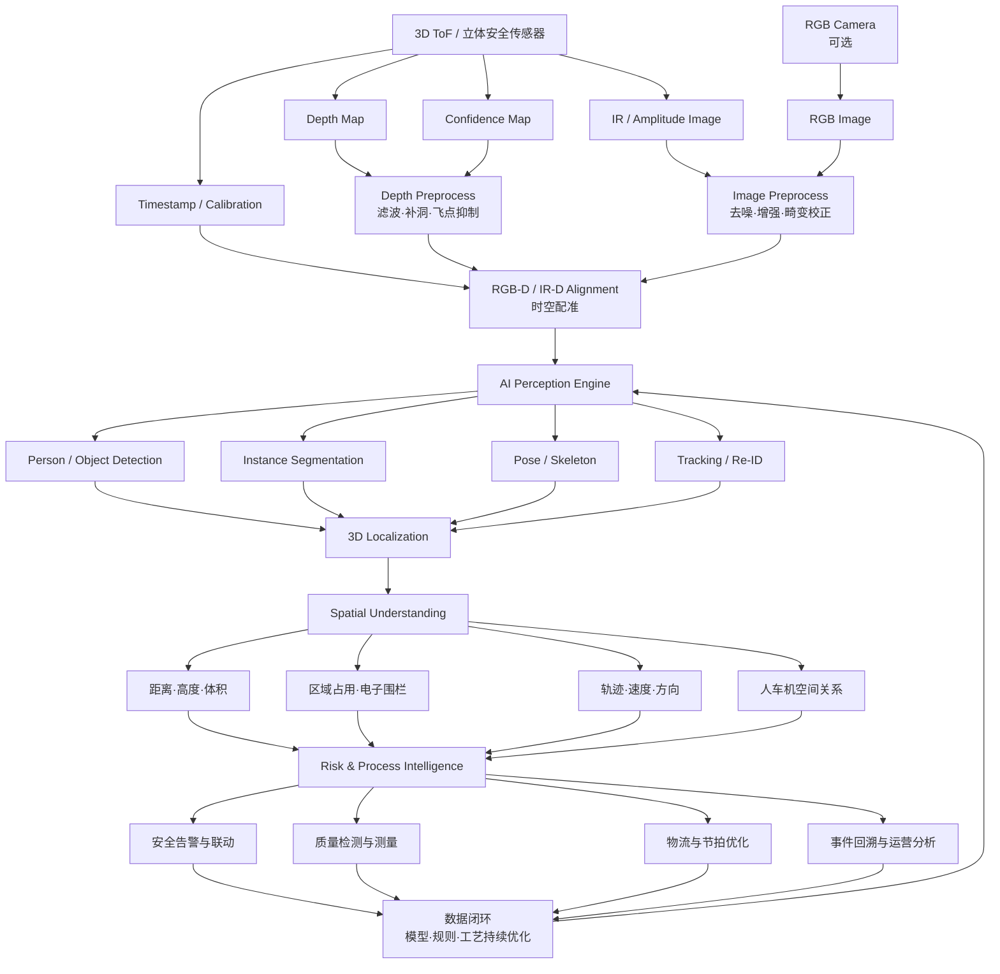

# 3D ToF + AI 工业价值闭环

## 1. 核心定位

3D ToF 不只是输出深度图。其工业价值来自“深度、强度/幅度、置信度、时间和标定关系”共同构成的空间观测，并通过 AI 检测、3D 定位、行为理解、风险决策和事件运营形成闭环。

## 2. 数据到价值的完整链路

## 3. 关键数据产品

| 层级 | 数据产品 | 工业用途 |
|---|---|---|
| 原始观测 | Depth、IR/Amplitude、Confidence | 测距、反射特性、有效性判断 |
| 几何产品 | 点云、法向量、地面、包围体、体积 | 定位、测量、占用分析 |
| 语义产品 | 人员、物体、姿态、实例掩码 | 目标识别、行为分析 |
| 时序产品 | Track、速度、加速度、轨迹预测 | 冲突预测、节拍分析 |
| 空间产品 | Zone Occupancy、Relation Graph | 电子围栏、人车机关系 |
| 风险产品 | Risk Event、TTC、Severity | 告警、降速、暂停、联锁请求 |
| 运营产品 | 回放、趋势、热力图、KPI | 根因分析和持续优化 |

## 4. 3D ToF 的工程优势

- 不依赖单目尺度估计，能够直接获得空间距离。
- 在纹理不足的工业场景中仍可提供几何信息。
- 可通过 Confidence Map 过滤低质量区域。
- 能够支撑高度、体积、距离、占用和包络体计算。
- 与目标检测、分割和跟踪结合后，可把二维识别升级为三维安全判断。

## 5. 工业难点

### 多径与反射

金属、玻璃、黑色材料、镜面和狭窄结构可能造成多径、饱和或低信噪比。应组合幅度、置信度、邻域一致性和场景掩码进行过滤。

### 遮挡与盲区

单点位不能保证完整覆盖。应通过多传感器视场设计、区域冗余、遮挡检测和设备状态融合降低风险。

### 时间一致性

深度帧、AI 推理、AGV/Robot 状态和 PLC 信号必须在统一时间基准上融合，否则会出现“空间正确、时间错误”。

### 标定与漂移

外参变化会直接影响空间关系。应提供标定版本、在线校验、漂移告警和维护流程。

## 6. 价值闭环指标

### 感知指标

- 深度有效率。
- 深度噪声与系统误差。
- AI 检出率、漏检率、误检率。
- 3D 定位误差。
- 跟踪稳定性和 ID 切换率。

### 系统指标

- 端到端延迟。
- 时间同步偏差。
- 设备在线率。
- 告警到控制响应时间。
- 事件证据完整率。

### 业务指标

- 高风险事件减少率。
- 非计划停线减少。
- 人工巡检工作量降低。
- 根因分析时间缩短。
- 安全策略优化周期缩短。

## 7. 推荐落地顺序

1. 选择一个边界清晰、风险高、可量化的区域。
2. 完成点位、视场、遮挡、网络和时间同步设计。
3. 建立深度质量基线与场景标定基线。
4. 先输出记录和告警，再逐步接入降速/暂停。
5. 建立事件回放与误报漏报复盘机制。
6. 经风险评估和验证后，才扩展到高等级控制闭环。

## 8. 与 Safety OS 的关系

3D ToF + AI 是 Safety OS 的关键感知与空间计算能力之一，但完整系统还需要：

- AGV、Robot、PLC 和工艺状态接入；
- 规则与状态机；
- Safety Supervisor；
- 控制命令网关；
- 事件审计和运行监控；
- 功能安全、网络安全和 AI 治理体系。

项目入口：[Safety OS](/projects/safety-os/)
