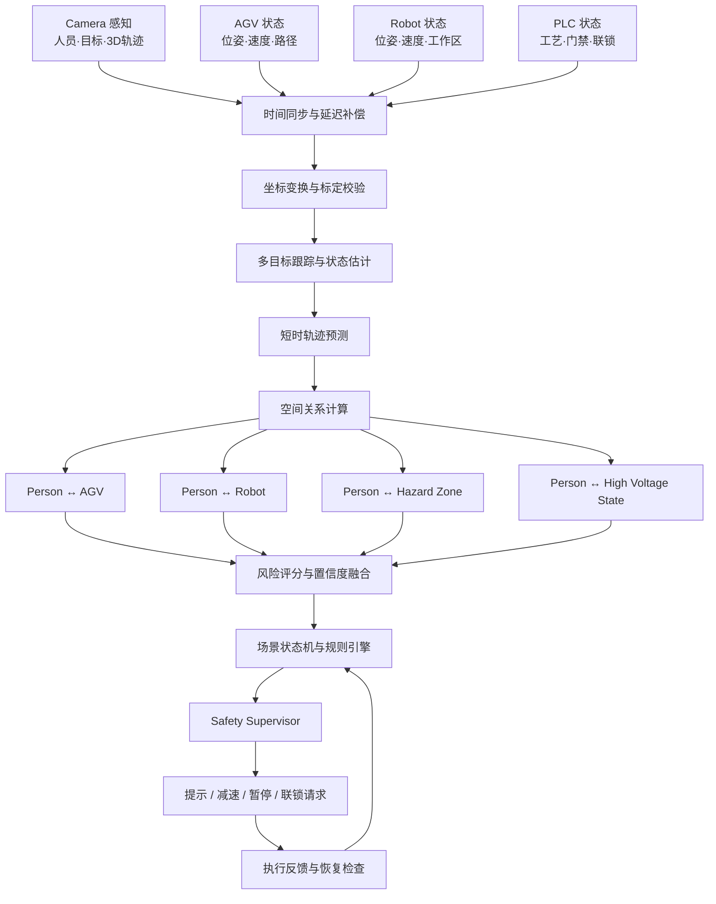
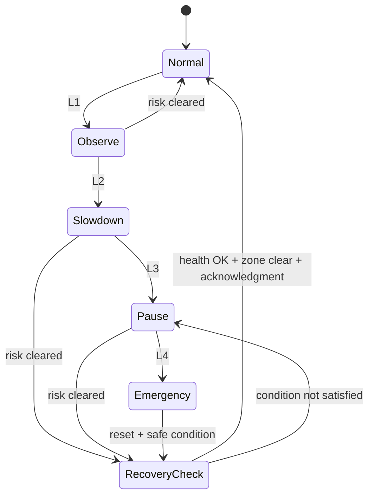

# AGV + Robot + Camera 融合算法

## 1. 算法目标

融合算法负责把Camera 的人员/物体感知、AGV 的定位与运动状态、Robot 的位姿与工作区、PLC 的工艺与安全状态映射到统一时空模型，实时判断人–车、人–机器人、人–危险区和设备–工艺状态冲突。

## 2. 多源输入

| 数据源 | 核心字段 | 典型频率 | 关键质量指标 |
|---|---|---:|---|
| Camera | Depth、IR/Amplitude、Confidence、目标框、3D 位置、轨迹 | 15–60 Hz | 深度置信度、遮挡率、帧延迟 |
| AGV/AMR | 位姿、速度、加速度、任务、路径、制动状态 | 10–50 Hz | 定位质量、路径版本、通信延迟 |
| Robot | 关节/末端位姿、模式、速度、程序、工作区、急停状态 | 10–125 Hz | 控制器状态、时间戳、模式一致性 |
| PLC/Safety PLC | 高压状态、IO、门禁、工位状态、联锁、急停 | 10–100 Hz | 扫描周期、信号质量、通道一致性 |
| 静态配置 | 地图、工位、危险区、限速区、标定参数 | 变更触发 | 配置版本、审批状态 |

## 3. 统一状态模型

```cpp
struct SpatialEntityState {
    std::string entity_id;
    std::string entity_type;
    int64_t timestamp_ns;
    std::string coordinate_frame;

    Pose3D pose;
    Vec3 velocity;
    Vec3 acceleration;
    BoundingVolume volume;

    double confidence;
    uint32_t quality_flags;
    std::string source_id;
    std::string trace_id;
};
```

建议将人员、AGV、Robot、危险区和工位统一表达为 `SpatialEntityState` 或静态/动态派生对象。

## 4. 融合处理链



## 5. 时间同步

融合前必须区分：

- **采集时间**：传感器或控制器生成数据的时间。
- **接收时间**：边缘节点收到消息的时间。
- **处理时间**：算法完成推理或融合的时间。
- **执行时间**：控制命令实际生效的时间。

推荐使用 PTP/IEEE 1588 或等效统一时钟；对于不支持硬件时间戳的设备，估计并监控固定延迟、抖动与时间漂移。

时间对齐可采用：

```text
state(t_fusion) =
  interpolate_or_predict(
    state(t_source),
    t_fusion - t_source
  )
```

当时间偏差超过场景阈值时，不应继续输出高等级自动控制命令。

## 6. 坐标体系

建议至少定义：

```text
map
line
station_<id>
camear_<id>
agv_<id>
robot_base_<id>
robot_tool_<id>
```

所有动态对象最终转换到 `map` 或 `line` 坐标系。每个变换包含版本、标定时间、误差评估和健康状态。

## 7. 轨迹预测与碰撞指标

对 AGV 可采用恒速度、恒加速度、扩展卡尔曼滤波或基于规划路径的预测；对人员可采用短时运动学模型，并对突变和意图不确定性保留安全裕量。

核心指标：

- 最近距离 `d_min`
- 到碰撞时间 `TTC`
- 到危险区时间 `TTZ`
- 相对速度 `v_rel`
- 停车距离 `d_stop`
- 预测轨迹交叠概率 `P_collision`
- 感知与状态置信度 `C_state`

示例：

```text
risk =
  w1 * normalize(TTC)
+ w2 * normalize(d_min)
+ w3 * P_collision
+ w4 * zone_severity
+ w5 * machine_energy_state
+ w6 * uncertainty_penalty
```

## 8. 场景判定

### 人–AGV

```text
预警条件：
predicted_person_path ∩ predicted_agv_swept_area ≠ ∅

升级条件：
TTC < threshold
或 d_min < stopping_distance + safety_margin
```

### 人–Robot

机器人风险区域应考虑：

- 当前机械臂包络体；
- 预测扫掠体；
- 工具与负载尺寸；
- 运行模式和速度；
- 防护门与区域占用状态。

### 人–高压测试区

仅有人员入侵不一定构成最终风险，必须与高压测试状态、门禁、授权和工艺步骤联合判断：

```text
risk = person_in_zone
    AND hv_test_active_or_armed
    AND NOT authorized_maintenance_mode
```

## 9. 状态机



恢复不能仅依赖“目标消失”，还应校验区域清空、设备健康、通信恢复、控制反馈和人工确认策略。

## 10. 控制命令接口

```cpp
enum class SafetyAction {
    NONE,
    NOTIFY,
    REQUEST_SLOWDOWN,
    REQUEST_PAUSE,
    REQUEST_STOP,
    REQUEST_INTERLOCK
};

struct ControlCommand {
    std::string command_id;
    std::string target_id;
    SafetyAction action;
    int priority;
    int64_t issued_at_ns;
    int64_t expire_at_ns;
    std::string reason_code;
    std::string rule_version;
    std::string trace_id;
};
```

命令网关需提供幂等、超时、重试、回执、优先级仲裁和撤销/恢复机制。

## 11. 失效与降级

| 异常 | 检测方法 | 降级建议 |
|---|---|---|
| Camera 画面/深度丢失 | 心跳、帧序列、置信度 | 区域进入保守模式，禁止自动放行 |
| AGV 定位质量下降 | 定位状态、协方差 | 放大安全区，限制速度 |
| Robot 状态中断 | 控制器心跳、状态超时 | 不推断为静止，保持保守风险 |
| PLC 通信中断 | 心跳、读写超时 | 停止高等级命令，转本地安全逻辑 |
| 时间同步异常 | PTP 偏差、时戳跳变 | 退出融合控制，仅告警与记录 |
| 模型健康异常 | 漂移、误检漏检指标 | 回退规则/传统传感器路径 |

## 12. 验证指标

- 端到端延迟 P50/P95/P99。
- 时间同步偏差。
- 3D 定位误差和标定漂移。
- 人员/AGV/Robot 轨迹误差。
- 场景检出率、误报率和漏报率。
- TTC/停车距离估计误差。
- 命令到执行反馈时间。
- 异常恢复成功率。
- 长时间运行稳定性和资源占用。
