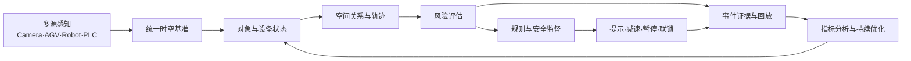

# 工业空间安全

工业空间安全关注人员、车辆、机器人、设备、物料与危险能量在同一生产空间中的动态关系。其技术核心是把离散传感器信号升级为统一的实时空间状态，再将状态转化为可解释风险和受约束的控制动作。

## 文档导航

### 1. Safety OS 总体架构

项目入口：[Safety OS](/projects/safety-os/)

覆盖设备接入、感知、空间建模、风险融合、规则决策、安全监督、控制网关、事件回放和运营平台。

### 2. AGV + Robot + Camera 融合算法

技术文档：[查看融合算法](/docs/industrial-space-safety/agv-robot-camera-fusion/)

重点说明多源数据模型、时间同步、坐标融合、轨迹预测、空间关系、风险评分、状态机与控制输出。

### 3. 3D ToF + AI 工业价值闭环

技术文档：[查看价值闭环](/docs/industrial-space-safety/3d-tof-ai-value-loop/)

重点说明 Depth、IR/Amplitude、Confidence、多模态配准、AI 检测、3D 定位、空间理解与安全运营闭环。

## 工业空间安全参考模型

## 工程原则

1. **功能安全边界明确**：AI 感知与 Safety PLC、认证安全功能之间必须定义责任边界。
2. **统一时间和坐标**：没有可信时间戳与坐标关系，融合结果不可审计。
3. **不确定性显式化**：置信度、数据质量、设备健康和遮挡状态必须进入决策。
4. **控制输出受监督**：所有动作经过白名单、优先级、去抖、超时和恢复条件校验。
5. **事件全链路追踪**：输入、模型、规则、决策、命令和执行反馈共享 Trace ID。
6. **失效安全与降级**：感知丢失、通信中断、时钟异常或模型健康异常时进入预定义降级状态。

## 相关入口

- [AI + Safety 技术发展趋势](/research/ai-safety/)
- [AI 安全系统标准体系](/docs/standards/ai-safety-development/)
