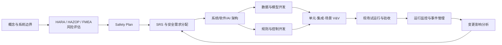

# AI 安全系统标准体系与开发规范

> 本页面用于工程规划、需求分解和合规映射，不替代正式标准文本、第三方认证意见或现场风险评估。

## 1. 标准体系总览

```mermaid
flowchart TB
    A["AI 安全系统标准体系"] --> B["机械与功能安全"]
    A --> C["AI 治理与风险"]
    A --> D["网络与信息安全"]
    A --> E["工业通信与互操作"]
    A --> F["工程生命周期与 V&V"]

    B --> B1["IEC 61508<br/>通用功能安全"]
    B --> B2["ISO 13849-1<br/>机械安全相关控制系统"]
    B --> B3["IEC 62061<br/>机械安全控制系统功能安全"]
    B --> B4["ISO 12100<br/>机械风险评估与风险降低"]

    C --> C1["ISO/IEC 42001<br/>AI 管理体系"]
    C --> C2["ISO/IEC 23894<br/>AI 风险管理"]
    C --> C3["ISO/IEC 22989<br/>AI 术语与概念"]

    D --> D1["IEC 62443<br/>IACS 网络安全"]
    D --> D2["ISO/IEC 27001<br/>信息安全管理体系"]

    E --> E1["IEC 61784<br/>工业通信网络 Profiles"]
    E --> E2["IEC 61158<br/>现场总线规范"]
    E --> E3["GB/T 36006-2018<br/>工业通信相关要求"]

    F --> F1["SRS / Architecture"]
    F --> F2["Data & Model Assurance"]
    F --> F3["Verification & Validation"]
    F --> F4["Operation Monitoring"]
    F --> F5["Change Management"]
```



## 2. 核心标准定位

| 标准 | 工程定位 | 对 AI 安全系统的主要作用 |
|---|---|---|
| IEC 61508 系列 | E/E/PE 安全相关系统的通用功能安全框架 | 安全生命周期、SIL、系统性能力、硬件与软件安全要求 |
| ISO 13849-1:2023 | 机械安全相关控制系统 SRP/CS 的设计与集成 | Performance Level、类别、可靠性与诊断能力 |
| IEC 62061:2021 及修订 | 机械安全相关控制系统的设计、集成与验证 | 机械领域 SIL、安全功能分解和验证 |
| ISO 12100 | 机械风险评估与风险降低 | 危险识别、风险估计、三步法风险降低 |
| IEC 62443 系列 | 工业自动化与控制系统网络安全 | 分区分域、安全等级、组件/系统/流程安全 |
| ISO/IEC 27001:2022 及修订 | 信息安全管理体系 | 组织级信息安全治理、风险与控制 |
| ISO/IEC 42001:2023 | AI 管理体系 | AI 责任、治理、风险、生命周期与持续改进 |
| ISO/IEC 23894:2023 | AI 风险管理指南 | AI 风险识别、分析、处置和监控 |
| IEC 61784 系列 | 工业通信网络 Profiles | 实时以太网、现场总线、安全通信和安装 Profiles |
| IEC 61158 系列 | 现场总线规范 | 工业通信协议和服务基础 |

截至 2026-07-11，ISO 13849-1 的现行版本为 2023 版；IEC 62061 已发布 2021 版及后续修订；IEC 62443 和 ISO/IEC 27001 需按具体分册及修订状态逐项校核。

## 3. AI 功能分级建议

| 等级 | AI 的作用 | 控制权限 | 典型应用 |
|---|---|---|---|
| L0 | 离线分析 | 无实时控制 | 报告、趋势、复盘 |
| L1 | 在线提示 | 告警与建议 | PPE、越界提示 |
| L2 | AI + 确定性规则 | 受限的非安全关键动作 | AGV 限速建议 |
| L3 | AI 参与安全相关决策 | 独立监督、架构分解、严格 V&V | 暂停请求、区域保护 |
| L4 | 自适应或直接高等级动作 | 极高保证要求，不应默认采用 | 需专项安全论证 |

## 4. 安全生命周期



## 5. SRS 必备字段

每条安全相关需求建议包含：

```text
Requirement ID
Title
Description
Rationale
Source / Standard Mapping
Hazard / Risk Link
Safety Function
Operating Design Domain
Preconditions
Inputs / Outputs
Timing Constraint
Failure Response
Safe / Degraded State
Verification Method
Acceptance Criteria
Traceability
Owner
Version / Status
```

推荐编号：

```text
SYS-FUN-001
SCN-AGV-001
SCN-ROB-001
SCN-HV-001
PER-001
SAFE-001
IF-LT-001
IF-PLC-001
IF-AGV-001
IF-ROB-001
LOG-001
SEC-001
AI-DATA-001
AI-MODEL-001
VV-001
```

## 6. AI 数据与模型保证

### 数据要求

- 明确 ODD、场景、设备、光照、遮挡、工装和人员行为分布。
- 定义采集、标注、审核、版本、许可和保留策略。
- 覆盖正常、异常、边界和长尾场景。
- 对合成数据、仿真数据和真实数据分别建立质量指标。
- 记录训练、验证、测试集隔离策略和数据泄漏检查。

### 模型要求

- 定义模型预期用途和禁止用途。
- 记录结构、权重、推理引擎、量化和硬件环境。
- 定义置信度、不确定性和拒绝策略。
- 进行鲁棒性、遮挡、扰动、漂移和资源压力测试。
- 建立版本签名、回滚、灰度发布和变更影响分析。

## 7. 运行时安全监督

Safety Supervisor 应独立于普通业务逻辑，至少检查：

- 输入数据新鲜度与序列完整性；
- 时间同步与坐标变换健康；
- 模型置信度和质量状态；
- 规则版本与配置授权；
- 命令目标、权限、优先级和有效期；
- 设备回执与执行超时；
- 风险解除、恢复条件和人工确认；
- 通信中断、资源耗尽和看门狗状态。

## 8. V&V 测试体系

| 测试层级 | 重点内容 |
|---|---|
| 单元测试 | 数据模型、几何计算、规则条件、状态机、接口序列化 |
| 模型测试 | 数据集性能、长尾、遮挡、漂移、扰动、硬件差异 |
| 集成测试 | LT/AGV/Robot/PLC 时间与坐标融合、消息丢失和重连 |
| 场景测试 | 人车冲突、人机侵入、高压区误入、恢复流程 |
| 故障注入 | 传感器丢帧、时钟漂移、网络延迟、设备状态异常 |
| 性能测试 | P50/P95/P99 延迟、吞吐、CPU/GPU/内存 |
| 长稳测试 | 7×24 小时运行、资源泄漏、队列积压、日志容量 |
| 网络安全测试 | 身份、权限、签名、升级、分区分域、攻击面 |
| 现场验收 | 验收场景、阈值、证据、控制反馈和操作流程 |

## 9. 网络安全基线

依据 IEC 62443 思路，建议：

1. 对 Safety OS、边缘传感器、AGV/Robot、PLC、管理平台进行资产识别。
2. 划分 Zone 与 Conduit，生产控制域和企业 IT 域隔离。
3. 实施设备身份、双向认证、最小权限和密钥管理。
4. 对模型、规则、配置和升级包进行签名与完整性校验。
5. 对控制接口建立白名单、速率限制、审计和异常阻断。
6. 建立漏洞、补丁、供应链和远程维护流程。
7. 将网络安全事件与安全事件统一关联追踪。

## 10. 工业通信要求

工业安全相关通信需关注：

- 确定性和实时性；
- 端到端延迟与抖动；
- 消息序列、重复、丢失、乱序和超时；
- 黑通道安全机制；
- 冗余、诊断与故障恢复；
- 网络拓扑、线缆、屏蔽、接地和安装 Profiles；
- PTP/IEEE 1588 时间同步；
- 协议和设备版本兼容性。

IEC 61784-3 系列用于功能安全现场总线 Profiles，其机制与 IEC 61508 的功能安全要求相关联。具体项目应依据所选 PROFINET/PROFIsafe、EtherCAT/FSoE、CIP Safety 等协议族确定适用分册。

## 11. 合规交付物

```text
Safety Plan
Hazard and Risk Analysis
System Boundary and ODD
Safety Requirements Specification
Interface Control Document
Architecture and Safety Mechanisms
AI Data Specification
Model Card / Assurance Case
Cybersecurity Plan
V&V Plan and Test Cases
Traceability Matrix
Anomaly and Incident Log
Configuration and Change Records
Safety Case / Technical File
Operation and Maintenance Manual
```

## 12. 标准使用原则

- 采用“风险驱动 + 生命周期 + 证据链”方法，而不是简单罗列标准。
- 明确每项标准适用于组织、系统、软件、AI、通信还是组件。
- 标准映射必须落实到需求、设计、测试和运行记录。
- 标准版本、国家采标、客户规范和认证要求需在项目启动时确认。
- 对 AI 是否承担安全功能进行明确架构决策，并形成可审查的保证论证。

## 13. 相关内容

- [Safety OS](/projects/safety-os/)
- [AI + Safety 技术发展趋势](/research/ai-safety/)
- [AGV + Robot + LT 融合算法](/docs/industrial-space-safety/agv-robot-lt-fusion/)
