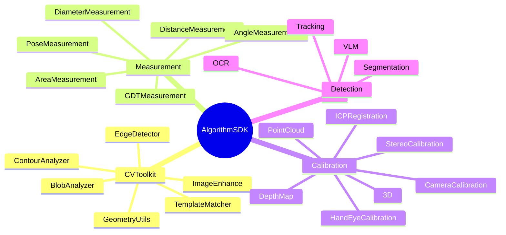
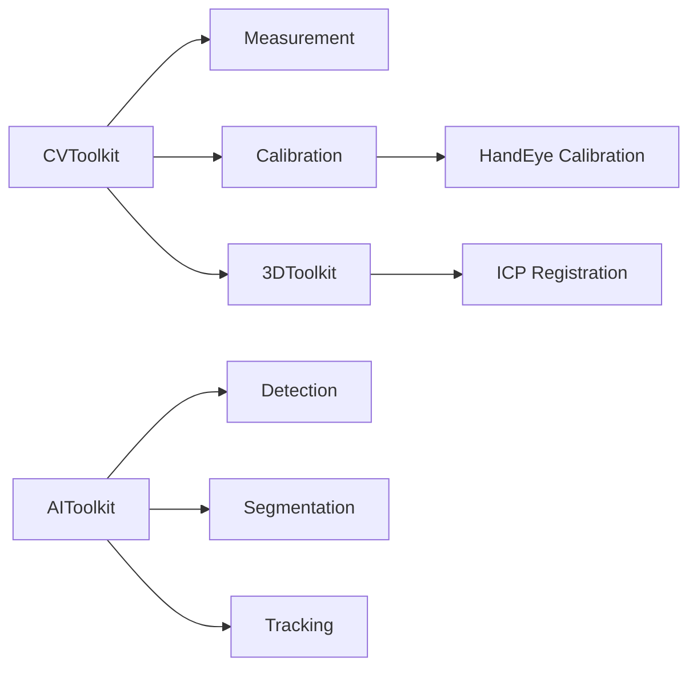

# 算法框架

> AlgorithmSDK 模块整体框架视图，覆盖传统视觉、AI 推理、3D 视觉三大领域。

```mermaid
mindmap
  root((AlgorithmSDK))
    CVToolkit
      ImageEnhance
      EdgeDetector
      ContourAnalyzer
      BlobAnalyzer
      TemplateMatcher
      GeometryUtils
    Measurement
      DistanceMeasurement
      DiameterMeasurement
      AngleMeasurement
      AreaMeasurement
      PoseMeasurement
      GDTMeasurement
    Calibration
      CameraCalibration
      StereoCalibration
      HandEyeCalibration
      3D
      PointCloud
      DepthMap
      ICPRegistration
    AI
      Detection
      Segmentation
      Tracking
      OCR
      VLM
```

## 模块关系

```mermaid
graph LR
    A[CVToolkit] --> B[Measurement]
    A --> C[Calibration]
    A --> D[3DToolkit]
    E[AIToolkit] --> F[Detection]
    E --> G[Segmentation]
    E --> H[Tracking]
    D --> I[ICP Registration]
    C --> J[HandEye Calibration]
```

> [!NOTE]
> 各模块详细说明见 [SDK 交付手册](/交付文档.md#4-功能模块详解)。
