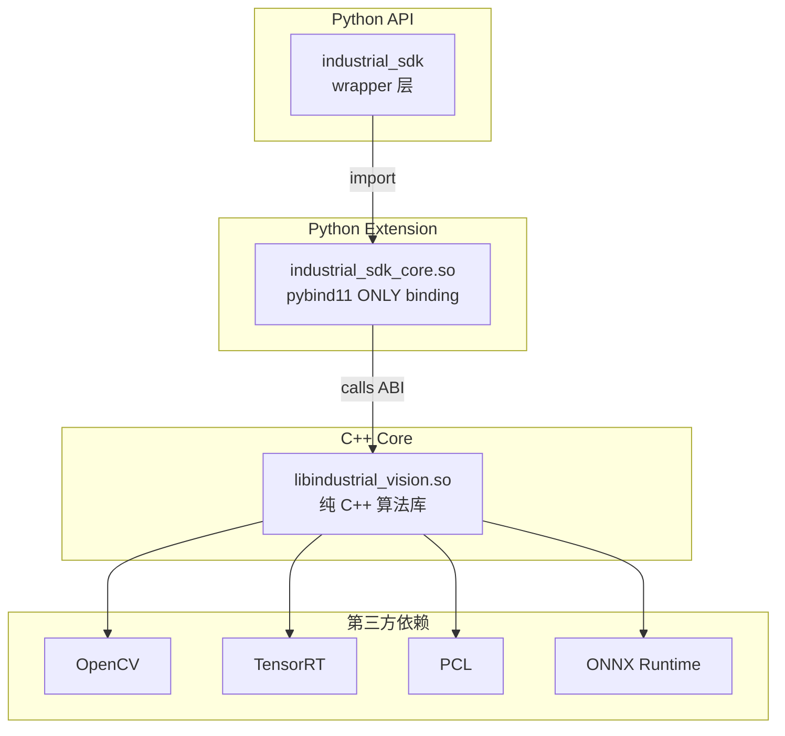

# 架构总览

## 目录结构

```
AlgorithmSDK/
├── CMakeLists.txt
├── core/                      # C++ SDK 核心代码
│   ├── include/IndustrialVisionSDK/
│   │   ├── VisionFrame.h
│   │   ├── CVToolkit.h
│   │   ├── MeasurementToolkit.h
│   │   ├── Calibration/
│   │   ├── ThreeDToolkit.h
│   │   ├── AIToolkit.h
│   │   └── VLMToolkit.h
│   └── src/
│       ├── CVToolkit.cpp
│       ├── MeasurementToolkit.cpp
│       ├── Calibration/
│       ├── ThreeDToolkit.cpp
│       ├── AIToolkit.cpp
│       └── VLMToolkit.cpp
├── bindings/
│   └── industrial_sdk_core.cpp
├── python/
│   ├── setup.py
│   └── industrial_sdk/
│       └── __init__.py
└── demo/
    ├── main.cpp
    └── demo.py
```

## 分层架构



## 模块关系

| 层级 | 说明 |
|------|------|
| **Python API** | `industrial_sdk` 包，对外暴露 SDK 功能 |
| **Python Extension** | `industrial_sdk_core.so`，纯 pybind11 绑定，无业务逻辑 |
| **C++ Core** | `libindustrial_vision.so`，CV / AI / VLM 纯 C++ 算法核心 |
| **第三方依赖** | OpenCV、TensorRT、PCL、ONNX Runtime |

> SDK 以 C++ 为核心，通过 pybind11 提供 Python 接口，面向工业检测、测量、标定、机器人视觉等场景。
