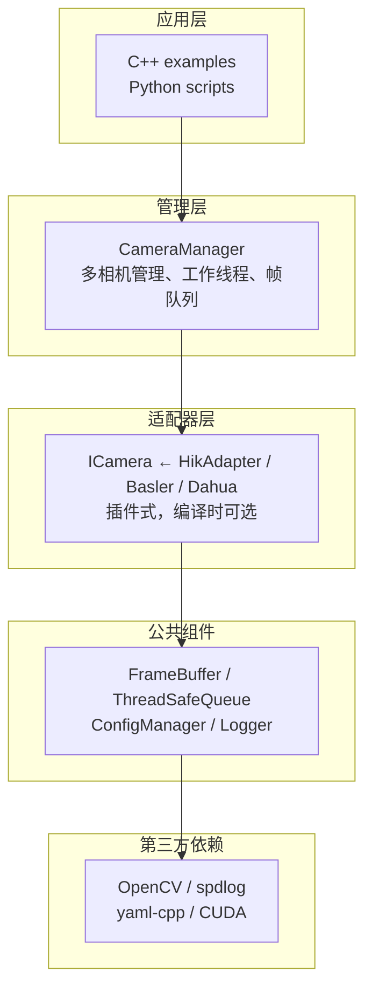

# 架构总览

> CameraSDK 是工业级跨平台相机 SDK，采用三层插件式架构。

## 目录结构

```
CrossPlatformCameraSDK/
├── CMakeLists.txt
├── config/
│   └── cameras.yaml              # 相机配置文件
│
├── include/
│   ├── ICamera.h                  # 核心抽象接口
│   ├── CameraFactory.h            # 工厂类
│   ├── CameraManager.h            # 多相机管理器
│   ├── CameraLinux.h / CameraWindows.h
│   ├── adapters/
│   │   ├── HikAdapter.h           # ★ 海康适配器（真实 SDK 对接）
│   │   ├── BaslerAdapter.h        # Basler 预留
│   │   └── DahuaAdapter.h         # 大华预留
│   └── common/
│       ├── FrameBuffer.h          # 帧缓冲（GPU 支持）
│       ├── ThreadSafeQueue.h      # 线程安全队列
│       ├── ConfigManager.h        # YAML 配置解析
│       └── Logger.h               # spdlog 封装
│
├── src/                           # 与 include 一一对应
│   ├── CameraFactory.cpp
│   ├── CameraManager.cpp
│   ├── adapters/HikAdapter.cpp    # ★ 真实海康 SDK 调用
│   └── common/
│
├── examples/
│   ├── single_frame.cpp           # 单帧采集
│   ├── continuous_capture.cpp     # 连续实时采集
│   ├── multi_camera.cpp           # 多相机管理
│   └── python_demo.py
│
├── python/
│   ├── setup.py / pyproject.toml
│   └── pycamera/
│       ├── __init__.py             # DLL 路径自动发现
│       └── _core.cp314-win_amd64.pyd
│
└── third_party/
    └── Hikvision/
        └── Windows/
            ├── MvCameraControl.dll
            └── MvCameraControl.lib
```

## 三层架构



## ICamera 核心接口

```cpp
class ICamera {
    virtual bool open() = 0;
    virtual void close() = 0;
    virtual bool grabFrame(FrameBuffer::Ptr &frame) = 0;
    virtual bool start() = 0;      // 启动连续取流
    virtual void stop() = 0;       // 停止取流
    virtual bool isOpened() const = 0;
    virtual void setFrameCallback(FrameCallback cb) = 0;
    virtual void enableGPU(bool enable) = 0;
    virtual bool setParam(const std::string &name, double value) = 0;
    virtual double getParam(const std::string &name) = 0;
};
```

## 取流模式

| 模式 | 调用方式 | 适用场景 |
|------|---------|---------|
| 单帧 | `open()` → `grabFrame()` → `close()` | 拍照 |
| 连续（轮询） | `open()` → `start()` → 循环 `grabFrame()` | 实时画面 |
| 连续（回调） | `setFrameCallback()` → `start()` | 事件驱动 |
| 多相机 | `CameraManager` + `startAll()` → `popFrame()` | 多相机同步 |

> [!NOTE]
> HikAdapter 完整实现细节见 [开发文档](/development.md)。
