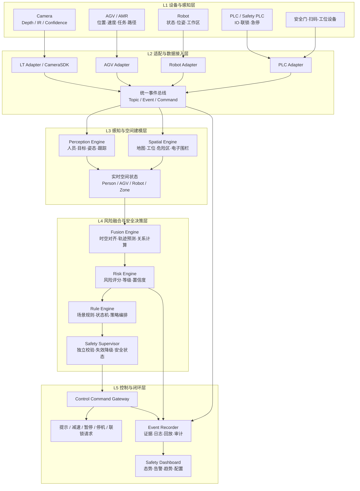

# WONSOR Safety OS

> 面向工业生产场景的人、车、机、料一体化工业空间安全操作系统。

WONSOR Safety OS 将立体安全传感器 LT、AGV、机器人、PLC、安全门、急停和生产状态统一接入，以空间建模、风险融合、规则决策和控制联动形成可解释、可追溯、可持续优化的工业安全闭环。

## 1. 项目目标

传统安全方案通常由光栅、安全门、区域扫描、PLC 联锁和独立视觉系统构成，设备之间缺少统一空间语义与风险上下文。Safety OS 的目标不是替代经认证的安全回路，而是在其上构建更完整的空间感知、风险预测、策略编排和事件运营能力。

核心价值：

- **看得见**：持续感知人员、AGV、机器人、物料和危险区域。
- **算得清**：统一坐标、轨迹、区域关系和风险等级。
- **联得动**：按策略输出提示、减速、暂停、停机或安全联锁请求。
- **可回溯**：保存事件、状态、证据片段、规则版本和控制结果。
- **可演进**：通过数据闭环优化模型、阈值、区域和运行策略。

## 2. 总体架构



## 3. 三条业务闭环

### 感知闭环

多源设备接入 → 时间同步 → 目标感知 → 空间配准 → 状态建模。

### 安全闭环

风险识别 → 风险评分 → 规则决策 → 安全监督 → 控制输出 → 执行反馈。

### 运营闭环

事件记录 → 视频与状态回溯 → 统计分析 → 策略优化 → 模型和规则迭代。

## 4. MVP 高风险场景

| 场景 | 主要风险 | 关键输入 | 主要动作 |
|---|---|---|---|
| AGV 与人员混行 | 碰撞、盲区、交叉路口冲突 | 人员轨迹、AGV 位姿/速度/路径、区域地图 | 提示、AGV 减速、暂停 |
| 机器人作业区域 | 人员侵入、机械臂扫掠、异常停留 | 人员位置、机器人状态/工作区、门禁状态 | 告警、暂停、联锁请求 |
| 高压测试及危险区域 | 未授权进入、测试状态与人员冲突 | 人员检测、PLC 高压状态、区域权限、门禁 | 禁入提示、测试禁止、联锁请求 |

## 5. 风险等级与控制策略

| 等级 | 定义 | 建议策略 |
|---|---|---|
| L0 | 正常或仅记录 | 记录状态与运行指标 |
| L1 | 关注 | 声光或界面提示 |
| L2 | 较高风险 | 降速、限制动作或请求人工确认 |
| L3 | 高风险 | 暂停 AGV/Robot/工位流程 |
| L4 | 紧急风险 | 进入经验证的安全状态或触发安全联锁路径 |

> L4 行为必须受安全架构、风险评估、认证边界和现场安全回路约束。AI 推理结果不应在未经安全论证的情况下直接替代 Safety PLC 或认证安全功能。

## 6. 核心模块

- **Adapters**：Camera、AGV、Robot、PLC 和现场设备协议适配。
- **Perception Engine**：人员/目标检测、跟踪、姿态与 3D 定位。
- **Spatial Engine**：世界坐标、工位、危险区、电子围栏和拓扑关系。
- **Fusion Engine**：多源时间对齐、状态融合、轨迹预测和冲突计算。
- **Rule Engine**：规则、状态机、优先级、抑制、恢复和策略版本管理。
- **Safety Supervisor**：健康检查、置信度门限、失效降级、命令二次校验。
- **Event Bus**：统一数据契约与发布订阅。
- **Event Recorder**：事件前后证据、日志、状态快照和审计链。
- **Dashboard**：实时态势、告警、回放、指标、配置和运维。

## 7. 统一数据契约

建议统一以下对象：

```text
Frame
DetectedObject
TrackedObject
DeviceState
SpatialZone
SpatialRelation
RiskEvent
SafetyDecision
ControlCommand
CommandResult
TraceContext
```

每条安全相关消息至少包含：

```text
schema_version
source_id
timestamp_ns
sequence
coordinate_frame
confidence
quality_status
trace_id
```

## 8. 技术路线

- 边缘核心：C++17/20、OpenCV、Eigen、ONNX Runtime/TensorRT。
- 设备与控制：ROS 2、OPC UA、Modbus TCP、MQTT、厂商 SDK。
- 事件与服务：内部无锁/有界队列、ROS 2 Topic、MQTT 或 Kafka。
- 前端：Web SCADA、WebSocket、WebRTC、事件时间轴。
- 部署：Docker Compose、边缘工控机、GPU/CPU 混合运行。
- 时间同步：PTP/IEEE 1588、硬件时间戳和统一单调时钟。


## 9. 相关知识资产

- [工业空间安全技术文档](/docs/industrial-space-safety/)
- [AGV + Robot + Camera 融合算法](/docs/industrial-space-safety/agv-robot-camera-fusion/)
- [3D ToF + AI 工业价值闭环](/docs/industrial-space-safety/3d-tof-ai-value-loop/)
- [AI + Safety 技术发展趋势](/research/ai-safety/)
- [AI 安全系统标准体系与开发规范](/docs/standards/ai-safety-development/)
